[TOC]


---


`cat /proc/1316/status`


`pstree`

> su(root)
>
> 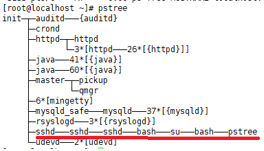
>
> webmaster
>
> 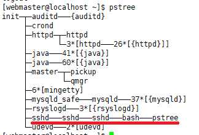


## & 백그라운드 작업

`find / -name "*.sh" -print &`  


`cat &`

> 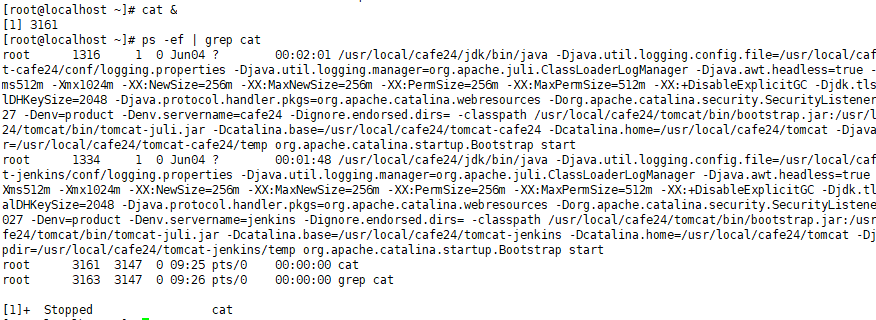


## ps

```
-ㅣ : 자세한 형태의 정보를 출력한다.
-a : 다른 사용자들의 프로세스도 보여준다.
-u : 프로세스의 사용자 이름과 시작 시간등 출력한다.
-x : 터미널과 연결되지 않은 프로세스도 보여준다.
-e : 환경을 보여준다. 
-f  : 프로세스의 정보를 한 둘로 자세히 출력한다.
-r : 현재 실행중인 프로세스들을 표시한다.
-j : 작업 중심의 형태로 출력한다.
-c : 커널 task_struct 구조체 형태로 보여준다.

보통 –aux  또는 –ef 옵션을 사용해서 프로세스 상태를 확인한다. 
```

> `ps -ef`
>
> 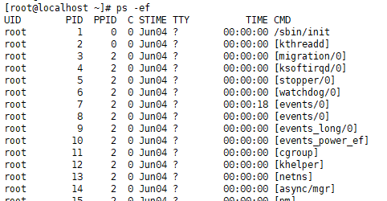
>
> ```
> USER: 프로세스 소유자의 계정   
> PID: 프로세스를 구분하는 프로세스 아이디   
> PPID:  부모 프로세스 PID
> STIME: 프로세스 시작 시간   
> TTY: 프로세스의 표준 입출력을 담당하는 터미널  
> TIME: 프로세스의 CPU 점유시간
> CMD: 실행 명령어    
> ```

> `ps -aux`
>
> 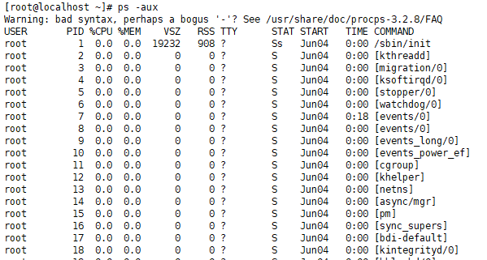
>
> ```
> USER: 프로세스 소유자의 계정   
> PID: 프로세스를 구분하는 프로세스 아이디  
> %CPU:마지막 분 동안 사용한 CPU의 %  
> %MEM: 마지막 분 동안 사용한 메모리 양의 %   
> VSZ: 프로세스 데이터 스택의 크기 RSS: 실제 메모리 양
> COMMAND: 실행 명령어  
> STAT: 프로세스의 상태  
> START: 프로세스가 시작된 시간    
> 
> stat:
> 첫 번째 필드
> D io와 같이 중지(interrupt)시킬 수 없는 잠자고 있는 (휴지) 프로세스 상태(디스크 입출력 대기)
> R 현재 동작중이거나 동작할 수 있는 상태
> S 잠자고 있지만, 중지시킬수 있는 상태(20초 미만의 짧은 휴식)
> T 작업 제어 시그널로 정지되었거나 추적중에 있는 프로세스 상태(일시 정지)
> X 완전히 죽어 있는 프로세tm
> Z 죽어 있는 좀비 프로세스
> ㅣ:20초 이상의 긴 휴식
> p: 수행가능
> 
> 두 번째 필드
> < 프로세스의 우선 순위가 높은 상태
> N 프로세스의 우선 순위가 낮은 상태
> L 실시간이나 기존 IO를 위해 메모리 안에 잠겨진 페이지를 가진 상태
> s 세션 리터(주도 프로세스)
> I 멀티 쓰레드
> + 포어그라운드 상태로 동작하는 프로세스
> ```

---


---

## `top`

```
-d 시간: 화면 갱신 시간 지정  
-c : 명령행 전체를 보여준다
-q : 화면을 계속 갱신한다.
```

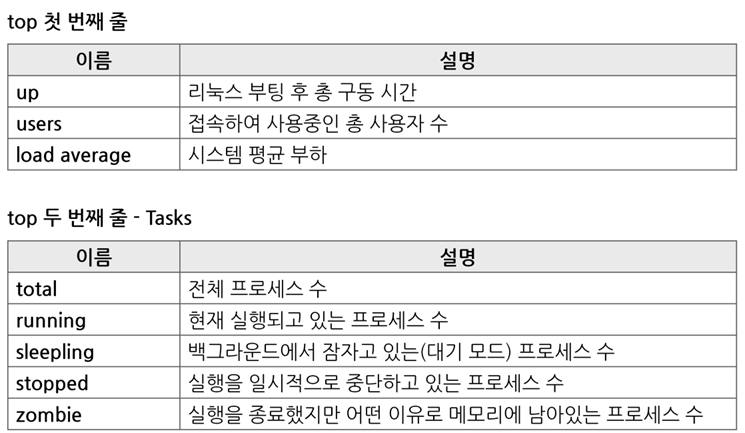

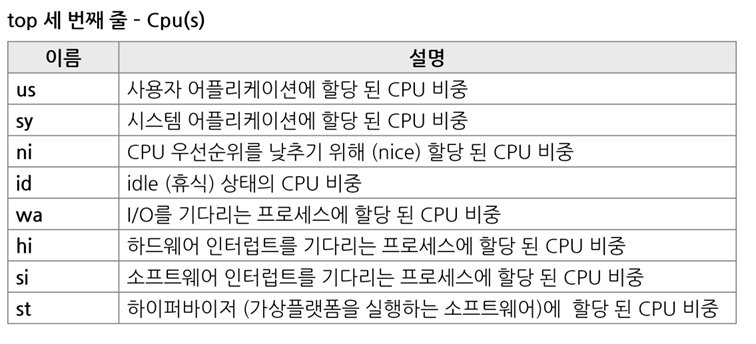

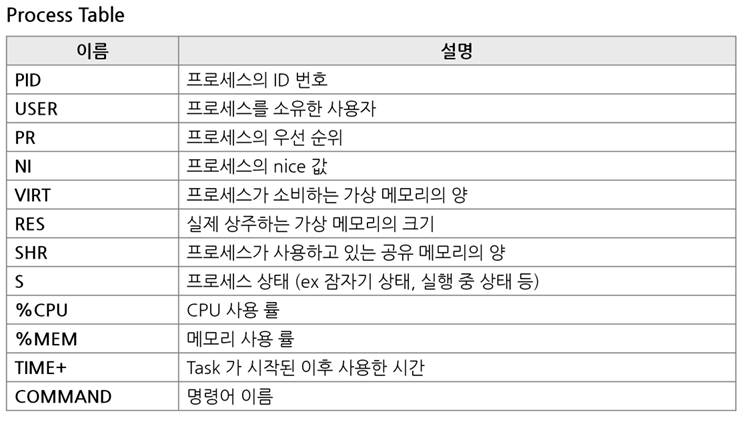


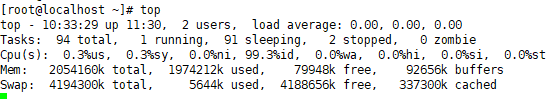

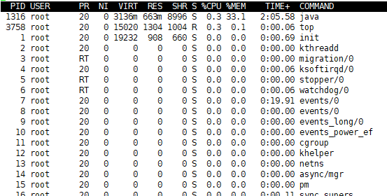


`cat /proc/loadavg`

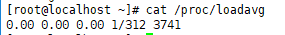

​										> 312개의 테스크가 대기중에 하나 실행중


## `free`

```
-b : 바이트 단위 표시  
-k : Kb 단위로 표시
-m : Mb 단위로 표시
-t  : 총합을 표시
```


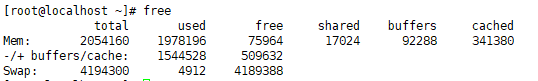

> `shared` : ipc 사용(우리가 사용할수X)
>
> `buffers` :  writer()할때, block devicedriver에 바로 가는게 X, buffer에 담겨있음 - 쓸 수 있음 
>
> `cached` 
>
> free는 물리적으로 비어있는 걸 더한..?

```
total - 전체 물리적인 메모리의 크기
used - 사용중인 메모리 크기
free - 사용중이 아닌 메모리 크기로 사용 가능한 메모리 크기
shared - 공유 메모리 크기
buff/buffers - 버퍼로 사용되고 있는 메모리 크기
cache/cached - 캐시로 저장된 메모리
```

<https://www.kdata.or.kr/info/info_04_view.html?field=&keyword=&type=techreport&page=17&dbnum=183855&mode=detail&type=techreport>


### Disk 캐시 비우기

`echo 3 > /proc/sys/vm/drop_caches `

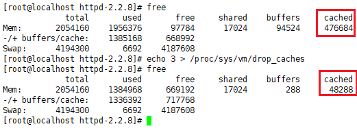

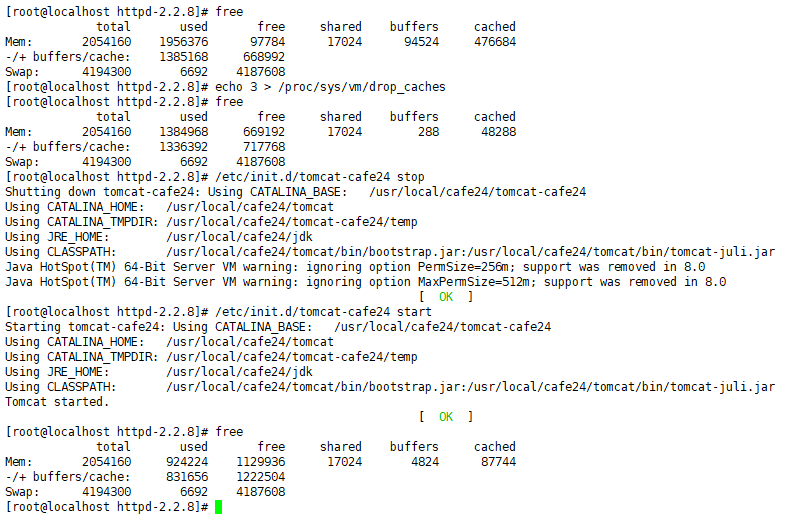


## `swap`

가상메모리가 물리메모리 많이 사용할때 swap영역사용.,!?

---


---

## `nice`

- Nice 레벨 - 프로세스 우선순위 를 지정한다.

```
프로세스 우선순위

- 상태(R) 프로세스는 순서대로 CPU 시간을 할당받아 실행
- 각 프로세스가 할당될 CPU 시간을 관리하기 위해 내부적으로 우선순위가 설정
- 프로세스에 부여된 값이 작을수록 우선순위가 높고 CPU할당시간이 길어진다

- 커널에의해 자동조절되는 값이기 때문에 유저 레벨에서는 변경 불가능
- 하지만, nice 명령으로 Nice 레벨을 조정하여 프로세스의 우선순위를 조정할 수 있다.

- Nice 레벨의 범위는 -20 ~ 19 (-20이 우선순위가 가장 높음), 디폴트는 0이다.
```


**우선순위 높여 `make`실행해보기**

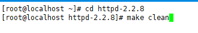

`nice -n -5 make`  : make 명령어를 nice -5레벨로 실행


`renice` 

---


---

## `ulimit`

```
soft limit : 현재 유효한 제한 값(hard limit를 넘지 않는 범위에서 변경 가능)
hard limit : soft limit이 변경 가능한 상한

core file size
QUIT 시그널을 받아 종료했을 때 작성하는 코어 덤프 파일 사이즈

file size
프로세스가 작성가능한 파일 사이즈

max user processes
해당 우저가 기동할 수 있는 프로세스 수
```

> 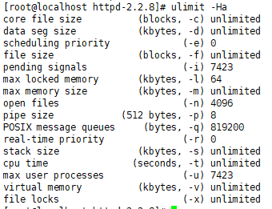


**core file size 를 hard limit 2048k, soft limit 1024k 로 설정하기**

`# ulimit -Hc 2048`

`# ulimit -Sc 1024`

`# ulimit -Ha`

> 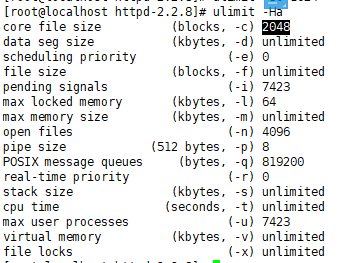

---


---

