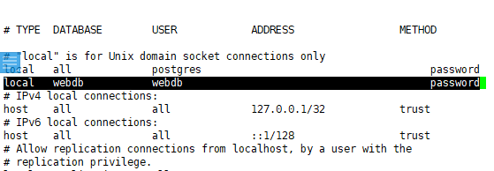
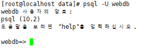
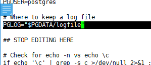
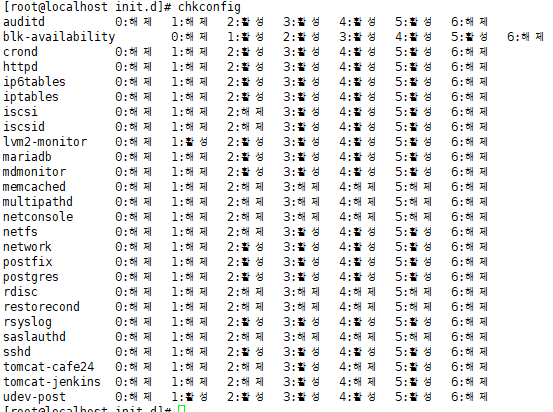
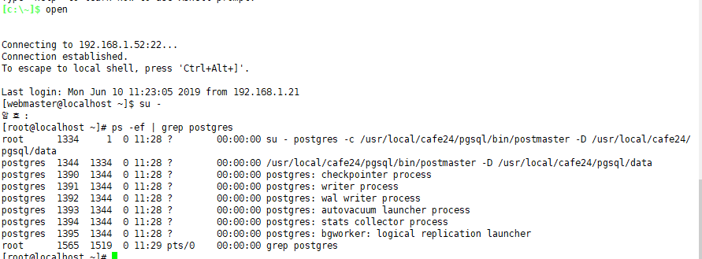
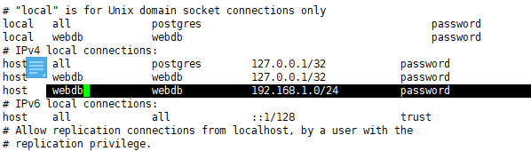
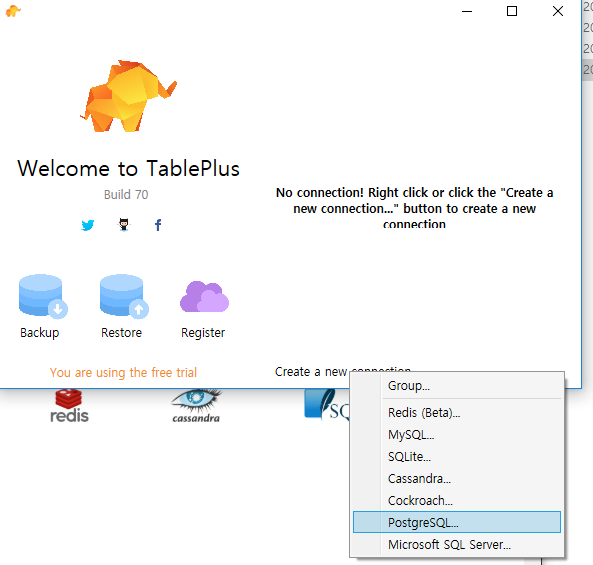
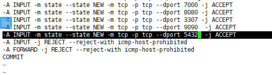
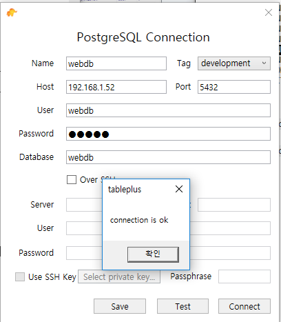

[TOC]

---

## 사용자 추가

`psql -U postgres`

`create user webdb with password 'webdb';`

## 테이블에 대한 권한 추가

`\dn`

`grant all privileges on all tables in schema public to webdb;`

> 

## 연결 설정

> /usr/local/cafe24/pgsql/data/pg_hba.conf

`vi /cafe24/pgsql/data/pg_hba.conf`

`killall postgres`

`sudo -u postgres /usr/local/cafe24/pgsql/bin/pg_ctl -D /usr/local/cafe24/pgsql/data -l /usr/local/cafe24/pgsql/data/logfile start`

## webdb 계정 연결

## 접근못함 -> 소유주 권한

아니면 접속할때

`psql -U postgres webdb`

## 테이블 소유자 변경

`alter table pet owner to webdb;`

그냥 webdb로 들어가도 가능!

## 데몬 설정

파일 가져오기(c드라이브에 파일 놓고)

`cp /home/webmaster/postgres /etc/init.d/`

`cd /etc/init.d/`

`chmod 755 postgres`

`vi postgres`

> 

## stop

`/etc/init.d/postgres stop`

`/etc/init.d/postgres start`

## chkconfig

`chkconfig --add postgres`

`sync`

`reboot`

**올라옴 ㅎㅎㅎ**

---

## 외부 연결

`vi /cafe24/pgsql/data/postgresql.conf `

> 

`vi /cafe24/pgsql/data/pg_hba.conf`

> 
>
> 
>
> 
>
> 이거랑 같은거임
>
> `create user 'webdb'@'192.168.1.0' <<<

서버 restart!!!!

`/etc/init.d/postgres stop`

`/etc/init.d/postgres start`

## tableplus 다운

<https://tableplus.io/windows>   64 bit

###  방화벽 풀기

` vi /etc/sysconfig/iptables`

`/etc/init.d/iptables stop`

`/etc/init.d/iptables start`

