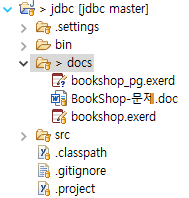
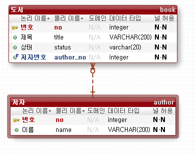
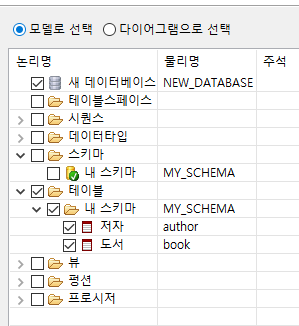
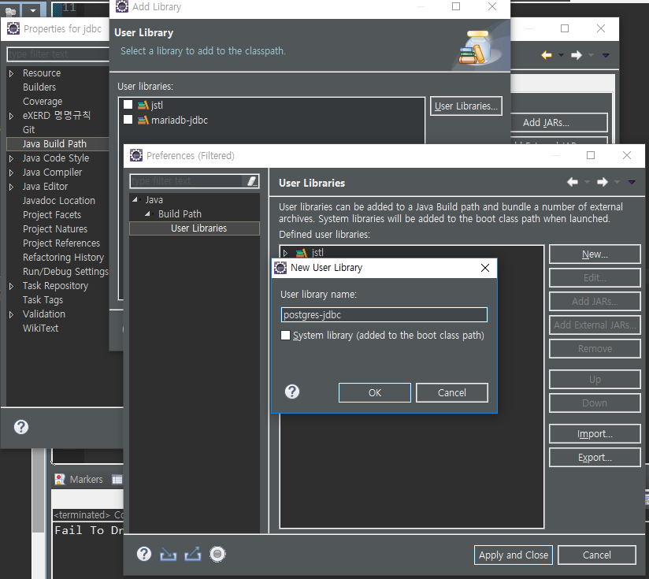
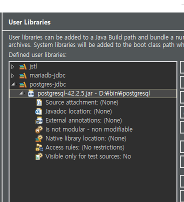
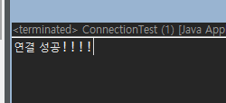
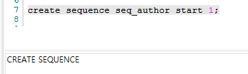
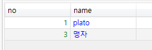

[TOC]

---

# JDBC

**jdbc/docs/bookshop_pg.exerd** 

`enum('대여중', '대여가능')`

> `create type enum_book_status as enum('대여중', '대여가능');`을 한 다음에 enum_book_status 타입을 쓰면 됨!



## 포워드




### 드라이버 다운로드

<https://jdbc.postgresql.org/download.html>

[PostgreSQL JDBC 4.2 Driver, 42.2.5](https://jdbc.postgresql.org/download/postgresql-42.2.5.jar)

-


---


---


---







---

**ConnectionTest.java**  

```java
package test.pg;
public class ConnectionTest {

	public static void main(String[] args) {
		
		Connection conn = null;
		
		try {
			// 1. JDBC Driver(MariaDB) 로딩
			Class.forName("org.postgresql.Driver");
			
			// 2. 연결하기
			String url = "jdbc:postgresql://192.168.1.52:5432/webdb";
			conn = DriverManager.getConnection(url,"webdb","webdb");
			
			System.out.println("연결 성공!!!!");
			
		} catch (ClassNotFoundException e) {
			System.out.println("Fail To Driver Loading : " +  e);
		} catch (SQLException e) {
			System.out.println("Error : " + e);
		} finally{
			try {
				if(conn != null) {
					conn.close();
				}
			} catch (SQLException e) {
				e.printStackTrace();
			}
		}
	}
}
```

> 

---


## insert

### sequence 만들기

`create sequence seq_author start 1;`

> 

`select nextval('seq_author');`

`insert into author values(nextval('seq_author'), 'plato');`

```sql
drop sequence seq_author;
create sequence seq_author start 1;

drop sequence seq_book;
create sequence seq_book start 1;
```

**InsertTest.java**      

```java
package test.pg;
public class InsertTest {
	
	public static void main(String[] args) {
		boolean result = insert("맹자");
		if(result) {
			System.out.println("성공");
		}
	}
	
	public static boolean insert(String name) {
		boolean result = false;
		
		// 	자원정리
		Connection conn = null;
		Statement stmt = null;
		
		try {
			// 1. JDBC Driver(MariaDB) 로딩
			Class.forName("org.postgresql.Driver");
			
			// 2. 연결하기
			String url = "jdbc:postgresql://192.168.1.52:5432/webdb";
			conn = DriverManager.getConnection(url,"webdb","webdb");
			
			// 3. statement 객체 생성 
			stmt =  conn.createStatement();
			
			// 4. SQL문 실행
			String sql = "insert into author values(nextval('seq_author'), '" + name + "')";
			
			int count = stmt.executeUpdate(sql); // 들어간 갯수만큼 return
			
			result = count == 1; // 1개 insert 성공하면 true!
			
		} catch (ClassNotFoundException e) {
			System.out.println("Fail To Driver Loading : " +  e);
		} catch (SQLException e) {
			System.out.println("Error : " + e);
		} finally{
			try {
				if(stmt != null) {
					stmt.close();
				} 
				if(conn != null) {
					conn.close();
				}
			} catch (SQLException e) {
				e.printStackTrace();
			}
		}
		return result;
	}
}
```

> 


