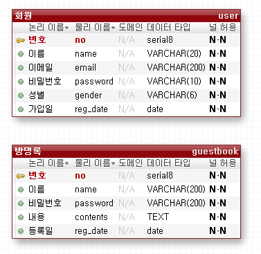
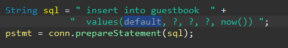
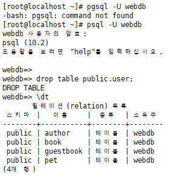

[TOC]


---

**pom.xml**  <https://mvnrepository.com/artifact/org.postgresql/postgresql/42.2.5>

```xml
<!-- postgresql jdbc driver -->
<dependency>
    <groupId>org.postgresql</groupId>
    <artifactId>postgresql</artifactId>
    <version>42.2.5</version>
</dependency>
```

---




포워드 엔지니어링

---

DAO에 Connection 수정

```java
private Connection getConnection() throws SQLException {
    Connection conn = null;
    try {
        Class.forName("org.postgresql.Driver");
        String url = "jdbc:postgresql://192.168.1.52:5432/webdb";
        conn = DriverManager.getConnection(url, "webdb", "webdb");
    } catch (ClassNotFoundException e) {
        System.out.println("드라이버 로딩 실패");
    } finally {

    }
    return conn;
}
```

null -> defalut

> 

date_format -> to_char

> 

---


---

**user table error**

테이블  user -> member 로 수정





