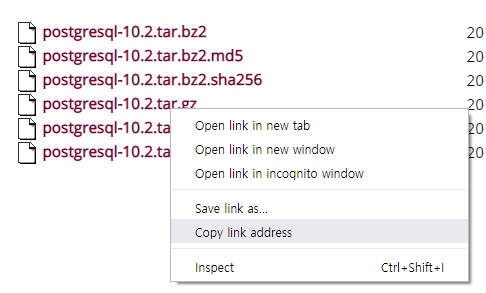
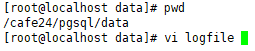
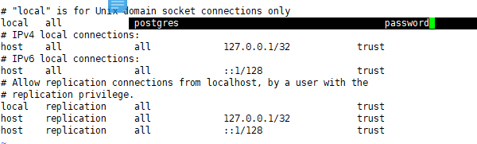
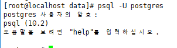
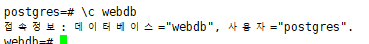
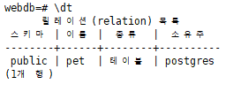
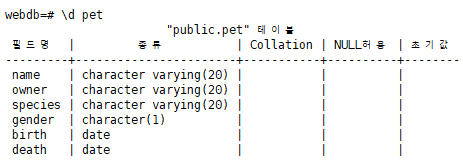
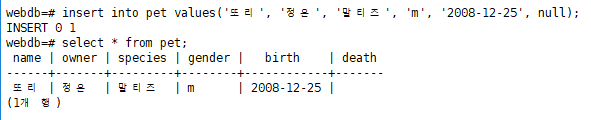
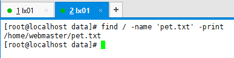

[TOC]

---

# PostgreSQL

[문서](<https://www.postgresql.org/docs/10/index.html>)

## 설치

<https://www.postgresql.org/ftp/source/v10.2/>



`wget https://ftp.postgresql.org/pub/source/v10.2/postgresql-10.2.tar.gz`

`tar xvfz postgresql-10.2`

`cd postgresql-10.2`


## 빌드 환경 구성, 빌드

`./configure
--prefix=/usr/local/cafe24/pgsql --with-python --with-openssl --enable-nls=ko`

---

#### :x:configure error - readline library not found


<https://m.blog.naver.com/lionlyloveil/220721358000>

---

`yum -y install readline-devel.x86_64`

`./configure
--prefix=/usr/local/cafe24/pgsql --with-python --with-openssl --enable-nls=ko`

---

#### :x:configure error - header file <python.h> required


---

`yum -y install python-devel`

`./configure
--prefix=/usr/local/cafe24/pgsql --with-python --with-openssl --enable-nls=ko`

성공!:o:

---

`make`

`make install`

---

## 확인


---


## postgres 계정 만들기, 권한

`adduser -M postgres`

`chown -R postgres:postgres /usr/local/cafe24/pgsql`


## 환경설정

`vi /etc/profile`

```powershell
#postgres
export POSTGRES_HOME=/usr/local/cafe24/pgsql
export PGLIB=$POSTGRES_HOME/lib
export PGDATA=$POSTGRES_HOME/data
export PATH=$PATH:$POSTGRES_HOME/bin
```

`source /etc/profile`


## 기본 database 생성

`sudo -u postgres /usr/local/cafe24/pgsql/bin/initdb -E UTF8 --locale=ko_KR.UTF-8 /usr/local/cafe24/pgsql/data`


## 실행

```
sudo -u postgres /usr/local/cafe24/pgsql/bin/pg_ctl -D /usr/local/cafe24/pgsql/data -l /usr/local/cafe24/pgsql/data/logfile start
```

`ps -ef | grep postgres`





## 종료

일단은 killall

`killall postgres`

다시 시작행


---

## 비밀번호

`psql -U postgres`

`alter user postgres with password 'postgres';`

`\q`

`vi /cafe24/pgsql/data/pg_hba.conf`



**껐다 키기**

`killall postgres`

`sudo -u postgres /usr/local/cafe24/pgsql/bin/pg_ctl -D /usr/local/cafe24/pgsql/data -l /usr/local/cafe24/pgsql/data/logfile start`

> **비밀번호 입력하고 들어가짐**
>
> 

---


---

## 기본 명령어

`\q` : 나가기

`\! {}` 리눅스 명령어 치기  -> `\! clear`

`select version(), current_DATE;`  -> 이런식으로 하면 돼

`\?`


## DB 생성

`create database webdb;`

확인 : `\l`

연결 : `\c webdb`

> 

테이블확인 : `\dt`


## table 생성

```sql
webdb=# create table pet(
webdb(# name varchar(20), 
webdb(# owner varchar(20),
webdb(# species varchar(20),
webdb(# gender char(1),
webdb(# birth date,
webdb(# death date);
CREATE TABLE
```

> 

스키마 확인 : `\d pet`

> 

테이블 삭제

```sql
webdb=# drop table pet;
DROP TABLE
```

다시 만들기

---


---

## **실습 연습**

값 넣기




`delete from pet;`


### txt파일 복사 -> 데이터 넣기




### 대소문자 구분함

`select name from pet where name like '%B%' or name like '%b%';`

`select name from pet where lower(name) like '%b%';`


### 글자 수

`select name from pet where name like '_____';`


