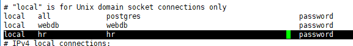
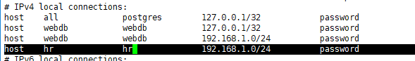
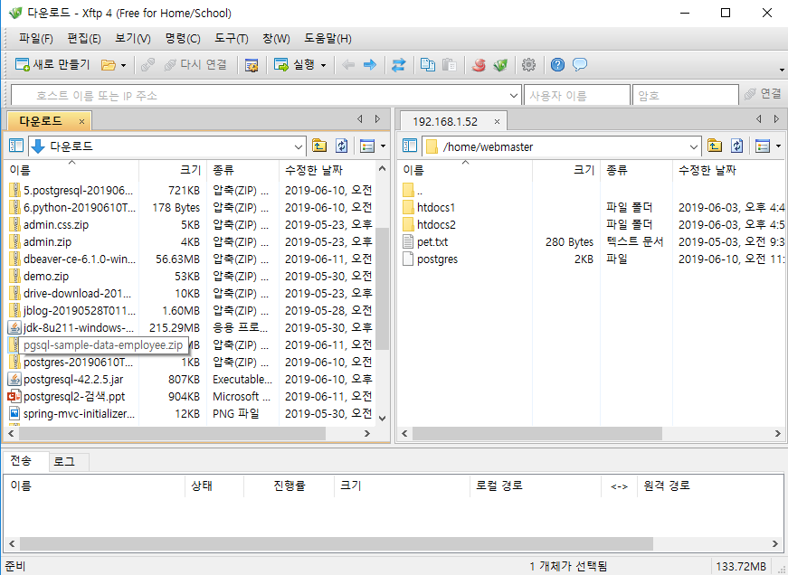
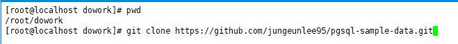
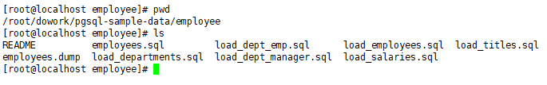
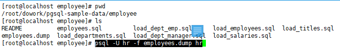
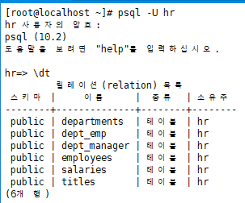
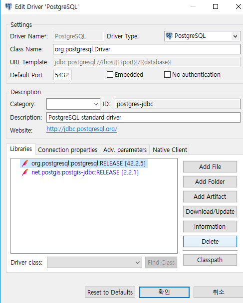
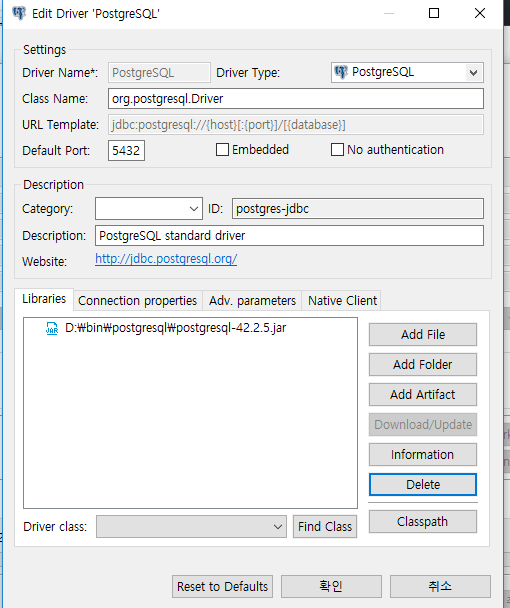

[TOC]

---

migration

mysql(hr) -> postgresql(hr)  : **pgloader(migration 툴)**

postgresql -> mysql

---

spring betch

---


**pgloader**

> <https://github.com/dimitri/pgloader>


위에꺼 연습으로 해보기

---


---

# postgresql


## 사용자 hr 생성

```
create user hr with password 'hr';
```


## db hr 생성

```
create database hr;
```


## 권한

```
grant all privileges on all tables in schema public to hr;
```


## 접속 설정

`vi /cafe24/pgsql/data/pg_hba.conf `





`/etc/init.d/postgres stop`

`/etc/init.d/postgres start`


## dump data 가져오기

1. **자료 dump data 직접 넣기**

   > 


2. **깃에서 가져오기**

`git clone <https://github.com/jungeunlee95/pgsql-sample-data`>





` psql -U hr -f employees.dump hr`



**dump 데이터 확인 !** 




## dbeaver 다운

<https://dbeaver.io/download/>

- [Windows 64 bit (zip archive)](https://dbeaver.io/files/dbeaver-ce-latest-win32.win32.x86_64.zip) 다운




Add File





