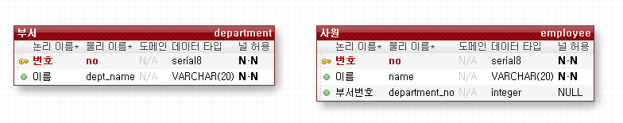

[TOC]

---

limit사용

postgresql

`select * from board order by reg_date limit 5 offset 10;`

```sql
select emp_no
from employees
order by hire_date desc
limit 5
offset 0;
```


## outer join



```sql
-- outter join
insert into department values(default, '총무팀');
insert into department values(default, '개발팀');
insert into department values(default, '인사팀');
insert into department values(default, '영업팀');

select * from department;

insert into employee values(default, '둘리', 1);
insert into employee values(default, '마이콜', 2);
insert into employee values(default, '또치', 3);
insert into employee values(default, '길동', null);

select * from employee;


-- join ~ on (inner join)
select *
  from employee a
  join department b
    on a.department_no = b.no;

-- left join (outter join)
   select a.name, coalesce(b.dept_name, '없음')
     from employee a
left join department b
       on a.department_no = b.no;
    
-- right join (outter join)
	select coalesce(a.name, '없음'), b.dept_name
      from employee a
right join department b
        on a.department_no = b.no;


-- full join (outter join, mysql/mariadb 지원 안함)
--	select a.name, b.name
--      from employee a
--  full join department b
--        on a.department_no = b.no;
```


