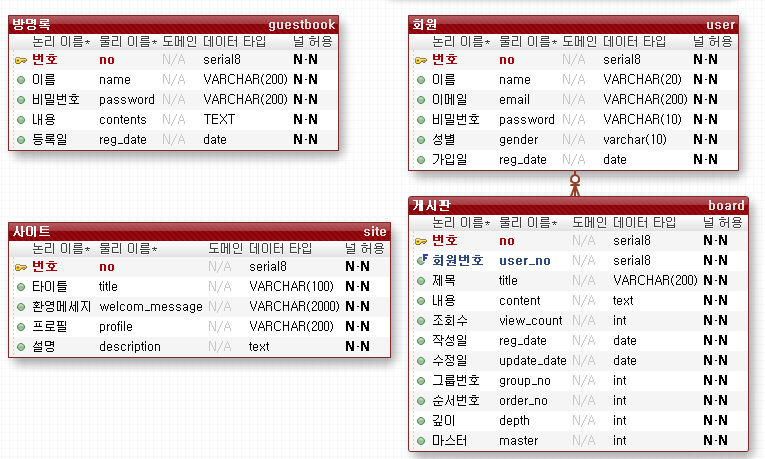
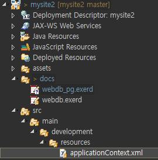
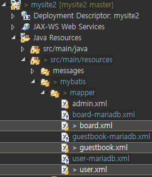
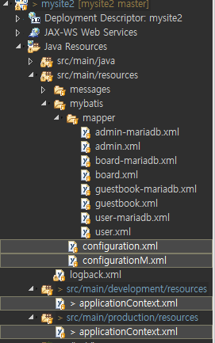
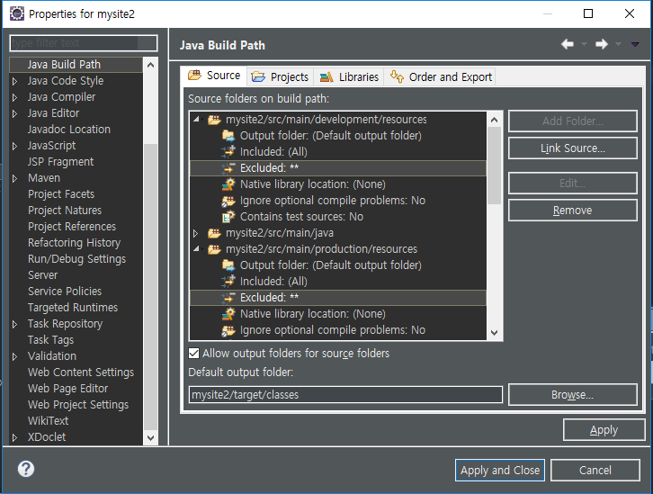
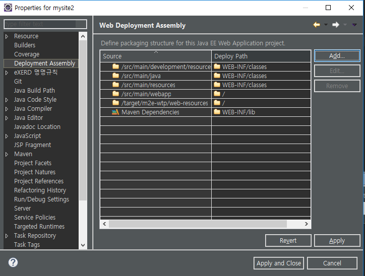
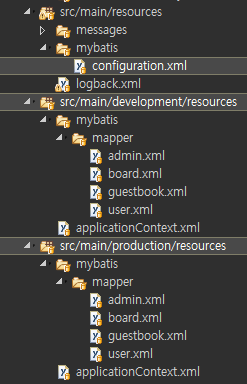

[TOC]


---

mysite -> postgresql





**pom.xml**

```xml
<!-- postgresql jdbc driver -->
<dependency>
    <groupId>org.postgresql</groupId>
    <artifactId>postgresql</artifactId>
    <version>42.2.5</version>
</dependency>
```

**applicationContext.xml**

```xml
<!-- Connection Pool DataSource -->
<bean id="dataSource"
      class="org.apache.commons.dbcp.BasicDataSource">
    <property name="driverClassName" value="org.postgresql.Driver" />
    <property name="url" value="jdbc:postgresql://192.168.1.52:5432/webdb" />
    <property name="username" value="webdb" />
    <property name="password" value="webdb" />
</bean>
```


**개발용, 배포용 mapper 수정**



---







---


# 폴더구조 다시 바꿈 :star:



---

**바로 pk 가져와야할때**

```xml
<insert id="insert" parameterType="uservo">
    <![CDATA[
  insert into users
  values(default, #{name }, #{email }, #{password }, #{gender }, 'USER', now())
 ]]>
    <selectKey keyProperty="no" resultType="long" order="AFTER">
        <![CDATA[
  select max(no) from users
 ]]>
    </selectKey>
</insert> 
```

```XML
<insert id="insert" parameterType="uservo">
    <![CDATA[
  insert into users
  values(#{no }, #{name }, #{email }, #{password }, #{gender }, 'USER', now())
 ]]>
    <selectKey keyProperty="no" resultType="long" order="BEFORE">
        <![CDATA[
  select nextval('seq_member')
 ]]>
    </selectKey>
</insert> 
```


