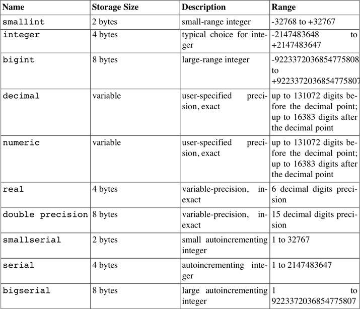
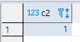
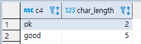
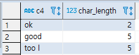
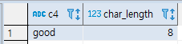
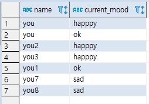
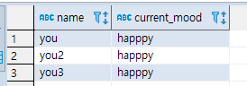
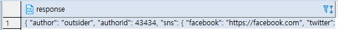
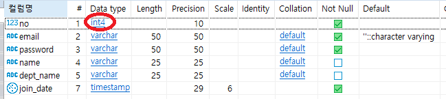
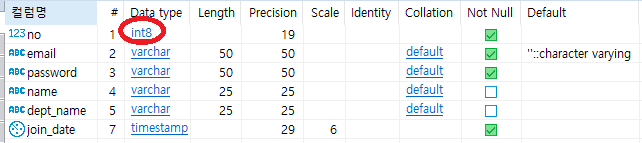

[TOC]

---

# PostgreSQL DDL




---

## serial

```sql
-- serial 
create table t1(
	c1 serial
);

insert into t1 values(default);

select * from t1;
```


---

## sequence

```sql
-- sequence
create sequence t2_seq; -- start 몇 지정 가능
create table t2(
	c2 int not null default nextval('t2_seq')
);
alter sequence t2_seq owned by t2.c2;

insert into t2 values(default);
select * from t2;
```

> 

---

## char

```sql
-- char
create table t3(
	c3 char(4)
);
insert into t3 values('ok');
select * from t3;
-- insert into t3 values('too long');
```

---

## varchar

```sql
-- varchar
create table t4(
	c4 varchar(5)
);
insert into t4 values('ok');
insert into t4 values('good             ');
-- insert into t4 values('too long');
select * from t4;

select c4, char_length(c4) from t4;
```


> 

```sql
insert into t4 values('too long'::varchar(5));
-- ::varchar(5) 만큼으로 짤림
```

> 

```sql
create table t5(
	c4 varchar(8)
);
insert into t5 values('good             ');
select c4, char_length(c4) from t5;
```



> 공백은 알아서 짤림!

---


---

## enum

```sql
-- enum
create type mood as enum('sad', 'ok', 'happpy');
create table person(
	name varchar(10),
	current_mood mood
);

insert into person values('you', 'happpy');

select * from person;
```

> 

```sql
select * from person where current_mood > 'ok';
```

> 

---


## **exception, log등을  DB에 쌓는 경우**

```sql
select '{"result":"success", "data":1}'::json;
```

> 

```sql
create table t5(
	response json
);

insert into t5 values(
'{ 
    "author": "outsider", 
    "authorId": 43434,
    "sns": { 
      "facebook": "https://facebook.com",
      "twitter": "https://twitter.com"
    },
    "createAt": "2014-06-14", 
    "category": ["pg", "tech", "dev"]
  }'
);

select * from t5;
```

> 

---


---

# 실습

## :heavy_check_mark: create

```sql
drop table member1;
-- table 생성
create table member1(
	no int,
	email varchar(50) not null default '',
	password varchar(50) not null,
	name varchar(25),
	dept_name varchar(25),
	primary key(no)	
);
```


## :heavy_check_mark: ​새 컬럼 수정

### 추가

`alter table member1 add juminbunho char(13) not null after no;`

mariadb에서는 물리적 위치도 지정 가능했지만, postgresql에선 불가능!

```sql
-- 새 컬럼 추가
alter table member1 add juminbunho char(13) not null;
alter table member1 add join_date timestamp not null;
```


### 삭제

```sql
-- 컬럼 삭제
alter table member1 drop juminbunho;
```


### 컬럼 타입 변경

마리아 : change

```sql
alter table member1 alter column no type bigint using no::bigint;
```






### not null 설정

```sql
-- not null 설정
alter table member1 alter column no set not null;
alter table member1 alter column dept_name set not null;
```

```sql
-- not null 제거
alter table member1 alter column dept_name drop not null;
```


### default seq 설정

```sql
-- default 설정
create sequence member1_seq start 10;
alter table member1 alter column no set default nextval('member1_seq');
```


### 컬럼 이름 변경

```sql
-- 컬럼 이름 변경
alter table member1 rename column dept_name to department_name;
```


### 테이블 이름 변경

```sql
-- 테이블 이름 변경
alter table member1 rename to member2;
select * from member2;
```

