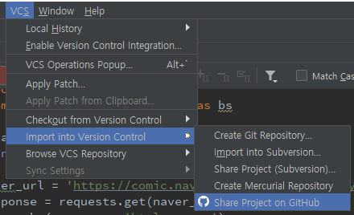

[TOC]

---

## git



---

# 파이썬 기본

## 변수이름

```python
# 변수 이름은 문자, 숫자, _로 구성
friend = 1
a = 10
my_name = '이정은'
myName = '이정은'
_yourname = '둘리'
member1 = '도우너'

# error
'''
frind$ = 1
a! = 10
1abc = 10
def = 10
print = 1
'''

# 한글 이름 변수도 사용 가능
가격 = 1000
print(가격)
```

기본 명령어 확인

```python
import keyword
print(keyword.kwlist)
```


## 치환

```python
# 여러 값 치환
a, b = 3, 5
c = d = 10
print(f'{a} {b} {c} {d}')
```

> 3 5 10 10


## 동적 타이핑

```python
a = 1
print(type(a))
a = 'hello'
print(type(a))
```

> <class 'int'>
> <class 'str'>

> a에 값이 들어가는 게 아니라, name table같은 곳에 매핑이..?


## 자료형

**접근 방법**

- 직접(Direct)           : int, float, complex, bool

- 시퀀스(Sequence)  : bytes, str, list, tuple 

  > 순서대로 index 접근 가능 : `a[0]` 

- 매핑(Mapping)       : dic

**변경 가능성**

- 변경 가능(Mutable)        : list, set, dict

- 변경 불가능(Immutable)  : int, float, complex, bool, bytes, str, tuple

**저장 모델**

- 리터럴(Literal)   : int, float, complex, bool, bytes, str

- 저장(Container) : list, tuple, dict, set


### - `bool`

```python
# literal : True, False
a = 1
print(a > 10)  		# False
print(a < 10)  		# True

b = a == 1
print(type(b)) 		# <class 'bool'>

print(b + 10)  		# 11
print(True + True)  # 2
print(a + b)   		# 2
```


### - `int`

```python
a = 23
print(type(a))
print(isinstance(a, int))

b = 0b1101
c = 0o23
d = 0x23

print(a, b, c, d)
```

> <class 'int'>
> True
> 23 13 19 35

```python
# 3.x int와 long이 합쳐졌다. (무한대 표현 범위)
e = 2 ** 1024
print(e)
print(type(e))
```

> 179769313486  ...
> <class 'int'>

```python
# 변환변수
print(oct(38))
print(hex(38))
print(bin(38))
```

> 0o46
> 0x26
> 0b100110


### - `float`

```python
a = 1.2
print(type(a))
print(isinstance(a, float))
print(a.is_integer())
```

> <class 'float'>
> True
> False

```python
b = 3e3
c = -0.2e-4

print(a, b, c)
```

> 1.2 3000.0 -2e-05

```python
a = 2.0
print(type(a))
print(a.is_integer())
```

> <class 'float'>
> True


### - `complex`

```python
a = 4 + 5j
print(type(a))
print(isinstance(a, complex))
```

><class 'complex'>
>True

```python
b = 7 - 2j
print(a + b)
print(b.real, b.imag)
```

>(11+3j)
>7.0   -2.0

```python
b = 7 - 2j
print(a + b)
print(b.real, b.imag)
```

> (11+3j)
> 7.0   -2.0


### - 산술 연산자 `arithmetic_operator`

```python
print(2 * 3)     # 6 
print(2 + 3)     # 5
print(2 - 3)     # -1
print(2 / 3)     # 0.6666666666666666
print(2 / 3.0)   # 0.6666666666666666
print(2.0 / 3) 	 # 0.6666666666666666
print(2.0 / 3.0) # 0.6666666666666666

# // 몫, ** 지수승, % 나머지
print(2 // 3)		# 0 
print(2 ** 3)		# 8
print(2 % 3)		# 2

# 몫, 나머지 동시 반환
print(divmod(2, 3)) # (0, 2)

r, l = divmod(3, 5)
print(r, l) 		# 0 3

t = divmod(3, 5)
print(t, type(t))	# (0, 3) <class 'tuple'>
```

**연산자 우선순위**

```python
print(2+3*4)
print(-2+3*4)
print(4 / 2 * 2)
print(2** 3** 4) # 2^(3^4)
```


### - 관계 연산자 `relational_operator`

```python
print(1 > 3)
print(2 < 4)
print(4 <= 5)
print(4 >= 5)
print(6 == 9)
print(6 != 9)
```

```python
# 복합 관계식
a = 6
print(0 < a < 10)
print(0 < a and a < 10)
```

> True
> True

```python
# 수치형 이외의 객체 비교
print('abcd' > 'abd')
print((1, 2, 4) < (1, 3, 1))
print([1, 3, 2] > [1, 2, 0])
```

> False
> True
> True


`==` : 동질성(객체의 값) 비교

`is` : 동일성(같은객체)

```python
a = 10
b = 20
c = a
print(a == b)
print(a is b)
print(a is c)
```


### - 논리연산자 `logical_operator`

```python
# 진리 값(True 또는 False)을 피연산자(operand)로 취해서 논리 값 계산을 한다
a = 20
print(not a < 30)
print(a < 30 and a != 30)
print(a == 30 or a > 30)
```

> False
> True
> False

```python
# bool 타입 객체의 값은 True -> 1, False -> 0 값을 가진다.
b = 10
print(True + 1) # 2
print((a < b) + 1) # 1
```

```python
# 다른 타입의 객체도 bool 타입으로 변환이 가능하다
print(bool(10), bool(0))		# True False
print(bool(3.14), bool(0.))		# True False
print(bool('abc'), bool(''))	# True False
print(bool([1, 2, 3]), bool([]))# True False
print(bool((1, 2, 3)), bool(()))# True False
print(bool({1:2}), bool({}))	# True False
print(bool(None))				# Fasle
```

```python
# 논리식의 계산 순서
print([] or 'logical')
print('logical' and 'operator')
print(None and 1)
```

> logical
> operator
> None

**활용**

```python
def f():
    print('execution !!!! ! !!! !!')
    
#if(1+2<10):
#    f()

1+2<10 and f()
```

```python
def f(msg=None):
    msg and print(msg)
s = 'hello world'
f()
f("실행")
```

> 실행


### - 비트 연산자 `bitwise_operator`

```python
# ~ 연산자			
print(~5)			# -6
print(~-1)			# 0

# << 연산자
a = 3				
print(a << 2)		# 12

# >> 연산자
a = 4
print(a >> 1)		# 2
a = -4	
print(a >> 1)		# -2

# bit and
a = 3
print(a & 2)		# 2
print(a | 8)		# 11
print(0x0f ^ 0x06)	# 9
```

> `~5`
>
> `5` : 0000 0101
>
> `not 5` : 1111 1010
>
> `6` : 0000 0110
>
> 6의 1의보수 : 1111 1001
>
> 6의 2의보수 : 1111 1010
>
> > 컴터는 음수를 2의 보수를 이용해 표현

