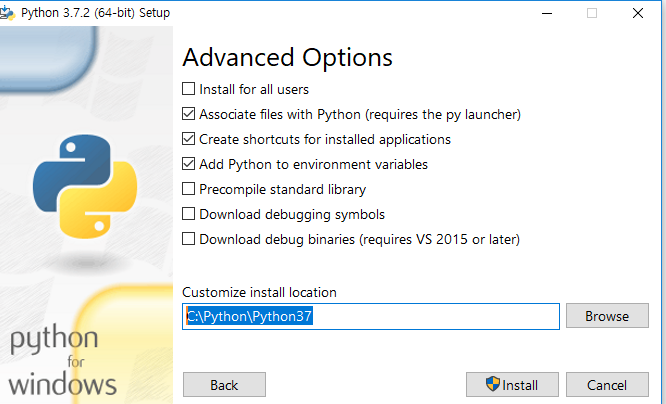
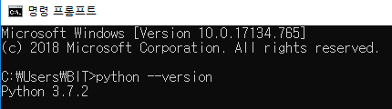
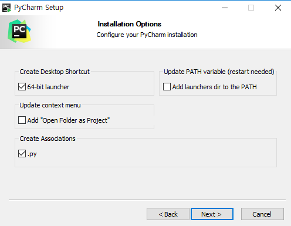
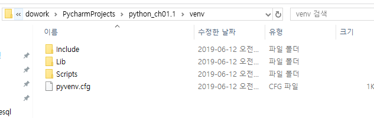

[TOC]

---

# 들어가기 전

Python 큰 활용분야

1. Web Programming
2. Data Analysis(NumPy, pandas) -> ML, DL
3. System Tool (shell script)


# 설치

```
1. 기존 파이썬 지우기
2. pycharm 지우기
3. python download
4. pycharm download
```

---

## python

https://www.python.org/downloads/release/python-373/

> - Download [Windows x86-64 executable installer](https://www.python.org/ftp/python/3.7.2/python-3.7.2-amd64.exe)








## pycharm 설치





---


> Virtualenv
>
> > location에 base interpreter를 복사할거야
>
> 프로젝트 별로 venv 밑에 /python/ptrhon37/* 등 라이브러리들이 복사됨
>
> 
>
> 프로젝트 별로 환경을 따로 나누는 것
>
> 이 환경을 가지고 씀
>
> 


