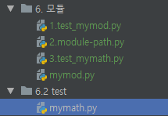
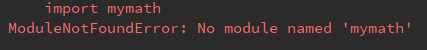
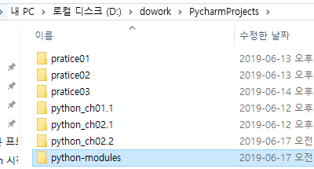
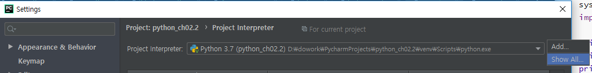
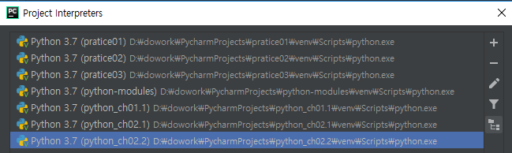
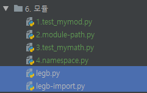

[TOC]

# module

**mymod.py**

```python
def add(a, b):
    return a + b

def subtract(a, b):
    return a - b

def multiply(a, b):
    return a * b

def divide(a, b):
    return a / b
```

**2.test_mymod.py**

```python
import mymod

print(mymod.add(10, 20))
print(mymod.subtract(10, 20))
print(mymod.multiply(10, 20))
print(mymod.divide(10, 20))
```

> ```
> 30
> -10
> 200
> 0.5
> ```

---


---

## path

**mymath.py**

```python
pi = 3.14
def add(a, b):
    return a + b
def area_circle(r):
    return r * r * pi
```

**test_mymath.py**

```python
import mymath

print(mymath.pi)
print(mymath.add(10, 20))
print(mymath.area_circle(10))
```

> 
>
> 


**절대경로 지정**

```python
import sys

sys.path.append('/dowork/PycharmProjects/python_ch02.2/6.2 test')
import mymath

print(mymath.pi)
print(mymath.add(10, 20))
print(mymath.area_circle(10))
```

> ```
> 3.14
> 30
> 314.0
> ```


**상대경로 지정**

```python
import sys
sys.path.append('../6.2 test')
import mymath

print(mymath.pi)
print(mymath.add(10, 20))
print(mymath.area_circle(10))
```


**다른 project 파일 import하기**








```python
import mymath

print(mymath.pi)
print(mymath.add(10, 20))
print(mymath.area_circle(10))
```


## namespace

```python
import math
import sys

sys.path.append('../6.2 test')
import mymath

pi = 3.141
print(mymath.pi)
print(math.pi)
print(pi)
```

> 3.14
> 3.141592653589793
> 3.141


### 네임스페이스가 주어지지 않은 변수나 함수는 LEGB 규칙에 따라 찾게 된다. 

Local -> E -> Global -> B

**legb.py**

```python
a = 1 # G
def f():
    b = 200 # E
    print("f() a : ", a)
    def g():
        b = 100 # L
        print("g() b : ", b)
    g()
    print("f() b : ", b)
    pass

f()
```

> ```
> f() a :  1
> g() b :  100
> g() __name__ :  __main__
> f() b :  200
> ```
>
> `__name__`: 모듈 name : 자기 자신은 `__main__`


**legb-import.py** 

```python
import legb

legb.f()
```

> ```
> f() a :  1
> g() b :  100
> g() __name__ :  legb
> f() b :  200
> f() a :  1
> g() b :  100
> g() __name__ :  legb
> f() b :  200
> ```

> `__name__`: 모듈 name : import 부르면 파일 네임!


**legb.py 에 추가**

```python
if __name__ == '__main__':
    f()
```

> 나한테서 실행 안하고 import당했을 때는 실행 안한다!


## import

```python
# import math
# print(math.sin(math.pi/6), math.cos(math.pi/3), math.tan(math.pi/4))

from math import pi, sin, cos, tan
print(sin(pi/6), cos(pi/3), tan(pi/4))
```


**현재 모듈에 특정 이름이 중복되는 경우 맨 마지막이 덮어 쓰게 된다.**

```python
from math import pi, sin, cos, tan
from mymath import pi
print(sin(pi/6), cos(pi/3), tan(pi/4))
```


**모듈 내 이름(변수, 함수, 클래스)을 다른 이름으로 사용하는 것도 가능하다.**

```python
from math import sin as mysin, cos as mycos, tan as mytan
import mymath as m
print(mysin(m.pi / 6), mycos(m.pi / 3), mytan(m.pi / 4))
```


### 내장 변수 `__name__` 과 모듈 이름 “__main__”

**modulename.py**

```python
import mymod

print('modulename.py의 모듈 이름 : ' + __name__)
print(mymod.add(10, 20))
```

**mymod.py**

```python
def add(a, b):
    return a + b

def subtract(a, b):
    return a - b

def multiply(a, b):
    return a * b

def divide(a, b):
    return a / b

def main():
    print("mymod.py : 최상위 모듈(독립실행)시 출력된다!")

if __name__ == '__main__':
    main()
else:
    print('mymod.py의 모듈 이름 : ' + __name__)
```

> modulename.py실행
>
> ```
> modulename.py의 모듈 이름 : mymod
> modulename.py의 모듈 이름 : __main__
> 30
> ```
>
> mymod.py 실행
>
> ```
> 최상위 모듈(독립실행)시 출력된다!
> ```


### dynamic import

**7.import_dynamic**

```python
import sys

# sys.path.append('D:\dowork\PycharmProjects\python-modules')
m = __import__('mymath')

print(m.pi)
print(m.add(10,20))
```

> ```
> 3.14
> 30
> ```


# 모듈의 공유

**mymod2.py**

```python
import mymod

def main():
    print('mymod2.py : 최상위 모듈(독립실행)시, 출력됩니다.')

def power(x, y):
    r = 1
    for i in range(y):
        r = mymod.multiply(r, x)
    return r

if __name__ == '__main__':
    main()
else:
    print('모듈 이름 : ' + __name__)
```

> ```
> mymod.py의 모듈 이름 : mymod
> mymod2.py : 최상위 모듈(독립실행)시, 출력됩니다.
> ```


**test-mymod2.py**

```python
import mymod
import mymod2

print(mymod.add(10,20))
print(mymod.subtract(10,20))
print(mymod.multiply(10,20))
print(mymod.divide(10,20))
print(mymod2.power(10,20))
```


---


# mod infinite

**mod_a.py**

```python
# module: mod_a.py

import mod_b

print('module name : ' + __name__)
```

> ```
> module name : mod_a
> module name : mod_b
> module name : __main__
> ```

**mod_b.py**

```python
# module: mod_b.py

import mod_a

print('module name : ' + __name__)
```

> ```
> module name : mod_b
> module name : mod_a
> module name : __main__
> ```

**mod_infinite.py**

```python
import mod_a

print('import infinite')
```

> ```
> module name : mod_b
> module name : mod_a
> import infinite
> ```

```python
for key in sys.modules.keys():
    print(key)
```


# module - attr

```python
'''
파이썬 변수, 함수, 클래스는
각각 자신이 정의된 모듈의 이름이
저장된 __module__ 속성을 가지고 있다.
'''

from math import sin
from mymath import add
from cmd import Cmd

print(sin.__module__)
print(add.__module__)
print(Cmd.__module__)

```

> ```
> math
> mymath
> cmd
> ```


