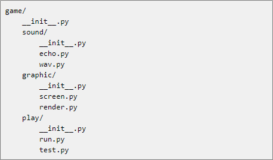
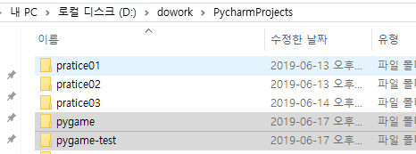
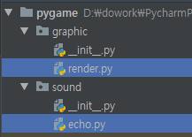
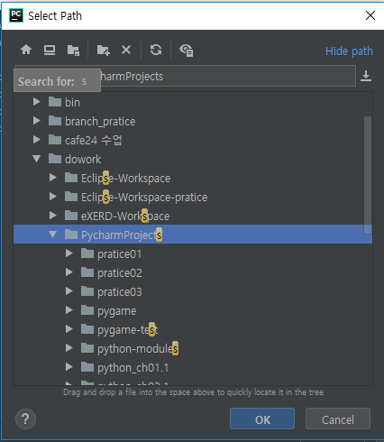
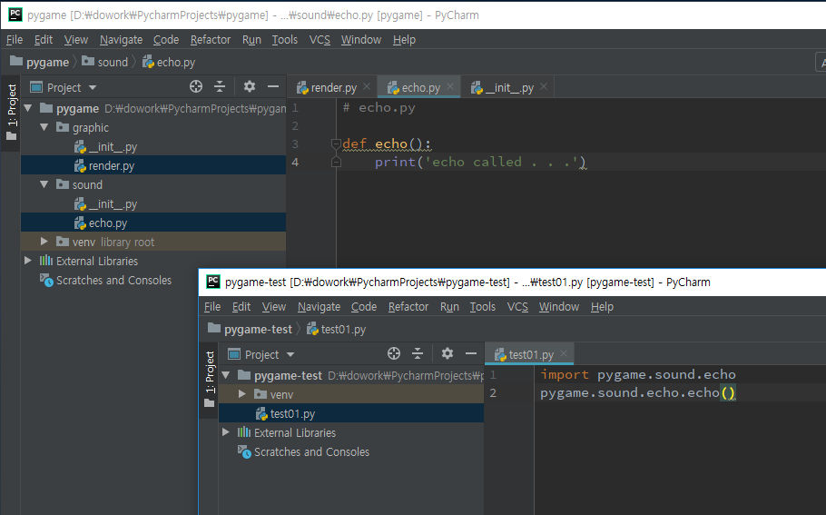
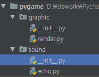
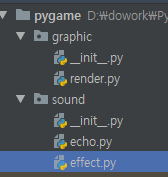
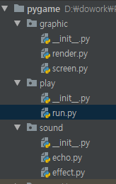

[TOC]

# :package: 패키지

  1) 모듈을 모아놓은 단위

  2) 관련된 여러 개의 모듈을 계층적인 디렉토리로 분류해서 저장하고 관리한다.

  3) 도트(.)을 이용하여 관리할 수 있다.  A.b 인 경우 A는 패키지가 되고 b는 모듈이 된다.

  4) 파이썬 패키지는 디렉토리와 파이썬 모듈로 이루어지며 구조는 보통 다음과 같다.

>  	game, sound, graphic, play 는 디렉토리이고  .py 파일이 파이썬 모듈이다.

> ​     `__init__.py` 는 패키지를 인식시켜주는 역활을 하는 파일로 특정 디렉토리가 패키지로 인식되기 위해 필요한 파일이다.







# 1 pygame(project) - library




# 2 pygame-test(project)

path 조건 => 최상위 디렉토리를 잡아주면 됨!!




**test01.py**

`from module(py) import func-name`

```python
import pygame.sound.echo
pygame.sound.echo.echo()
```


**test02.py**

`from package import module`

```python
from pygame.sound import echo
echo.echo()
```


**test03.py**

```python
from pygame.sound.echo import echo
echo()
```


---

## :heavy_check_mark: package import

**test04.py**

```python
import pygame.sound
pygame.sound.echo.echo()
```

> ## e​r​ror​ :x:


`pggame/sound/__init__.py`  

```python
from . import echo
```

 이제 error안남


**test05.py**

```python
from pygame.sound import *

echo.echo()
```


---

### `__all__`



**pygame/sound/`__init__.py`**

```python
__all__ = ['effect', 'echo']
# from . import echo
```


**pygame-test/test05.py**

```python
from pygame.sound import *

echo.echo()
effect.effect()
```

> ```
> echo called . . .
> effect called . . .
> ```


## 같은 위치 모듈 import

**pygame/graphic/screen.py**

```python
# screen.py
from . import render

def screen():
    print('screen called . . .')
    render.render()
```


---


## 내부 import != 외부 import

**pygame/play/run.py** 

```python
# run.py
from graphic import screen
from sound import echo

def start():
    screen.screen()
    echo.echo()

start()
```


외부에서 쓸때는 import 경로 바꿔야함

```python
# run.py
# from graphic import screen
# from sound import echo

from ..graphic import screen
from ..sound import echo

def start():
    screen.screen()
    echo.echo()
```


**pygame-test/test06.py**

```python
from pygame.play import run

run.start()
```

---


---

## alias

**pygame/graphic/`__init__`.py**

```python
from .render import render
```

**pygame-test/test07.py**

```python
import pygame.graphic as pg

pg.render()
```

