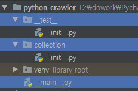
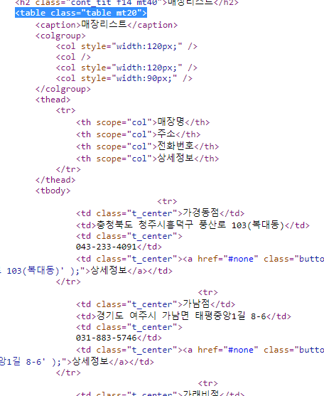
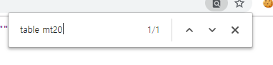
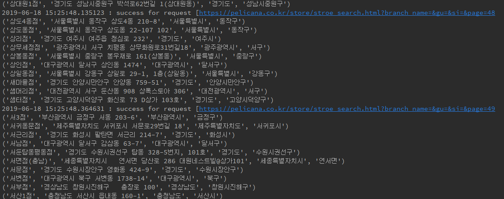

[TOC]

---

# Python Crawling 시작!

python_crawler project

> 

`pip install beautifulsoup4`

---


---

# beautifulsoup test :desktop_computer:

**[test_bs4.py]**

```python
bs = BeautifulSoup(html, 'html.parser')
print(bs)
print(type(bs))
```

> ```
> <td class="title">
> <div class="tit3">
> <a href="/movie/bi/mi/basic.nhn?code=161967" title="기생충">기생충</a>
> </div>
> </td>
> <class 'bs4.BeautifulSoup'>
> ```


## :heavy_check_mark: [1] tag 조회

```python
bs = BeautifulSoup(html, 'html.parser')
tag = bs.td
print(tag)
print(type(tag))
```

> ```
> <td class="title">
> <div class="tit3">
> <a href="/movie/bi/mi/basic.nhn?code=161967" title="기생충">기생충</a>
> </div>
> </td>
> <class 'bs4.element.Tag'>
> ```


```python
tag = bs.div
print(tag)

tag = bs.a
print(tag)
```

> ```
> <div class="tit3">
> <a href="/movie/bi/mi/basic.nhn?code=161967" title="기생충">기생충</a>
> </div>
> 
> <a href="/movie/bi/mi/basic.nhn?code=161967" title="기생충">기생충</a>
> ```


```python
tag = bs.td.div
print(tag)
```

> ```
> <div class="tit3">
> <a href="/movie/bi/mi/basic.nhn?code=161967" title="기생충">기생충</a>
> </div>
> ```


## :heavy_check_mark: [2] attribute 값 가져오기

```python
tag = bs.td
print(tag['class'])
```

> ```
> ['title']
> ```


```python
tag = bs.a
print(tag['href'])
```

> ```
> /movie/bi/mi/basic.nhn?code=161967
> ```


```python
tag = bs.div
# 에러 : 없는 속성은 error
# print(tag['id'])
print(tag.attrs)
```

> ```
> {'class': ['tit3']}
> ```


## :heavy_check_mark: [3] attribute로 element 조회

```python
tag = bs.find('td', attrs={'class':'title'})
print(tag)
```

> ```
> <td class="title">
> <div class="tit3">
> <a href="/movie/bi/mi/basic.nhn?code=161967" title="기생충">기생충</a>
> </div>
> </td>
> ```


```python
tag = bs.find(attrs={'class':'tit3'})
print(tag)
```

> ```
> <div class="tit3">
> <a href="/movie/bi/mi/basic.nhn?code=161967" title="기생충">기생충</a>
> </div>
> ```

---

# 

------

# Naver 영화 랭킹 분석 :movie_camera:

**[test_naver_movie_rank.py]**

`http://movie.naver.com/movie/sdb/rank/rmovie.nhn`

## :bookmark_tabs: Elements 분석 

> 

```html
<tbody>
    <tr><td colspan="8" class="blank01"></td></tr>
    <tr>
        <td class="ac"></td>
        <td class="title">
            <div class="tit3">
                <a href="/movie/bi/mi/basic.nhn?code=161967" title="기생충">기생충</a>
            </div>
        </td>
        <!-- 평점순일 때 평점 추가하기  -->  
        <!----------------------------------------->  
        <td class="ac"></td>
        <td class="range ac">0</td>
    </tr>
```

> 영화 제목 : `<div class="tit3">` 의 `<a>`의 `text`에 있네!?


## :bookmark_tabs: ​get 방식으로 가져오기

**test_naver_movie_rank.py**

```python
request = Request("https://movie.naver.com/movie/sdb/rank/rmovie.nhn?sel=cnt&date=20190617")
response = urlopen(request)
html = response.read().decode('cp949')
print(html)
```

> html 가져와지고
>
> BeautifulSoup 사용

```python
bs = BeautifulSoup(html, 'html.parser')
# print(bs.prettify()) # 예쁘게(들여쓰기) 출력

divs = bs.findAll('div', attrs={'class':'tit3'})
print(divs)
```

> ```
> [<div class="tit3">
> <a href="/movie/bi/mi/basic.nhn?code=161967" title="기생충">기생충</a>
> </div>, <div class="tit3">
> <a href="/movie/bi/mi/basic.nhn?code=163788" title="알라딘">알라딘</a>
> </div>, <div class="tit3">
> <a href="/movie/bi/mi/basic.nhn?code=97631" title="맨 인 블랙: 인터내셔널">맨 인 블랙: 인터내셔널</a>
> </div>,
> ... ]
> ```


```python
for rank, div in enumerate(divs, start=1):
    print(rank, div.a.text, 'https://movie.naver.com/'+div.a['href'], sep=" : ")
```

> ```
> 1 : 기생충 : https://movie.naver.com//movie/bi/mi/basic.nhn?code=161967
> 2 : 알라딘 : https://movie.naver.com//movie/bi/mi/basic.nhn?code=163788
> 3 : 맨 인 블랙: 인터내셔널 : https://movie.naver.com//movie/bi/mi/basic.nhn?code=97631
> 4 : 엑스맨: 다크 피닉스 : https://movie.naver.com//movie/bi/mi/basic.nhn?code=164125
> 5 : 0.0MHz : https://movie.naver.com//movie/bi/mi/basic.nhn?code=177371
> 6 : 천로역정: 천국을 찾아서 : https://movie.naver.com//movie/bi/mi/basic.nhn?code=183836
> ...
> ```

#  


> BBQ는 매장정보가 위도, 경도가 필요
>
> 그만한 노력까지 해서 크롤링 하는 것은 오히려 시간낭비라 생각해서 생략

------

# 페리카나 매장 정보 크롤링 :poultry_leg:

`https://pelicana.co.kr/store/stroe_search.html?branch_name=&gu=강릉시&si=강원도&page=1`

`https://pelicana.co.kr/store/stroe_search.html`

`[__main__.py]`

```python
def crawling_pelicana():
    url = 'https://pelicana.co.kr/store/stroe_search.html?branch_name=&gu=&si=&page=1'
    request = Request(url)

    # CERTIFICATE_VERIFY_FAILED 에러 해결
    # context = ssl._create_unverified_context()
    # response = urlopen(request, context=context)

    # 위 아래 둘 중 하나로 해결 가능!

    ssl._create_default_https_context = ssl._create_unverified_context
    response = urlopen(request)

    receive = response.read()
    html = receive.decode('utf-8')
	
    print(html)
```

> ```error
> Traceback (most recent call last):
>   File "D:/dowork/PycharmProjects/python_crawler/__main__.py", line 30, in <module>
>     crawling_pelicana()
>   File "D:/dowork/PycharmProjects/python_crawler/__main__.py", line 19, in crawling_pelicana
>     html = receive.decode('utf-8')
> UnicodeDecodeError: 'utf-8' codec can't decode byte 0xbd in position 11634: invalid start byte
> ```

:point_right: `html = receive.decode('utf-8', errors='replace')` 로 해결!


## :heavy_check_mark: 매장 elements 분석


**tr을 통째로 가져오기가.. 마땅하지 않다..**



> table의 `class="table mt20"` 속성을 가져올까?
>
> 마침 하나밖에 없네!?
>
> 
>
> table의 tbody의 tr을 가져오면 되겠다!


## :heavy_check_mark: 매장정보 크롤링

```python
url = 'https://pelicana.co.kr/store/stroe_search.html?branch_name=&gu=&si=&page=1'
request = Request(url)

ssl._create_default_https_context = ssl._create_unverified_context
response = urlopen(request)

receive = response.read()
html = receive.decode('utf-8', errors='replace')

bs = BeautifulSoup(html, 'html.parser')
```

### **- 방법 1**

```python
# ---- 1
trs = bs.table.findAll("tr")
for i in range(1, len(trs) - 1):
    td = trs[i].findAll('td')
    title = td[0].text
    addr = td[1].text
    call = td[2].text.strip()
    sidogu = addr.split()[:2]
    print(f'가게 이름: {title}, 주소: {addr}, 전화번호: {call}, 시도구 : {sidogu[0], sidogu[1]}')
    print("--------------------------------")
```


### **- 방법 2**

```python
# ---- 2
tag_table = bs.find('table', attrs={'class': 'table mt20'})
tag_tbody = tag_table.find('tbody')
tags_tr = tag_tbody.findAll('tr')

results = []
for tag_tr in tags_tr:
    strings = list(tag_tr.strings)
    name = strings[1]
    address = strings[3]
    sidogu = address.split()[:2]
    results.append((name, address) + tuple(sidogu))

    for t in results:
        print(t)
```


### + 통신 부분 try~except 묶기

### + 끝 검출

### + for i in count()  : 시작 결정, 끝이 없을 때 까지!

```python
import ssl
import sys
from datetime import datetime
from itertools import count
from urllib.request import Request, urlopen
from bs4 import BeautifulSoup

def crawling_pelicana():
    for page in count(113):
        url = 'https://pelicana.co.kr/store/stroe_search.html?branch_name=&gu=&si=&page=%d' % page

        try:
            request = Request(url)
            
            ssl._create_default_https_context = ssl._create_unverified_context
            response = urlopen(request)

            receive = response.read()
            html = receive.decode('utf-8', errors='replace')
            # print(html)
            print(f'{datetime.now()} : success for request [{url}')
        except Exception as e:
            print('%s : %s' % (e, datetime.now()), file=sys.stderr)

        bs = BeautifulSoup(html, 'html.parser')

        # ---- 2
        tag_table = bs.find('table', attrs={'class': 'table mt20'})
        tag_tbody = tag_table.find('tbody')
        tags_tr = tag_tbody.findAll('tr')

        results = []

        # 끝 검출
        if len(tags_tr) == 0:
            break
        for tag_tr in tags_tr:
            strings = list(tag_tr.strings)
            name = strings[1]
            address = strings[3]
            sidogu = address.split()[:2]
            results.append((name, address) + tuple(sidogu))

        for t in results:
            print(t)


if __name__ == '__main__':
    # pelicana
    crawling_pelicana()

```

> 

> 

---


# 

# 크롤링 data 파일로 저장 :open_file_folder:

## PANDAS!!!

`pip install pandas`

import : pandas는 as pd를 씀! 관례야! `import pandas as pd`


```python
# store
table = pd.DataFrame(results, columns=['name', 'address', 'sido', 'gu'])
table.to_csv('__results__/pelicana.csv', encoding='utf-8', mode='a', index=0)
```

> 


#  

#  :star:전체코드:star:

`__main__`.py

```python
import ssl
import sys
from datetime import datetime
from itertools import count
from urllib.request import Request, urlopen

import pandas as pd
from bs4 import BeautifulSoup


def crawling_pelicana():
    results = []
    for page in count(start=113):
        url = 'https://pelicana.co.kr/store/stroe_search.html?branch_name=&gu=&si=&page=%d' % page

        try:
            request = Request(url)

            # CERTIFICATE_VERIFY_FAILED 에러 해결
            # context = ssl._create_unverified_context()
            # response = urlopen(request, context=context)

            # 위 아래 둘 중 하나로 해결 가능!

            ssl._create_default_https_context = ssl._create_unverified_context
            response = urlopen(request)

            receive = response.read()
            html = receive.decode('utf-8', errors='replace')
            # print(html)
            print(f'{datetime.now()} : success for request [{url}')
        except Exception as e:
            print('%s : %s' % (e, datetime.now()), file=sys.stderr)
            continue


        bs = BeautifulSoup(html, 'html.parser')


        # # ---- 1
        # trs = bs.table.findAll("tr")
        # for i in range(1, len(trs) - 1):
        #     td = trs[i].findAll('td')
        #     title = td[0].text
        #     addr = td[1].text
        #     call = td[2].text.strip()
        #     sidogu = addr.split()[:2]
        #     print(f'가게 이름: {title}, 주소: {addr}, 전화번호: {call}, 시도구 : {sidogu[0], sidogu[1]}')
        #     print("--------------------------------")

        # ---- 2
        tag_table = bs.find('table', attrs={'class': 'table mt20'})
        tag_tbody = tag_table.find('tbody')
        tags_tr = tag_tbody.findAll('tr')

        # 끝 검출
        if len(tags_tr) == 0:
            break
        for tag_tr in tags_tr:
            strings = list(tag_tr.strings)
            name = strings[1]
            address = strings[3]
            sidogu = address.split()[:2]
            results.append((name, address) + tuple(sidogu))

        # for t in results:
        #     print(t)

    # store
    table = pd.DataFrame(results, columns=['name', 'address', 'sido', 'gu'])
    # print(table)
    table.to_csv('__results__/pelicana.csv', encoding='utf-8', mode='w', index=0)

if __name__ == '__main__':
    # pelicana
    crawling_pelicana()

```


#  

# 네네치킨 매장 정보 크롤링 :poultry_leg:

```python
results = []
for page in count(start=1):
    try:
        url = 'https://nenechicken.com/17_new/sub_shop01.asp?ex_select=1&ex_select2=&IndexSword=&GUBUN=A&page=%d' % page
        request = Request(url)
        response = urlopen(request)

        receive = response.read()
        html = receive.decode('utf-8')

        print(f'{datetime.now()} : success for request [{url}')
        except Exception as e:
            print('%s : %s' % (e, datetime.now()), file=sys.stderr)
            continue

            bs = BeautifulSoup(html, 'html.parser')

            divs = bs.select('.shopWrap > .shop')
            for info in divs:
                info_list = info.select('td')
                name = info_list[0].select('.shopName')[0].text
                addr = info_list[0].select('.shopAdd')[0].text
                sidogu = addr.split()[:2]
                call = info_list[1].a['href'].split(':')[1]
                results.append((name, addr, call) + tuple(sidogu))

                if len(divs) != 24 :
                    break
                    # store
                    table = pd.DataFrame(results, columns=['name', 'address','tel', 'sido', 'gu'])
                    table.to_csv('__results__/nene.csv', encoding='utf-8', mode='w', index=0)
```

