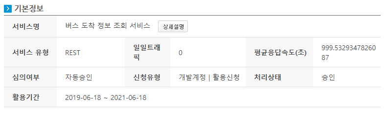
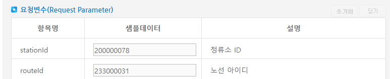
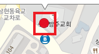
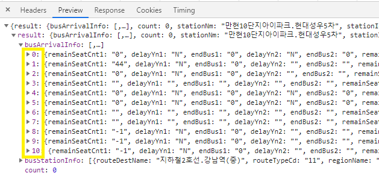
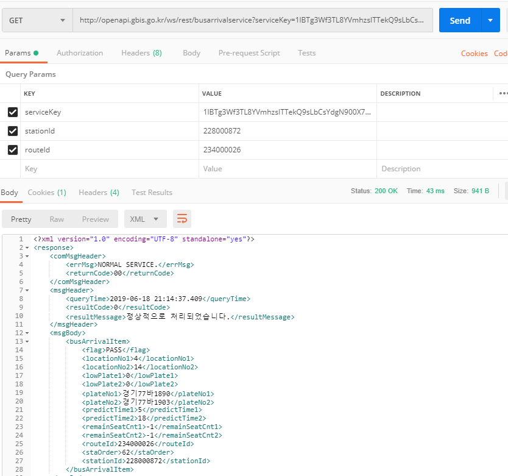
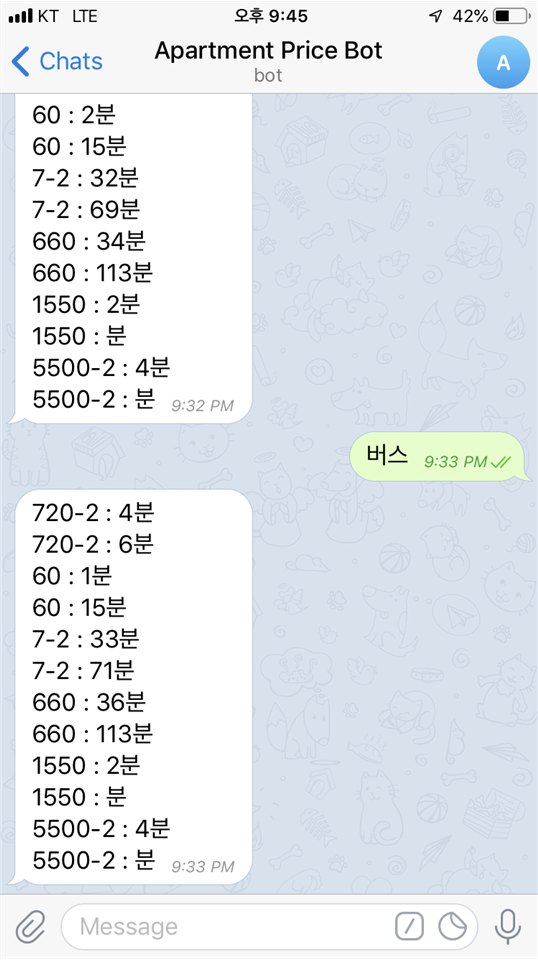

[TOC]

---

# 잠시후 도착 버스 확인 :bus:

활용 API : 공공데이터포털 > [버스도착정보조회서비스](<https://www.data.go.kr/dataset/15000175/openapi.do>)

> 


url 요청시 필수 파라미터 3가지

1. serviceKey
2. stationId
3. routeId

> 


stationid와 routeid를 한참 찾아 해매다가(2시간정도 고생).. 아주 쉽게 찾는 법을 발견했다!!

[경기버스정보](http://www.gbis.go.kr)에서 내가 찾고자하는 정류소를 입력 후

`http://www.gbis.go.kr/gbis2014/schBus.action?cmd=mainSearchText&searchText=만현10단지아이파크.현대성우5차`

해당 정류소 아이콘을 누르면   

개발자모드 network tab의 schBusAPl.action에서 쉽게 찾을 수 있다





# 포스트맨으로 실험하니 성공! :orange_book:




# :one: - Test Code

```python
def find_bus():
    route_list = {
        '234000026':'720-2',
        '241420004':'82',
        '241420009':'99',
        '234000316':'60',
        '200000040':'7-2',
        '241420006':'82-1',
        '234000027':'6900',
        '234000046':'660',
        '234000047':'720',
        '234000136':'1550',
        '234000148':'5500-2'
    }

    for routeId, busNo in route_list.items():
        serviceKey = key값
        stationId='228000872'
        routeId=str(routeId)
        url = "http://openapi.gbis.go.kr/ws/rest/busarrivalservice?serviceKey={}&stationId={}&routeId={}".format(serviceKey, stationId,routeId)

        request = Request(url)

        response = urlopen(request)

        receive = response.read()
        html = receive.decode('utf-8', errors='replace')
        bs = BeautifulSoup(html, 'html.parser')

        if bs.resultmessage.text == '정상적으로 처리되었습니다.':
            print(busNo, ' : ', bs.predicttime1.text)
            print(busNo, ' : ', bs.predicttime2.text)


if __name__ == '__main__':
    find_bus()
```

> ```
> 720-2  :  3
> 720-2  :  15
> 60  :  12
> 60  :  29
> 7-2  :  51
> 7-2  :  91
> 660  :  42
> 660  :  127
> ```


# :two: - Telegram에 적용

aws의 cloud9활용

```python
from flask import Flask, request, render_template
import requests
import time
import json
import os
from bs4 import BeautifulSoup as bs

app = Flask(__name__)
TELEGRAM_TOKEN = os.getenv('TELEGRAM_TOKEN')
TELEGRAM_URL = 'https://api.hphk.io/telegram'

@app.route('/{}'.format(os.getenv('TELEGRAM_TOKEN')), methods=['POST'])
def telegram() :
    # 텔레그램으로부터 요청이 들어 올 경우, 해당 요청을 처리하는 코드
    #print(request.get_json()["message"]["from"]["id"])
    #print(request.get_json()["message"]["text"])
    response = request.get_json()
    
    """
    {'update_id': 693359414, 'message': {'message_id': 22, 'from': {'id': 748290634, 
    'is_bot': False, 'first_name': 'Jungjung', 'language_code': 'ko'}, 'chat': {'id': 748290634, 
    'first_name': 'Jungjung', 'type': 'private'}, 'date': 1545292109, 'text': '하이하이'}}
    """
    chat_id = response["message"]["from"]["id"]
    txt = response["message"]["text"]

    if(txt == '안녕'):
        msg = "존댓말."
    elif txt == '버스':
        route_list = {
            '234000026':'720-2',
            '241420004':'82',
            '241420009':'99',
            '234000316':'60',
            '200000040':'7-2',
            '241420006':'82-1',
            '234000027':'6900',
            '234000046':'660',
            '234000047':'720',
            '234000136':'1550',
            '234000148':'5500-2'
        }
        results = []
        for routeId, busNo in route_list.items():
            serviceKey = '1lBTg3Wf3TL8YVmhzsITTekQ9sLbCsYdgN900X7wl5kwx70UMdmKHTl60QPh%2B%2FiSVHn7fJjI99CinyOkZy6gRg%3D%3D'
            stationId='228000872'
            routeId=str(routeId)
            url = "http://openapi.gbis.go.kr/ws/rest/busarrivalservice?serviceKey={}&stationId={}&routeId={}".format(serviceKey, stationId,routeId)
    
            response = requests.get(url).text

            bss = bs(response, 'html.parser')
    
            if bss.resultmessage.text == '정상적으로 처리되었습니다.':
                print(busNo, ' : ', bss.predicttime1.text)
                print(busNo, ' : ', bss.predicttime2.text)
                results.append([busNo, bss.predicttime1.text])
                results.append([busNo, bss.predicttime2.text])
        msg = ''
        for i in results:
            msg += '{} : {}분\n'.format(i[0], i[1])
            
    elif(txt == '안녕하세요') :
        msg = "넹"
        
    elif(txt == '환율') :
        url = 'http://info.finance.naver.com/marketindex/exchangeList.nhn'
        response = requests.get(url).text
        soup = bs(response, 'html.parser')
        soup = soup.find_all("td", {"class":{"tit", "sale"}})
        
        exchanges={}
        for i in range(88):
            if(i == 0 or i % 2 == 0):
                exchanges['국가'] = soup[i].text 
            elif(i % 2 == 1) :
                exchanges['환율'] = soup[i].text
        #print(exchanges)
        #print(exchanges[0])
        #print(exchanges[1]["cost"])

        for i in range(len(exchanges)):
            msg += ', '.join("{} = {}".format(key, val) for (key, val) in exchanges.items())
            
    else:
        msg = '등록되지 않은 메세지입니다.'

    url = 'https://api.hphk.io/telegram/bot{}/sendMessage'.format(TELEGRAM_TOKEN)

    requests.get(url, params = {"chat_id" : chat_id, "text" : msg})

    return '', 200
    
    
@app.route('/set_webhook')    # alert창 띄우기 
def set_webhook():
    url = TELEGRAM_URL + '/bot' + TELEGRAM_TOKEN + '/setWebhook'
    params = {
        'url' : 'https://sspy-week2-juneun.c9users.io/{}'.format(TELEGRAM_TOKEN)
    }
    response = requests.get(url, params = params).text
    return response

```





