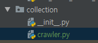
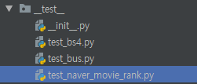
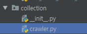
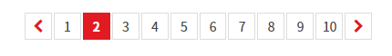
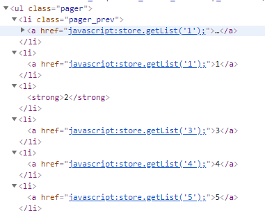
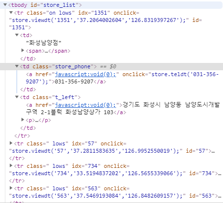
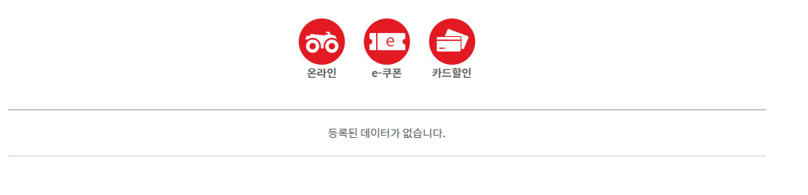
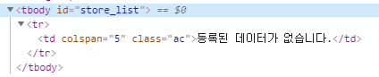
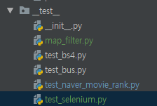
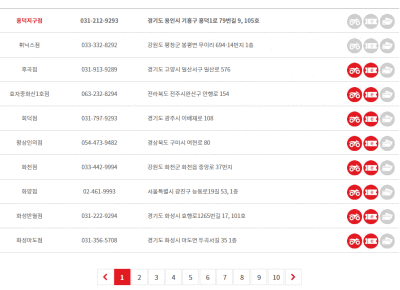

[TOC]

---

[코드보기](https://github.com/jungeunlee95/python-crawler)

# 크롤링 중복 함수로 빼기 :heavy_minus_sign:

**crawler.py** 

```python
import ssl
import sys
from urllib.request import Request, urlopen
from datetime import datetime

def crawling(url='', encoding='utf-8'):
    try:
        request = Request(url)

        # CERTIFICATE_VERIFY_FAILED 에러 해결
        # context = ssl._create_unverified_context()
        # response = urlopen(request, context=context)

        # 위 아래 둘 중 하나로 해결 가능!

        ssl._create_default_https_context = ssl._create_unverified_context
        response = urlopen(request)
        receive = response.read()
        html = receive.decode(encoding, errors='replace')
        # print(html)
        print(f'{datetime.now()}: success for request [{url}]')
    except Exception as e:
        print(f'{e} : {datetime.now()}', file=sys.stderr)
    return html
```


**test_naver_movie_rank.py**   

> ex02()에 적용!

```python
from urllib.request import Request, urlopen
from bs4 import BeautifulSoup
from collection import crawler

def ex01():
    request = Request("https://movie.naver.com/movie/sdb/rank/rmovie.nhn?sel=cnt&date=20190617")
    response = urlopen(request)
    html = response.read().decode('cp949')
    # print(html)

    bs = BeautifulSoup(html, 'html.parser')
    # print(bs.prettify()) # 예쁘게 출력

    divs = bs.findAll('div', attrs={'class':'tit3'})
    # print(divs)

    for rank, div in enumerate(divs, start=1):
        print(rank, div.a.text, 'https://movie.naver.com/'+div.a['href'], sep=" : ")

def ex02():
    html = crawler.crawling('https://movie.naver.com/movie/sdb/rank/rmovie.nhn?sel=cnt&date=20190617', 'cp949')
    bs = BeautifulSoup(html, 'html.parser')
    divs = bs.findAll('div', attrs={'class': 'tit3'})
    for rank, div in enumerate(divs, start=1):
        print(rank, div.a.text, 'https://movie.naver.com/'+div.a['href'], sep=" : ")

__name__ == '__main__' \
and not ex01() \
and ex02()
# ex01()이 return이 없으니까, 그 차제가 false잖아 그래서 ex02()실헹
```

---


근데 만족이 안된다...!?

> 함수를 호출해서 return html받는건 별로~
>
> 아예 이런식으로 호출하고 끝내고 싶다
>
> ```python
> crawler.crawling(url=url,
>                  encoding=encoding,
>                  proc=proc_rank,
>                  store=store_rank)
> ```


---

부르는 코드

**`__test__`/test_naver_movie_rank.py**

```python
html = crawler.crawling(url='https://movie.naver.com/movie/sdb/rank/rmovie.nhn?sel=cnt&date=20190617', encoding='cp949')
```

**collection/crawler.py**

`proc=None`으로  받는 경우 ` result = proc(html) if proc is not None else html` 

```python
def crawling(url='', encoding='utf-8', proc=None):
    try:
        ...

        result = proc(html) if proc is not None else html
		...
```

---

`proc=lambda data:data`으로 받는 경우 `result = proc(html)` 처리

```python
def crawling(url='', encoding='utf-8', proc=lambda data:data):
    try:
        ...

        result = proc(html)
		...
```

---

### **crawler.py** : 크롤링 모듈  

```python
import ssl
import sys
from urllib.request import Request, urlopen
from datetime import datetime

def crawling(url='',
             encoding='utf-8',
             err=lambda e: print(f'{e} : {datetime.now()}', file=sys.stderr),
             proc1=lambda data:data,
             proc2=lambda data:data,
             ):
    try:
        request = Request(url)

        ssl._create_default_https_context = ssl._create_unverified_context
        response = urlopen(request)
        print(f'{datetime.now()}: success for request [{url}]')

        receive = response.read()
        html = receive.decode(encoding, errors='replace')
        return proc2(proc1(html))

    except Exception as e:
        err(e)
```

### 이전 코드

```python
def ex01():
    request = Request("https://movie.naver.com/movie/sdb/rank/rmovie.nhn?sel=cnt&date=20190617")
    response = urlopen(request)
    html = response.read().decode('cp949')
    # print(html)

    bs = BeautifulSoup(html, 'html.parser')
    # print(bs.prettify()) # 예쁘게 출력

    divs = bs.findAll('div', attrs={'class':'tit3'})
    # print(divs)

    for rank, div in enumerate(divs, start=1):
        print(rank, div.a.text, 'https://movie.naver.com/'+div.a['href'], sep=" : ")
```

### 바뀐코드

```python
def ex02():
    crawler.crawling(url='https://movie.naver.com/movie/sdb/rank/rmovie.nhn?sel=cnt&date=20190617',
encoding='cp949',err=error,proc1=proc_naver_movie_rank,proc2=store_naver_movie_rank)

def error(e):
    pass

def proc_naver_movie_rank(data):
    bs = BeautifulSoup(data, 'html.parser')
    results = bs.findAll('div', attrs={'class': 'tit3'})
    return results

def store_naver_movie_rank(data):
    # output
    for rank, div in enumerate(data, start=1):
        print(rank, div.a.text, 'https://movie.naver.com/'+div.a['href'], sep=" : ")
    return data

```

> error은 내가 파라미터 안넣으면 기본으로 print해주고,
>
> error을 받아서 log처리 하고싶으면 구현해서 넣으면 됨


## proc2 = lambda로 바꾸기

```python
def ex02():
    crawler.crawling(url='https://movie.naver.com/movie/sdb/rank/rmovie.nhn?sel=cnt&date=20190617',
                     encoding='cp949',
                     err=error,
                     proc1=proc_naver_movie_rank,
                     proc2=lambda data: list(map(lambda div: print(div.a.text, 'https://movie.naver.com/'+div.a['href'], sep=" : "), data)))
```

---


#  

# 교촌치킨 매장정보 크롤링 :poultry_leg:

```python
def crawling_kyochon():
    results = []
    for sido1 in range(1, 18):
        for sido2 in count(start=1):
            url = 'http://www.kyochon.com/shop/domestic.asp?sido1=%d&sido2=%d' % (sido1, sido2)
            html = crawler.crawling(url)

            # 끝 검출
            if html is None:
                break

            bs = BeautifulSoup(html, 'html.parser')
            tag_ul = bs.find('ul', attrs={'class':'list'})
            tags_span = tag_ul.findAll('span', attrs={'class':'store_item'})

            for tag_span in tags_span:
                strings = list(tag_span.strings)
                name = strings[1]
                addrs = strings[3].strip()
                sidogu = addrs.split()[:2]
                results.append((name, addrs) + tuple(sidogu))

    # store
    table = pd.DataFrame(results, columns=['name', 'address', 'sido', 'gu'])
    table.to_csv('__results__/kyochon.csv', encoding='utf-8', mode='w', index=0)
```


#  

# 굽네치킨 매장정보 크롤링 :poultry_leg:

굽네는, 페이지를 누른 순간



javascript로 데이터를 가져옴



## 	:arrow_down_small::arrow_down_small::arrow_down_small::arrow_down_small:



## 끝 데이터 검출





마지막검출 시  원래 tr의 class가 있는데, 마지막은 tr이 class가 없네!

`if tags_tr[0].get('class') is None : break`


---

## 셀레니움 사용! :white_check_mark:

[구글 드라이버 다운로드](<http://chromedriver.chromium.org/downloads>)


**test_selenium.py**   

```python
import time

from selenium import webdriver

path = 'D:/bin/chromedriver/chromedriver.exe'
wd = webdriver.Chrome(path)
wd.get('https://www.google.com')

time.sleep(2)
html = wd.page_source
print(html)

wd.quit()
```


`__main__`.py : 굽네 데이터 가져오기!

```python
def crawling_goobne():
    url = 'http://www.goobne.co.kr/store/search_store.jsp'

    # 첫 페이지 로딩
    path = 'D:/bin/chromedriver/chromedriver.exe'
    wd = webdriver.Chrome(path)
    wd.get(url)
    time.sleep(3)

    results= []
    for page in count(start=1):
        # 자바스크립트 실행
        script = 'store.getList(%d)' % page
        wd.execute_script(script)
        print(f'{datetime.now()}: success for request [{script}]')
        time.sleep(1)

        # 실행 결과 HTML(동적으로 렌더링 된 HTML) 가져오기
        html = wd.page_source
        bs = BeautifulSoup(html, 'html.parser')
        tag_tbody = bs.find('tbody', attrs={'id':'store_list'})
        tags_tr = tag_tbody.findAll('tr')

        # 끝 검출
        if tags_tr[0].get('class') is None :
            break

        for tag_tr in tags_tr:
            strings = list(tag_tr.strings)
            name = strings[1]
            addrs = strings[6]
            sidogu = addrs.split()[:2]

            results.append((name, addrs) + tuple(sidogu))

    # store
    table = pd.DataFrame(results, columns=['name', 'address', 'sido', 'gu'])
    table.to_csv('__results__/goobne.csv', encoding='utf-8', mode='w', index=0)
    wd.quit()
```

성공!




