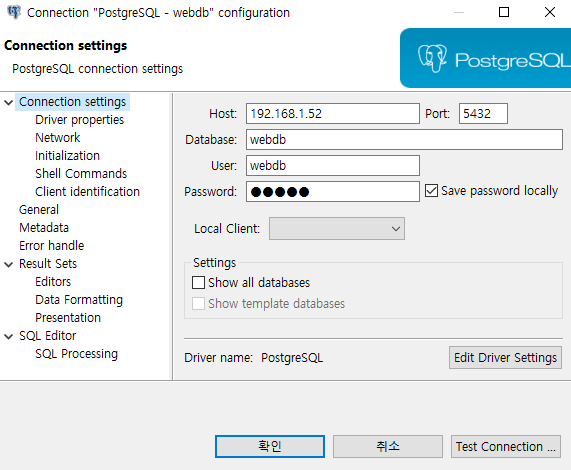
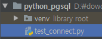
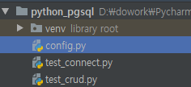
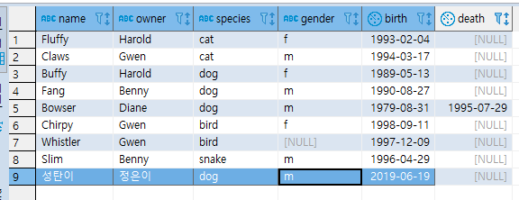
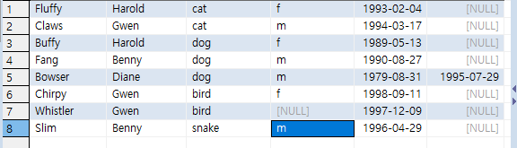

[TOC]

---

[코드보기](<https://github.com/jungeunlee95/python-pgsql>)

# Python postgres :crayon:

new project - D:\dowork\PycharmProjects\python_pgsql


## [1] 드라이버 설치 - psycopg2 v2.8.3

`pip install psycopg2`

mac :  `pip install psycopg2==2.7.5`

​			[terminal] - `# brew install postgresql`


## [2] Connect Test

**DBeaver로 먼저 확인!**  :bear:

> 

**test_connect.py**    

```python
import psycopg2

try:
    conn = psycopg2.connect(
        user='webdb',
        password='webdb',
        host='192.168.1.52',
        port='5432',
        database='webdb',
        )
    cursor = conn.cursor()
    cursor.execute('select version()')
    record = cursor.fetchone()
    print(f'connected to - {record}')

except Exception as e:
    print(f'error : {e}')
    
finally:
    'conn' in locals() \
    and conn \
    and conn.close()

    'cursor' in locals() \
    and cursor\
    and cursor.close()
```

> connected to - ('PostgreSQL 10.2 on x86_64-pc-linux-gnu, compiled by gcc (GCC) 4.4.7 20120313 (Red Hat 4.4.7-23), 64-bit',)


## [3] CRUD Test

**config.py**   

```python
db = {
    'user' : 'webdb',
    'password' : 'webdb',
    'host' : '192.168.1.52',
    'port' : '5432',
    'database' : 'webdb',
}
```


### 1. insert

**test_crud.py**

```python
def test_insert():
    try :
        conn = psycopg2.connect(**config.db)

        cursor = conn.cursor()
        cursor.execute("insert into pet values('성탄이', '정은이', 'dog', 'm', '2019-06-19')")

    except Exception as e:
        print(f'error : {e}')
    finally:
        cursor and cursor.close()
        conn and (conn.commit() or conn.close())
```

> 


### 2. select

```python
def test_select():
    try :
        conn = psycopg2.connect(**config.db)

        cursor = conn.cursor()
        cursor.execute("select * from pet")
        records = cursor.fetchall()

        for record in records:
            print(record, type(record))

    except Exception as e:
        print(f'error : {e}')
    finally:
        cursor and cursor.close()
        conn and conn.close()
```

> ```
> ('Fluffy', 'Harold', 'cat', 'f', datetime.date(1993, 2, 4), None) <class 'tuple'>
> ('Claws', 'Gwen', 'cat', 'm', datetime.date(1994, 3, 17), None) <class 'tuple'>
> ('Buffy', 'Harold', 'dog', 'f', datetime.date(1989, 5, 13), None) <class 'tuple'>
> ('Fang', 'Benny', 'dog', 'm', datetime.date(1990, 8, 27), None) <class 'tuple'>
> ('Bowser', 'Diane', 'dog', 'm', datetime.date(1979, 8, 31), datetime.date(1995, 7, 29)) <class 'tuple'>
> ('Chirpy', 'Gwen', 'bird', 'f', datetime.date(1998, 9, 11), None) <class 'tuple'>
> ('Whistler', 'Gwen', 'bird', None, datetime.date(1997, 12, 9), None) <class 'tuple'>
> ('Slim', 'Benny', 'snake', 'm', datetime.date(1996, 4, 29), None) <class 'tuple'>
> ('성탄이', '정은이', 'dog', 'm', datetime.date(2019, 6, 19), None) <class 'tuple'>
> ('성탄이', '정은이', 'dog', 'm', datetime.date(2019, 6, 19), None) <class 'tuple'>
> ('성탄이', '정은이', 'dog', 'm', datetime.date(2019, 6, 19), None) <class 'tuple'>
> ('성탄이', '정은이', 'dog', 'm', datetime.date(2019, 6, 19), None) <class 'tuple'>
> ('성탄이', '정은이', 'dog', 'm', datetime.date(2019, 6, 19), None) <class 'tuple'>
> ```


### 3. delete

```python
def test_delete():
    try :
        conn = psycopg2.connect(**config.db)

        cursor = conn.cursor()
        cursor.execute("delete from pet where name='성탄이'")

    except Exception as e:
        print(f'error : {e}')
    finally:
        cursor and cursor.close()
        conn and (conn.commit() or conn.close())
```

> 


