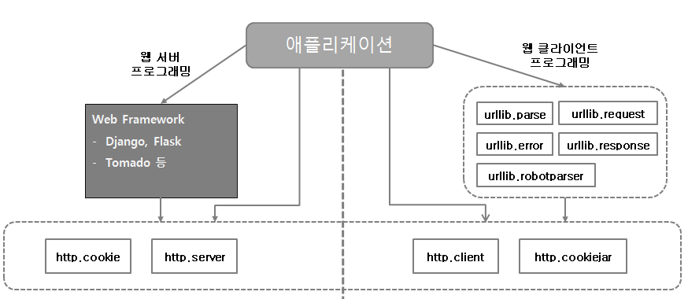

[TOC]

---

# [django] 파이썬 웹 표준 라이브러리 정리



---


---

## 웹 표준 라이브러리 구성

```
1) 파이썬 설치 시, 기본적으로 함께 설치되는 표준 라이브러리

2) 웹 클라이언트 프로그래밍 또는 웹 서버 프로그래밍에 따라 사용 모듈이 달라진다.

3) 2.x 와 3.x 에 따라 패키지명, 모듈명이 재구성되어 있는 차이가 있고 함수와 클래스등의 내용 자체는 거의 동일 

4) 웹표준 라이브러리의 구성
```

> Django는 자유도가 떨어져서 Flask 사용이 더 편할 수도 있다.

---


---

## python web library 공부

### [ 웹 클라이언트 라이브러리 ? ]

> 1) 웹 서버에 요청을 보내는 모든 애플리케이션은 웹 클라이언트라 할 수 있다.
>
> 2) 웹브라우저, Open API를 사용하는 프로그램들
>
> 3) 웹 클라이언트와 웹 서버는 HTTP/HTTPS  프로토콜을 사용한다.

---


---

**새로운 프로젝트 `python_weblib`에서 실습**

### [1] http.client모듈의 HTTPConnection Test

```
1) HTTP 프로토콜의 저수준의 요청을 보낼 수 있다.
2) urllib.request 요청과 동일한 요청을 보낼 수 있다.
3) GET 방식 요청
```


예제를 위해 예비된 [2단계](https://ko.wikipedia.org/wiki/2단계_도메인) [도메인 네임](https://ko.wikipedia.org/wiki/도메인_네임)인 'www.example.com'을 이용해 응답 확인하기

```python
from http.client import HTTPConnection
conn = HTTPConnection('www.example.com')
```


**성공 확인**

```python
# 성공
# GET / HTTP/1.1
# 200 OK
conn.request('GET', '/')
response = conn.getresponse()
print(response.status, response.reason)

if response.status == 200:
    body = response.read()
    print(body, type(body))
```

> <출력> : 해당 홈페이지 <body> 출력
>
> ```
> 200 OK
> b'<!doctype html>\n<html>\n<head>\n    <title>Example Domain</title>\n\n    <meta charset="utf-8" />\n    <meta http-
> ...
> ```


**실패 확인** - 404 File Not Found

```python
# 실패
# GET /hello.html HTTP/1.1
# 404 File Not Found
conn.request('GET', '/hello.html')
response = conn.getresponse()
print(response.status, response.reason)
```

> <출력>
>
> ```
> 404 Not Found
> ```

---

 

---

### [2] urllib.parse 모듈의 urlparse Test

```python
from urllib.parse import urlparse

# full url 파싱
result = urlparse('http://www.python.org:80/guide/python.html:philosophy?overall=3#here')
print(result)
```

> <출력>
>
> ```
> ParseResult(scheme='http', netloc='www.python.org:80', path='/guide/python.html:philosophy', params='', query='overall=3', fragment='here')
> ```
>
> [ParseResult 속성 알아보기](<https://dololak.tistory.com/254>)

---

 

---

### [3] urllib.request 모둘의 urlopen Test

> 해당 url을 열어 데이터를 얻을 수 있는 기능을 제공한다.
>
> `urlopen(url)`  리턴 타입 :  `<class 'http.client.HTTPResponse'>`
>
> `urlopen(url [, data [, timeout]])`
>
> ```
> url : 열고자 하는 URL 문자열, request 클래스의 인스턴스가 포함된다.
> data : POST 방식으로 전송 시에 서버로 업로드할 폼 데이터, URL 인코딩 되있는 문자열
> timeout : 내부에서 사용하는 모든 블로킹 연산에 사용할 타임아웃 시간
> ```
>
> 지원 메소드
>
> ```
> urlopen().read([nbytes]) : nbyte의 데이터를 바이트 문자열로 읽음 
> urlopen().readline() : 한 줄의 텍스트를 바이트 문자열로 읽음
> urlopen().info() : URL에 연관된 메타 정보를 담은 매핑 객체를 반환
> urlopen().getcode() : HTTP 응답 코드를 정수로 반환( 200, 404 )
> urlopen().close() : 연결을 닫는다
> ```

**코드로 확인**

```python
from urllib.parse import urlencode
from urllib.request import urlopen, Request
```


**1) get 방식**

```python
# get 방식
http_response = urlopen('http://www.example.com')
body = http_response.read()
print(body)
```


**2) post 방식**

```python
# urlencode : 쿼리 스트링 파라미터를 Encoding 
data = {
    'email' : 'leeap1004@gmail.com',
    'password' : '1234',
    'name':'이정은'
}
data = urlencode(data)
print(data)
```

> <출력>
>
> ```
> email=leeap1004%40gmail.com&password=1234&name=%EC%9D%B4%EC%A0%95%EC%9D%80
> ```

```python
# post 방식
data = {
    'email' : 'leeap1004@gmail.com',
    'password' : '1234',
    'name':'이정은'
}
data = urlencode(data).encode('utf-8')
request = Request('http://www.example.com', data)
http_response = urlopen(request)
body = http_response.read()
print(body)
```


**[ request에 header데이터 추가 기능 ]**

> cookie정보도 전송할 수 있다.

```python
data = {
    'email' : 'leeap1004@gmail.com',
    'password' : '1234',
    'name':'이정은'
}
data = urlencode(data).encode('utf-8')
request = Request('http://www.example.com', data)

request.add_header('Content-Type', 'text/html')
request.add_header('cookies:jsessionid=3232dswsd2')

http_response = urlopen(request)
body = http_response.read()
print(body)
```


