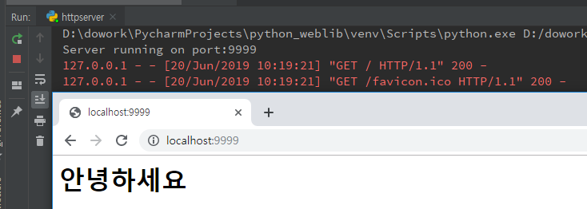

[TOC]

---

# Python httpserver 만들기

## HTTPServer를 이용해 서버 띄우기

```python
from http.server import BaseHTTPRequestHandler, HTTPServer

port = 9999

class SimpleHTTPRequestHandler(BaseHTTPRequestHandler):
    def do_GET(self):
        self.send_response(200)
        self.send_header('Content-Type', 'text/html; charset=utf-8')
        self.end_headers()
        self.wfile.write('<h1>안녕하세요</h1>'.encode('utf-8'))

httpd = HTTPServer(('0.0.0.0', port), SimpleHTTPRequestHandler)
print(f'Server running on port:{port}')
httpd.serve_forever()
```

> 


## [1] 직접 url 파라미터 받아보기

**ex)** `http://localhost:9999/user/login?id=jungeun&password=1234`로 접근하기


만약 로그인 화면이라고 가정을 한다면

```python
class SimpleHTTPRequestHandler(BaseHTTPRequestHandler):
    def do_GET(self):
        print(self.path)
```

<출력>

> /user/login?id=jungeun&password=1234


파라미터를 받아오기위해  문자열을 분리해야한다.

서버의  `['/favicon.ico']`이 같이 오기 때문에 `if`문을 사용해 걸러보자!

```python
class SimpleHTTPRequestHandler(BaseHTTPRequestHandler):
    def do_GET(self):
        # print(self.path)
        if '?' in self.path:
            urls = self.path.split('?')
            path = urls[0]
            qs = urls[1].split('&')
            print(path, qs)
```

<출력>

> /user/login ['id=jungeun', 'password=1234']


## [2] url parse 사용으로 파라미터 받기

```python
class SimpleHTTPRequestHandler(BaseHTTPRequestHandler):
    def do_GET(self):
        result = urlparse(self.path)
        print(result)
```

<출력>

> ParseResult(scheme='', netloc='', path='/user/login', params='', query='id=jungeun&password=1234', fragment='')
>
> ParseResult(scheme='', netloc='', path='/favicon.ico', params='', query='', fragment='')


**params 분리하기**

```python
class SimpleHTTPRequestHandler(BaseHTTPRequestHandler):
    def do_GET(self):
        result = urlparse(self.path)
        params = parse_qs(result.query)
        print(params)
```

<출력>

> {'id': ['jungeun'], 'password': ['1234']}

> **파라미터가 왜 list일까?**
>
> check box 같은 경우, 다중 선택으로 parameter를 보낼 때, 같은 name으로 value가 멀티로 날라오는 경우가 있기 때문이다.


장고의 **urls.py** 에서도 이렇게 url path를 가져와서 url을 매핑 하는 것 같다.

```python
from django.urls import path
import mycontroller

urlpatterns = [
    path('/user/login' : mycontroller.login),
]
```


