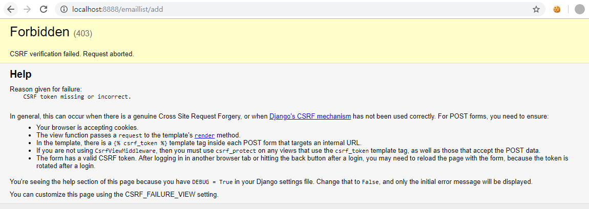
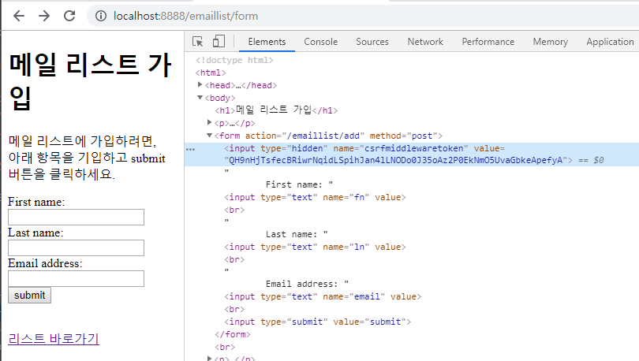
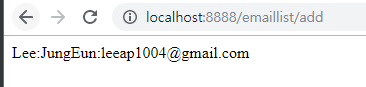
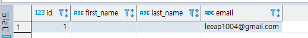
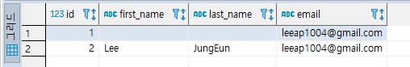
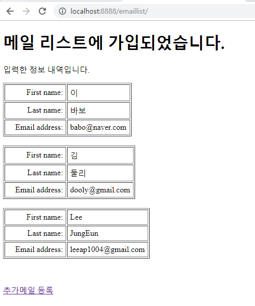

[TOC]

---


[전체 코드 보기](https://github.com/jungeunlee95/django-basic)


---

# [django] 4 Python Django - form data 받아 table에 insert하기 

[지난 포스팅](https://jungeunlee95.github.io/django/2019/06/20/3-Django-Application-추가-작업/)에 이어서, 오늘은 기능 추가 작업


---

## **[1] html form data 받아오기**

**templates/emaillist/form.html** 데이터를 받는 방법

```html
<form action="/emaillist/add" method="">
    First name: <input type="text" name="fn" value="" ><br>
    Last name: <input type="text" name="ln" value=""><br>
    Email address: <input type="text" name="email" value=""><br>
    <input type="submit" value="submit">
</form>
```


**action의 `/emaillist/add`을 먼저 urls.py에 매핑을 설정한다.**

**python_ch3/urls.py**

```python
urlpatterns = [
    path('emaillist/', emaillist_views.index),
    path('emaillist/form', emaillist_views.form),
    path('emaillist/add', emaillist_views.add),
	...
]
```


**urls.py에서 설정한 url을 매핑할 add함수 정의**

**emaillist/views.py**

아래의 코드와 같이 html의 input name값으로 데이터를 받을 수 있다.

```python
def add(request):
    firstname = request.POST['fn']
    lastname = request.POST['ln']
    email = request.POST['email']

    return HttpResponse(f'{firstname}:{lastname}:{email}')
```

> `HttpResponse()`는 text를 그대로 화면에 출력해주는 기능


---

### CSRF verification failed. Request aborted Error!

**403 Forbidden** 



> [CSRF란?](https://ko.wikipedia.org/wiki/%EC%82%AC%EC%9D%B4%ED%8A%B8_%EA%B0%84_%EC%9A%94%EC%B2%AD_%EC%9C%84%EC%A1%B0)
>
> 장고의 기능 중 post데이터를 받을 때 CSRF보안코드가 포함되어 있지 않으면,
>
> Error페이지를 출력

---

### [해결] 장고에서 CSRF token 처리하기

해당 form 뒤에  `` 코드를 추가해주면 된다.

```html
<form action="/emaillist/add" method="post">
    
    First name: <input type="text" name="fn" value="" ><br>
    Last name: <input type="text" name="ln" value=""><br>
    Email address: <input type="text" name="email" value=""><br>
    <input type="submit" value="submit">
</form>
```

위의 코드로 처리하면 form이 있는 page에 hidden으로 CSRF데이터가 생긴다.



> 이 처리는 상당히 보안에 취약하다. 
>
> 해당 페이지의 html을 파싱해서 페이지의 `csrfmiddlewaretoken`값의 `value`를 가져와 form data와 함께 전송하면, 여전히 공격을 받기 쉬운 처리이다. 
>
> 이는 장고를 좀 더 공부한 뒤, 좀 더 보안적으로 처리해보도록 하자!

> 일단 토큰 처리를 마쳤으니, 다시 접근해보자!
>
> 
>
> 성공!

---


---

## **[2] 받은 data, DB에 insert하기**

**emaillist/views.py**

```python
from emaillist.models import Emaillist
from django.http import HttpResponseRedirect

def add(request):
    emaillist = Emaillist()
    emaillist.firstname = request.POST['fn']
    emaillist.lastname = request.POST['ln']
    emaillist.email = request.POST['email']
    emaillist.save()

    # insert 후에는 꼭 redirect 처리!
    return HttpResponseRedirect('/emaillist')
```

> `http://localhost:8888/emaillist/form`에서 submit! 을 한 뒤
>
> 
>
> **DBeaver에서 확인해보기**
>
> 
>
> 이름이 안들어왔다. --> views.py에서 컬럼명이 달랐다.
>
> 
>
> **views.py** 수정
>
> ```python
> emaillist.first_name = request.POST['fn']
> emaillist.last_name = request.POST['ln']
> ```
>
> 
>
> 성공!

---


---

## **[3] DB data select 가져오기**

sample data를 몇 개 넣어보고 확인해보자! 


**emaillist/views.py**

index에서 모든 데이터를 select해와서 list보여주기!

```python
def index(request):
    emaillist = Emaillist.objects.all().order_by('-id')
    # for email in emaillist:
    #     print(email)
    data = {'emaillist':emaillist}
    return render(request, 'emaillist/index.html', data)
```

> emaillist를 출력해보면 튜플형태로 나오는 것을 확인할 수 있다.
>
> 이를 dict 타입으로 묶어서 render에 같이 보내주면 html에서 받을 수 있다.

```
Emaillist(이, 바보, babo@naver.com)
Emaillist(김, 둘리, dooly@gmail.com)
Emaillist(Lee, JungEun, leeap1004@gmail.com)
```


**templates/emaillist/index.html** 수정

> [template tag](https://wikidocs.net/9677)을 이용해 보여주기

```html
<!DOCTYPE html>
<html>
<head>
<meta http-equiv="Content-Type" content="text/html; charset=UTF-8">
<title>Insert title here</title>
</head>
<body>
	<h1>메일 리스트에 가입되었습니다.</h1>
	<p>입력한 정보 내역입니다.</p>
	<!-- 메일정보 리스트 -->
	
	<table border="1" cellpadding="5" cellspacing="2">
		<tr>
			<td align=right>First name: </td>
			<td>{{ email.first_name }}</td>
		</tr>
		<tr>
			<td align=right width="110">Last name: </td>
			<td width="110">{{ email.last_name }}</td>
		</tr>
		<tr>
			<td align=right>Email address: </td>
			<td>{{ email.email }}</td>
		</tr>
	</table>
	<br>
	
	<br>
	<p>
		<a href="/emaillist/form">추가메일 등록</a>
	</p>
	<br>
</body>
</html>
```




