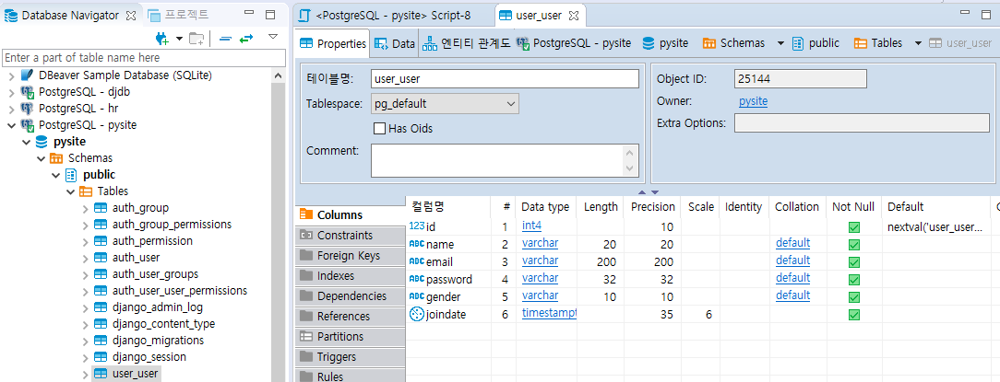
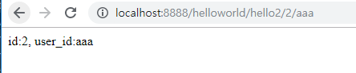
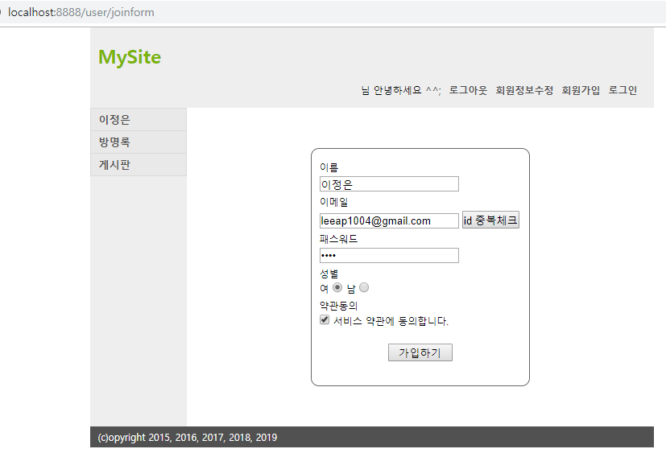
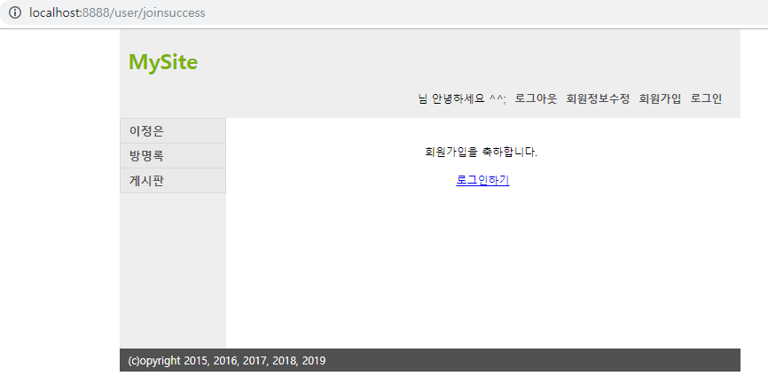
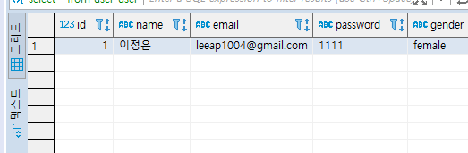

[TOC]

---


[전체 코드 보기](https://github.com/jungeunlee95/python-mysite)


---

# [django-mysite프로젝트] 2 - 회원가입 기능 추가

---

## [1] application user 추가

Terminal -> `python manage.py startapp user`


## [2] settings.py app 추가

```python
INSTALLED_APPS = [
    ...
    'user',
    ...
]
```


## [3] Model 정의

**user/models.py**

```python
from django.db import models

# Create your models here.
class User(models.Model):
    name = models.CharField(max_length=20)
    email = models.CharField(max_length=200)
    password = models.CharField(max_length=32)
    gender = models.CharField(max_length=10)
    joindate = models.DateTimeField(auto_now=True)

    def __str__(self):
        return f'User({self.name}, {self.email}, {self.password}. {self.gender}, {self.joindate}'
```


admi.py

```python
from django.contrib import admin

# Register your models here.
from user.models import User

admin.site.register(User)
```


## [4] migrate

`python manage.py makemigrations`

`python manage.py migrate`

> DBeaver 확인
>
> 


## [5] 회원가입 기능 추가하기

**urls.py** 매핑 추가

```python
path('user/joinform', user_views.joinform),
path('user/join', user_views.join),
```


> path variable을 받을 때는
>
> **urls.py**
>
> `path('user/join/<int:id>/<str:user_id>', helloworld_views.hello2),` 
>
> **views.py**
>
> ```python
> def hello2(request, id=0, user_id=''):
>     return HttpResponse(f'id:{id}, user_id:{user_id}')
> ```
>
> 
>
> 이런식으로 받으면 된다.


**views.py**

```python
from django.http import HttpResponseRedirect
from django.shortcuts import render
from user.models import User

def joinform(request):
    return render(request, 'user/joinform.html')

def joinsuccess(request):
    return render(request, 'user/joinsuccess.html')

def join(request):
    user = User()
    user.name = request.POST['name']
    user.email = request.POST['email']
    user.password = request.POST['password']
    user.gender = request.POST['gender']
    user.save()

    return HttpResponseRedirect('user/joinsuccess')
```


**templates/base.html**

```html
<!DOCTYPE html>
<html>
<head>
<title>mysite</title>
<meta http-equiv="content-type" content="text/html; charset=utf-8">


</head>
<body>
	<div id="container">
		<div id="header">
			<h1>MySite</h1>
			<ul>
				<li><a href="/user/loginform">로그인</a><li>
				<li><a href="/user/joinform">회원가입</a><li>
				<li><a href="/user/">회원정보수정</a><li>
				<li><a href="/user/logout">로그아웃</a><li>
				<li>님 안녕하세요 ^^;</li>
			</ul>
		</div>
		<div id="wrapper">
			<div id="content">

                

			</div>
		</div>
		<div id="navigation">
			<ul>
				<li><a href="/">이정은</a></li>
				<li><a href="/guestbook">방명록</a></li>
				<li><a href="/board">게시판</a></li>
			</ul>
		</div>
		<div id="footer">
			<p>(c)opyright 2015, 2016, 2017, 2018, 2019</p>
		</div>
	</div>
</body>
</html>
```


**templates/user/joinform.html**

```html



<link href="/assets/css/user.css" rel="stylesheet" type="text/css">



<div id="user">
	<form id="join-form" name="joinForm" method="post" action="/user/join">
        
		<label class="block-label" for="name">이름</label>
		<input id="name" name="name" type="text" value="">

		<label class="block-label" for="email">이메일</label>
		<input id="email" name="email" type="text" value="">
		<input type="button" value="id 중복체크">

		<label class="block-label">패스워드</label>
		<input name="password" type="password" value="">

		<fieldset>
			<legend>성별</legend>
			<label>여</label> <input type="radio" name="gender" value="female" checked="checked">
			<label>남</label> <input type="radio" name="gender" value="male">
		</fieldset>

		<fieldset>
			<legend>약관동의</legend>
			<input id="agree-prov" type="checkbox" name="agreeProv" value="y">
			<label>서비스 약관에 동의합니다.</label>
		</fieldset>

		<input type="submit" value="가입하기">

	</form>
</div>


```


**templates/user/joinsuccess.html**

```html



<link href="/assets/css/user.css" rel="stylesheet" type="text/css">



<div id="user">
	<p class="jr-success">
		회원가입을 축하합니다.
		<br><br>
		<a href="/user?a=loginform">로그인하기</a>
	</p>				
</div>

```


## [6] Test



**성공!**




**DB 확인**




