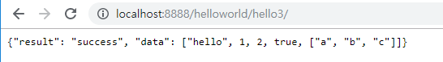

[TOC]

---


[장고의 배신](https://www.slideshare.net/EunhyangKim2/ss-118560530)


---

# 로그인,로그아웃, 회원가입 기능 추가

## 장고 템플릿 sub 안될 때

`pip install django-mathfilters` 설치 후

**settings.py** app 추가

```python
INSTALLED_APPS = [
    'mathfilters',
]
```

mathfilters를 사용 할 html에 import를 해줘야한다.

``


**guestbook/list.html**에서 게시글 index 처리 2가지 방법

1, [{{ guestbooklist|length | sub:forloop.counter | add:1  }}]

2, [{{ forloop.revcounter }}]

---


---

## login 만들기

**loginform.html 수정**

```html




<link href="/assets/css/user.css" rel="stylesheet" type="text/css">



<div id="user">
	<form id="login-form" name="loginform" method="post" action="/user/login">
		
		<label class="block-label" for="email">이메일</label>
		<input id="email" name="email" type="text" value="">
		<label class="block-label" >패스워드</label>
		<input name="password" type="password" value="">
		
		<p style="color: red;">
			로그인이 실패 했습니다.
		</p>
		
		<input type="submit" value="로그인">
	</form>
</div>

```


**urls.py 매핑**

```python
urlpatterns = [
...
    path('user/loginform', user_views.loginform),
    path('user/login', user_views.login),
...
]
```


**views.py 로그인 세션 로직 처리**

```python
# login
def loginform(request):
    return render(request, 'user/loginform.html')

def login(request):
    results =  User.objects.filter(email=request.POST['email']).filter(password=request.POST['password'])

    # 로그인 실패
    if len(results)==0:
        return HttpResponseRedirect('/user/loginform?result=fail')

    # 로그인 처리
    authUser = results[0]
    request.session['authUser'] = model_to_dict(authUser)

    return HttpResponseRedirect('/')
```


**base.html -> 세션 처리!**

```html
<!DOCTYPE html>
<html>
<head>
<title>mysite</title>
<meta http-equiv="content-type" content="text/html; charset=utf-8">


</head>
<body>
	<div id="container">
		<div id="header">
			<h1>MySite</h1>
			<ul>
				
				<li><a href="/user/loginform">로그인</a><li>
				<li><a href="/user/joinform">회원가입</a><li>

				
				<li><a href="/user/">회원정보수정</a><li>
				<li><a href="/user/logout">로그아웃</a><li>
				<li>[{{ request.session.authUser.name }}]님 안녕하세요 ^^;</li>
				
			</ul>
		</div>
		<div id="wrapper">
			<div id="content">

                

			</div>
		</div>
		<div id="navigation">
			<ul>
				<li><a href="/">이정은</a></li>
				<li><a href="/guestbook/list">방명록</a></li>
				<li><a href="/board">게시판</a></li>
			</ul>
		</div>
		<div id="footer">
			<p>(c)opyright 2015, 2016, 2017, 2018, 2019</p>
		</div>
	</div>
</body>
</html>
```


## logout 처리


**urls.py 매핑**

```python
urlpatterns = [
...
    path('user/logout', user_views.logout),
...
]
```


**views.py 로그아웃 세션 로직 처리**

```python
def logout(request):
    del request.session['authUser']
    return HttpResponseRedirect('/')
```


> 이렇게 하면, 로그아웃 눌러야지 로그아웃됨 
>
> 로그인 상태로 서버 껐다 키면 세션 남아있음

해결방법

**settings.py**에 코드 추가

```python
# 브라우저 닫으면 session 없애기
SESSION_EXPIRE_AT_BROWSER_CLOSE = True
# update되면 session바로 반영
SESSION_SAVE_EVERY_REQUEST = True
```

---


---

## 회원정보 수정

**urls.py**

```python
urlpatterns = [
...
    path('user/updateform', user_views.updateform),
    path('user/update', user_views.update),
...
]
```

**views.py**

```python
# 회원정보 수정
def updateform(request):
    user = User.objects.get(id=request.session['authUser']['id'])
    data = {
        'user':user
    }
    return render(request, 'user/updateform.html', data)

def update(request):
    user = User.objects.get(id=request.session['authUser']['id'])
    user.name = request.POST['name']

    user.gender = request.POST['gender']
    if request.POST['password'] is not '':
        user.password = request.POST['password']
    user.save()
    
    # 수정정보 다시 가져오기
    # request.session['authUser'] = model_to_dict(user)
    request.session['authUser']['name']=user.name
    return HttpResponseRedirect('/user/updateform?result=success')
```


**updateform.html** 추가

```html



<link href="/assets/css/user.css" rel="stylesheet" type="text/css">




<script>
	alert('정보 수정이 완료되었습니다.')
</script>

<div id="user">
	<form id="join-form" name="joinForm" method="post" action="/user/update">
		
		<label class="block-label" for="name">이름</label>
		<input id="name" name="name" type="text" value="{{ user.name }}">

		<label class="block-label" for="email">이메일</label>
		<input id="email" name="email" type="text" value="{{ user.email }}">
		<input type="button" value="id 중복체크">

		<label class="block-label">패스워드</label>
		<input name="password" type="password" value="">

		<fieldset>
			<legend>성별</legend>
			
				<label>여</label> <input type="radio" name="gender" value="female" checked="checked">
				<label>남</label> <input type="radio" name="gender" value="male">
			
				<label>여</label> <input type="radio" name="gender" value="female">
				<label>남</label> <input type="radio" name="gender" value="male" checked="checked">
			
		</fieldset>


		<input type="submit" value="수정하기">

	</form>
</div>


```


---

## json data 받기

**views.py**

`path('helloworld/hello3/', helloworld_views.hello3),`

```python
def hello3(request):
    jsonresult = {
        'result' : 'success',
        'data' : ['hello', 1, 2, True, ('a','b','c')]
    }
    return JsonResponse(jsonresult)
```

> 

---


---

## 중복체크 

### jquery  

`<script src="/assets/js/jquery/jquery-1.9.0.js"></script>`

**joinform.html**

잠깐 자바스크립트

```javascript
function f(){
    console.log("hello~")
}
$(f);
```

```javascript
$(function(){
    console.log("hello~")
});
```

```javascript
f = function(){
    console.log("hello~")
}
$(f);
```

> 다 같은 코드야


### 이메일 중복 - jquery, ajax

**joinform.html**

```javascript
<script src="/assets/js/jquery/jquery-1.9.0.js"></script>
<script>
	/* 중복체크! */
	$(function(){
		/* 아이디 수정했을 때 */
		$('#email').change(function () {
			$('#img-email').hide();
			$('#btn-email').show();
		});

		$('#btn-email').click(function(){
			var email = $('#email').val()
			if(email == ''){
				alert('이메일을 입력해주세요.')
				return;
			}

			$.ajax({
				url:'/user/api/checkemail?email='+email,
				type:'get',
				dataType:'json',
				success:function(response){
					if(response.result != 'success'){
						console.error(response.data)
						return;
					}
					if(response.data == 'exist'){
						alert("존재하는 이메일 입니다!ㅇㅠㅇ");
						$('#email').val('').focus();
						return;
					}else{
						$('#img-email').show();
						$('#btn-email').hide();
						return;
					}
					// console.log(response)
				}

			})
		});
	});

</script>
```

**urls.py** path 추가 

```python
path('user/api/checkemail', user_views.checkemail),
```

**views.py**

```python
def checkemail(request):
    try:
        user = User.objects.get(email=request.GET['email'])
    except Exception as e:
        user = None
    result = {
        'result':'success',
        # 'data' : model_to_dict(user)  # console에서 확인
        'data' : "not exist" if user is None else "exist"
    }
    return JsonResponse(result)
```


**joinform.html**

```html

		<input id="btn-email" type="button" value="이메일 중복체크">
```


