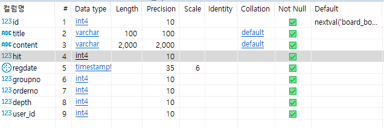

[TOC]

----

# 게시판 기능 추가

board app 추가 ! `python manage.py startapp board`

settings.py 에 app 추가


## 1(user):N(board) 관계 Model

**board/models.py**

```python
from django.db import models

# Create your models here.
from user.models import User


class Board(models.Model):
    title = models.CharField(max_length=100)
    content = models.CharField(max_length=2000)
    hit = models.IntegerField(default=0)
    regdate = models.DateTimeField(auto_now=True)
    groupno = models.IntegerField(default=0)
    orderno = models.IntegerField(default=0)
    depth = models.IntegerField(default=0)
    user = models.ForeignKey(User, to_field='id', on_delete=models.CASCADE)
    # user모델의 id를 fk로, user가 지워지면 같이 삭제

```

**admin.py등록**

```python
from board.models import Board
admin.site.register(Board)
```

`python manage.py makemigrations`

`python manage.py migrate`


**확인**




# ORM

1, limit 처리

```python
start = (page-1)*pagesize
Board.objects.all().order_by('-regdate')[start:start+pagesize]
```

2, insert

```python
def write(request):
    board = Board()
    board.title = request.POST['title']
    board.content = request.POST['content']
    board.user = User.objects.get(id=request.session['authUser']['id'])

    # 새글 작성
    if request.POST['no'] == '-1':
        value = Board.objects.aggregate(max_groupno=Max('groupno'))
        board.groupno = value["max_groupno"]+1
        board.save()
    # 답글 작성
    else:
        board2 = Board.objects.get(id=request.POST['no'])
        Board.objects.filter(orderno__gte=board2.orderno+1).update(orderno=F('orderno') + 1)
        board.groupno = board2.groupno
        board.orderno = board2.orderno+1
        board.depth = board2.depth+1
        board.save()

    return HttpResponseRedirect('list')
```

3, increase hit

```python
board = Board.objects.filter(id=no)
board.update(hit=F('hit')+1)
```

4, TotalCount

```python
board_count = Board.objects.count()
```

5, orderno, groupno, depth update

```python
Counter.objects.filter(groupno=1).filter(orderno__gte=2).update(orderno=F('orderno')+1)
# F('orderno')객체 = 현재 orderno값
```


