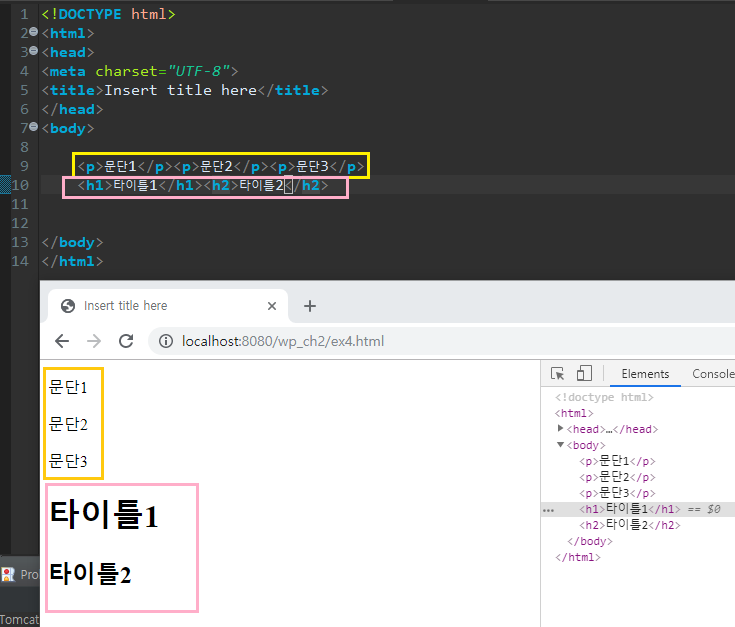
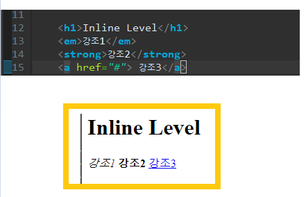
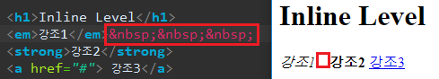
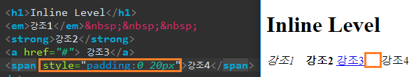
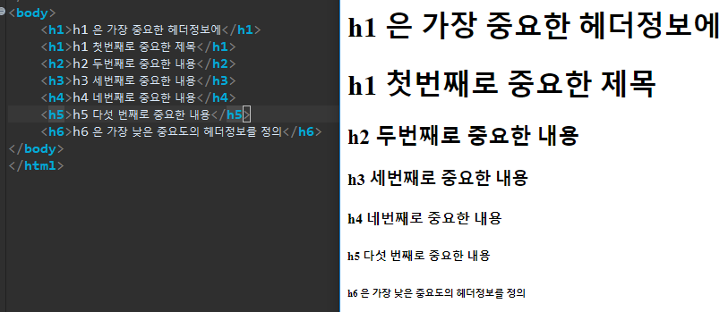

[TOC]

---

# HTML 기본 이해

## 웹 표준이란 ?

HTML을 시작하기 전, 웹 표준에 대해 알고가자!

하나의 브라우저에 최적화 되어서 다른 브라우저에서 깨지는 웹 페이지는 이제 없다.

특정 웹 브라우저에  종속되는 웹 페이지는 더 이상 설 자리가 없다.

★ ==> 웹 페이지 제작 기술에  표준의 필요성이 대두 

> **특정 브라우저에서만 사용하는 비표준화된 기술은 배제**
>
> **특정 브라우저에서만 사용하는 비표준화된 기술은 배제**
>
> 
>
> 웹문서의 구조(HTML)와  표현(CSS) 그리고 동작(JavaScript)을 구분해서  사용(제작)
>
> ```
> [ HTML과 CSS를 웹의 표준으로 사용하자 ]
> - 웹 표준에 따라 웹 페이지를 작성하게 되면 표준을 따르는 브라우저에서는 모두 같은 정보를 얻게 되므로 사용자가 가장 큰 혜택을 보게 된다. 
> - IE, 파이어폭스, 크롬, 사파리등 서로 다른 브라우저라도 같은 화면을 보여 주는 것, 즉 브라우저의 벽을 허물어 주는 개념을 ‘크로스 브라우징’ 이라 한다.
> 
> 
> [ HTML은 구조를 잡고, CSS는 디자인을 담당하도록 분리하자 ]
> - 정보의 구조는 HTML이 담당하고  CSS는 레이아웃과 디자인을 담당하도록 분리
> - 하나의 콘텐츠 소스는 다양한 장비와 브라우저에서 사용할 수 있다는 의미
> ```

---


---

## HTML이란 ?

> [HTML](https://ko.wikipedia.org/wiki/HTML) (Hypertext Markup Language,하이퍼텍스트 마크업 언어)는 우리가 보는 웹페이지가 어떻게 구조화되어 있는지 브라우저로 하여금 알 수 있도록 하는 마크업 언어이다.
>
> HTML은 elements로 구성되어 있으며, 이들은 적절한 방법으로 나타내고 실행하기 위해 각 컨텐츠의 여러 부분들을 감싸고 마크업한다.
>
> tags는 웹 상의 다른 페이지로 이동하게 하는 하이퍼링크 내용들을 생성하거나, 단어를 강조하는 등의 역할을 한다.


## 태그 

`<` `>` 사이에 오는 단어나 문자

> 브라우저에게 작성한 텍스트의 구조와 의미에 관해 알려준다.

- 웹 페이지의 구조를 브라우저가 알 수 있게 하기 위해서 태그들의 쌍을 사용
- `<h1> Hello </h1>` 
  - 시작(opening)태그 + 콘텐츠(내용) + 종료(closing) =  엘리먼트라고 한다. 


## 하이퍼 텍스트

- 웹 전체의 기초가 되는 것

- 단일 페이지에서 벗어나 다른 페이지와 연결할 수 있게 해주는 것

- `<a href="#"></a>` 와 같은 모양으로 링크가 걸린다. 

  > href속성은 목적지를 명시


## 시맨틱

### **시맨틱 검색**

> ''시맨틱검색""은 검색로봇이 검색어 의미를 스스로 분석하고 추리해 원하는 정보를 더 정교하게 찾아주는 검색방식 

### **시맨틱 마크업**

> "시맨팁 마크업"이란 HTML의 태그를 사용하여 문서 안의 내용이 담고 있는 의미가 무엇인지 표현할 수 있도록 구조를 작성하는 것을 말함 

```
내용이 담고 있는 의미가 무엇인지 표현할 수 있도록 작성해야 한다.
HTML과 CSS를 사용하여 ‘구조’와 ‘표현’을 구분해야 한다.
엘리먼트는 HTML문서의 개별적인 구성요소이다.
```

---


### [기본 마크업 태그 확인하기](http://www.w3.org/TR/html401/index/elements.html)


---

### **블록레벨**

> - 브라우저 안에 블록처럼 쌓여가며 줄 바꿈을 하여 표시한다.
>
> - 항상 새로운 줄로 줄 바꿈하여 표시 된다.
> - 너비 값은 브라우저 화면에 100%로 꽉 차게 표시된다.

**ex)** 

`<p></p>` 태그,  `<h1></h1>` 태그



---


### **인라인 레벨**

> - 이미 표시된 엘리먼트에 이어 같은 줄 안에 표시되고 너비는 내용만큼 차지한다.
> - 같은 줄 안에 이어서 표시된다.
> - 너비 값은 요소가 가지고 있는 값 자체로 표시된다.

**ex)**




띄어쓰기 해보기 

 1,  `&nbsp;`

> 


2, `padding`값 주기

> 

---


### **기본 마크업 태그 `h`**

**[  모든 페이지에는 h1 태그가 한개씩만 존재해야 한다  ]**

```
<h1>은 가장 중요한 헤더정보에
<h6>은 가장 낮은 중요도의 헤더정보를 정의
<h1>첫번째로 중요한 제목</h1>
<h2>두번째로 중요한 내용</h2>
<h2>두번째로 중요한 내용</h2>
<h3>세번째로 중요한 내용</h3>
```

> 

---


### **기본 마크업 태그 `address`**

> 문서 저자나 소유자를 위한 연락처 정보 정의

---


### **기본 마크업 태그 `div`**

> css 스타일 적용해 디자인을 입힐 때 많이 사용
>
> 블록레벨 엘리먼트들을 그룹으로 묶음

---


### **기본 마크업 태그 `span`**

> html문서에서 인라인 레벨 엘리먼트들을 그룹으로 묶을 때 사용

---


---

## DOCTYPE

```
- DOCTYPE은 html의 태그는 아니지만 웹페이지에서 맨 처음에 선언되어 어떤 종류의 html을 사용할지 웹브라우저에게 알려줄 목적으로 사용
- 브라우저는 DOCTYPE 선언을 확인하고 브라우저 모드를 결정한다.
- 브라우저 모드는 표준 호환 모드,  비표준 호환 모드
- 웹 표준에서는 웹 페이지를 제대로 표현하기 위해서는 올바른 문서 형태를 정의 해주어야 한다.
- 가장 많이 사용되고 있는 HTML 버전은 HTML4.01  과  XHTML1.0
- 최신 버전인 HTML5를 문서형식으로 사용하는 웹사이트도 증가 추세
```

[W3C의 doctype추천 페이지](http://www.w3.org/QA/2002/04/valid-dtd-list.html)

#### HTML Validator (문서 유효성 검증 )

> **'HTML Validator'**는
> **DOCTYPE**에 선언된 데로 태그가 올바르게 작성되었는지 여부를 확인하고 인증해주는 서비스 (validator.w3.org)


