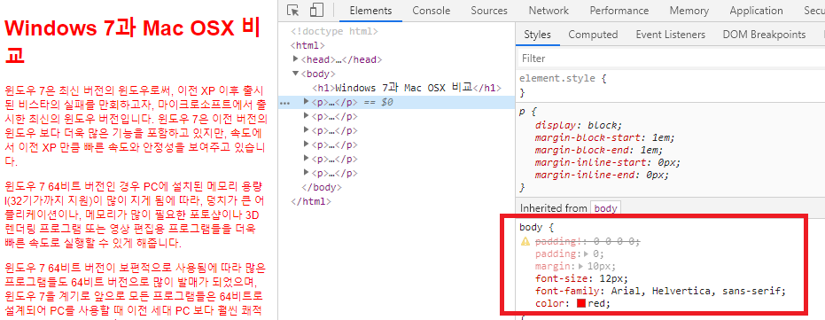

[TOC]

# CSS 기본

## CSS 란?

> Cascading Style Sheet - "계단형"의 의미로 스타일 적용에 특정도, 우선순위가 있다. 우선순위가 정해지는 것이 계단식 스타일 시트라는 의미이다.

```
필요한 이유 :
1. HTML에 직접 스타일을 적용함으로써 생기는 HTML문서 자체의 무거움을 줄일 수 있다.
2. 하나의 스타일로 다수 의 페이지에 같은 속성을 적용 함으로써 작업시간 단축
3. 웹 표준의  원칙  :  HTML 마크업을 통해 구조를 잡고,  CSS로 디자인을 입힘
```


## CSS를 적용하는 다양한 방법

### [1] 인라인 방식

> 태그에 직접 스타일을 적용하기 때문에 바로 확인이 가능하다.

> 바로 스타일 적용이 확인 되기 때문에 테스트 용도또는 웹메일을 전송할 때만 사용해야하고 그 외에는 절대 사용하지 말 것 !!!!!!!!! 

ex ) `<p style="color:red"> 내용 </p>     `

---


### [2] 임베디드 방식

> -태그에 직접 스타일을 지정하지 않고 `<head>와 </head>` 사이에 스타일을 지정하는 방식
>
> -HTML 문서 내부에 따로 스타일을 지정
>
> -스타일 형식을 지정 해주고 미디어 타입을 지정
>
> -스타일 형식 ‘text/css’ 는 고정
>
> -media타입은 화면에 보여줄 때 screen, 프린트 출력에는 print 그리고 두 가지 모두에 적용되는 공통 스타일이면 all 등이 올 수 있다.
>
> -CSS 코드가 길어지면 관리하기가 힘들어 진다.

ex)

```css
...
<head>
...
<style type=‘text/css’ media=‘screen’>
	p { color:#ddd }	
</style>  
...
</head>
<body>

	<p> 내용 </p>

</body>
```

---


### [3] link방식

> -임베디드 방식과 마찬가지로 `<head> 와 </head>` 사이에 특정 CSS 파일을 불러오도록 지정한다.
>
> -link방식을 선호 => 구버전 브라우저에서 @import를 인식 못하며, 속도 측면에서 link방식이 조금 빠르다고 한다.

**main.css**

```css
body {
   padding!: 0 0 0 0;
   padding: 0;
   margin: 10px;
   font-size: 12px;
   font-family: Arial, Helvertica, sans-serif;
   color: red;
} 
```

**html**

```html
<link href='main.css' rel='stylesheet' type='text/css'>
<body>
    
   ...
    
</body>
```


>

---


###  [4] @import 방식

```html
<style type=‘text/css’ media=‘screen’>
   @import url(main.css)	
</style>
```

> -하나의 CSS파일 내부에서 다른 CSS 파일을 불러올 수 있다.

ex) 

**main.css**

```css
* {
	margin: 0;
	padding: 0
}

body {
	font: 0.75em "맑은 고딕", 돋움, 굴림;
	text-align: center
}
```

**ex.css**

```css
@import "mysite.css";
```

