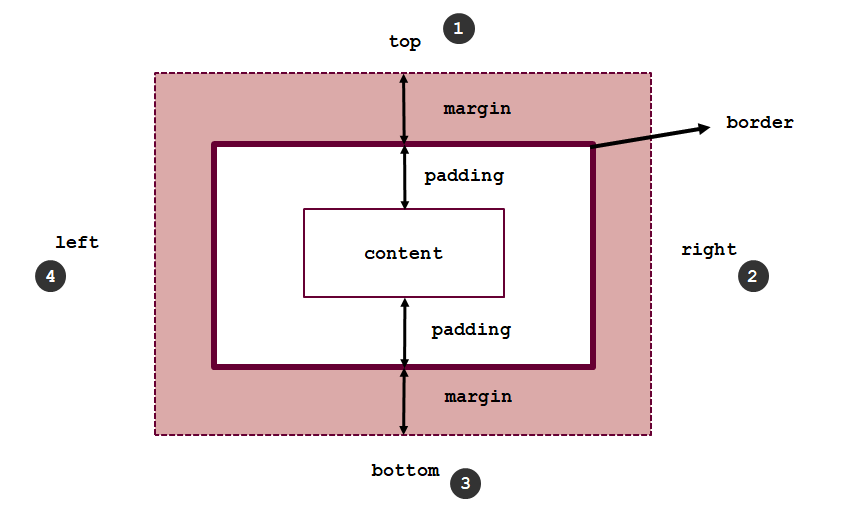
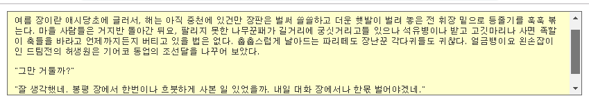
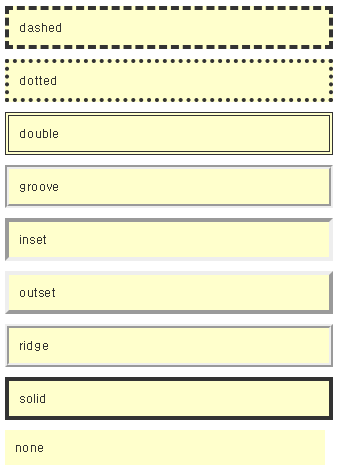
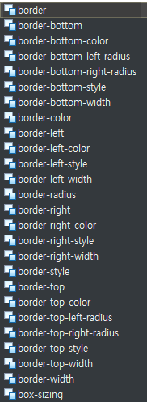
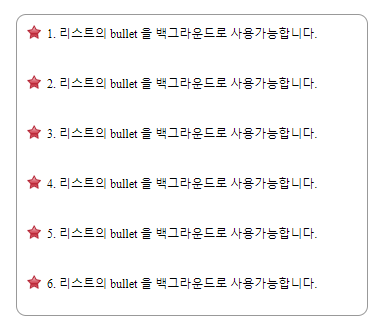

[TOC]

---

# CSS 박스 모델 속성

## 마진과 패딩 (margin & padding) 속성

먹히는 순서 -> top , right, bottom, left



```
지정 방법
방법1.  4개의 방향을 각각 지정
        margin-top:10px;
        margin-right:20px;
        margin-bottom:30px;
        margin-left:40px;
        
방법2. 각 방향으로 한꺼번에 지정하는 단축형
		margin: 10px 20px 30px 40px;   
		margin 값은 음수가 될 수 있다. 
```

- 가장 자주쓰는 속성

- 마진은 컨텐츠의 테두리를 기준으로  외부공간 지정

- 패딩은 컨텐츠의 테두리를 기준으로  내부공간 지정 

- 보통 모든 브라우저마다 마진 값이 기본적으로 지정되어 있다. 그리고 브라우저 마다 그 값이 다르다. 그래서  초기화 해주는 것이 페이지 레이아웃 잡을 때 편리하다.

  > `* { margin:0; padding:0}`

- px(픽셀), %(퍼센트), em(엠) 이렇게 세가지 단위를 가장 많이 사용

- margin 값은 음수가 될 수 있다. 


**ex)**

```css
padding-top: 10px;
padding-right: 20px;
padding-bottom: 30px;
padding-left: 40px;
/* shorten */ padding : 10px 20px 30px 40px;

/* 상하 좌우 같은 경우 */
padding: 10px 20px 10px 20px;
/* shorten */ padding : 10px 20px;

/* 모두 다 같은 경우 */
padding: 10px 10px 10px 10px;
/* shorten */ padding : 10px;

/* 좌우만 같은 경우 */
padding: 50px 10px 80px 10px;
/* shorten */ padding : 50px 10px 80px;
```

### margin음수값은 어떻게 응용할 수 있을까?

>  시간 지나면 점점 올라가 사라지는

```html
<script>
	window.onload = function() {
		var margin = 0;
		var intervalId = setInterval(function() {
			var el = document.getElementById('box');
			/* console.log(el.style.marginTop) */
			margin -= 10;
			el.style.marginTop = margin + "px"
			if (margin < -200) {
				clearInterval(intervalId);
			}
		}, 100);
	}
</script>
<body>
    <div id='box' style='margin-top:0;'>
    Hello World
    </div>
</body>
```

#### width & height 지정

- width 와 height 지정

  > width 와 height의 속성값은 %(퍼센트) 또는 px(픽셀 사용)

- 최대(최소) width 와  최대(최소) height 는 화면해상도에 맞는 페이지 작성할 때 유용

```html
<style type="text/css">
.box1 {
     max-width: 980px;
     min-width: 800px;  
         
     max-height: 100px;
     min-height:50px;
     
     height:500px;  
     
     overflow-y:hidden;
     overflow-y:scroll;
     overflow-y:auto;
}
</style>
<body>
<div class="box1">
	<p>여름 장이란 애시당초에 글러서, 해는 아직 중천에 있건만 장판은 벌써 쓸쓸하고 더운 햇발이 벌려 놓은 전 휘장 밑으로 등줄기를 훅훅 볶는다. 마을 사람들은 거지반 돌아간 뒤요, 팔리지 못한 나무꾼패가 길거리에 궁싯거리고들 있으나 석유병이나 받고 고깃마리나 사면 족할 이 축들을 바라고 언제까지든지 버티고 있을 법은 없다. 춥춥스럽게 날아드는 파리떼도 장난꾼 각다귀들도 귀찮다. 얼금뱅이요 왼손잡이인 드팀전의 허생원은 기어코 동업의 조선달을 나꾸어 보았다.</p>
	
	<p>"그만 거둘까?" </p>
	
	<p>"잘 생각했네. 봉평 장에서 한번이나 흐붓하게 사본 일 있었을까. 내일 대화 장에서나 한몫 벌어야겠네." </p>
</div>

</body>
```

> 


---

## border 속성

- 박스의  선을 긋는 속성으로 가장 많이 사용되는 속성중 하나이다.

```
지정 방법
[방법1].  일반형
    border-width: 속성값(두께지정)
    border-style : 속성값(dashed, dotted, double, inset, outset, ridge, solid, none)
    border-color : 색상지정
    
[방법2]. 
    border: 두께 스타일 컬러;
    
[방법3].
    border-top: 두께 스타일 컬러;
    border-right: 두께 스타일 컬러;
    border-bottom: 두께 스타일 컬러;
    border-left: 두께 스타일 컬러;
```

**ex)**

```html
<style type="text/css">
body {
	font-family: "돋움", "맑은 고딕";
	font-size: 0.8em;
	color: #333;	
	margin:0;
	padding:0; 
}
.box1, .box2, .box3, .box4, .box5, .box6, .box7, .box8, .box9  {
	margin:10px;
	padding:10px;
	width:300px;
	background-color: #FFC;
}
.box1 { border: 4px dashed;}
.box2 {border:4px dotted;}
.box3 {border:4px double;}
.box4 {border:4px groove;}
.box5 {border:4px  inset;}
.box6 {border:4px outset;}
.box7 {border: 4px ridge;}
.box8 {border: 4px solid;}
.box9 {border: 4px none;}
</style>

<body>
<div class="box1">dashed</div>
<div class="box2">dotted</div>
<div class="box3">double</div>
<div class="box4">groove</div>
<div class="box5">inset</div>
<div class="box6">outset</div>
<div class="box7">ridge</div>
<div class="box8">solid</div>
<div class="box9">none</div>
</body>
```

> 

**상 하 좌 우 로 각각 개별 속성을 줄 수 있다.**



```html
<style type="text/css">
.box8 {
	border: 3px #f00 solid;
	border-color: #f00 #0f0 #ff0 #000;
	border-style: 1px 5px 10px 15px;
	border-top-width: 10px;
}
</style>
```

> 


---


## 백그라운드 이미지 속성

- 아름다운 페이지를 표현하는 제일 강력한 속성
- 백그라운드 이미지를 사용하면 스타일만 제거했을 때 불필요한 이미지들이 대부분 사람짐  -> 프린트할 때 유용
- 표준 웹 페이지 는 백그라운드 이미지로 이미지를 대부분 표현한다.

```
지정 방법
방법1  :
{background: 속성값;}

[속성값]
color:  색상을 지정,
image:  배경 이미지 지정 URL(‘……’)
repeat: 배경이미지의 반복  repeat, no-repeat, repeat-x, repeat-y
position:  백그라운드 이미지의 위치  x,y 축을 기준으로  픽셀  값으로 지정  하거나 top, center, bottom, left, right 를 복합적,  또는 하나만 사용 
```

**ex)**

백그라운드 컬러 : `background-color:#022250;`

백그라운드 url 지정: `background-image:url('/wp_ch3/images/back_image2.jpg');`

백그라운드 사이즈 : `background-size:300px;`

백그라운드 시작 위치 : `background-position:0 0;`

백그라운드 반복 :

```html
# x 축으로 반복
background-repeat:repeat-x; 
# y 축으로 반복
background-repeat:repeat-y; 
# xy축으로 반복
background-repeat:repeat-xy;
```


**ex2) ul, li 속성에 image 삽입하기 **

```html
<style type="text/css">
body {
	font-size:12px;
	margin:10px;
	padding:10px;
}

ul.bullet {
	list-style-type:none;
	margin:10px 0 0 0;
	padding:0;
	border:1px solid #999;
	border-radius:10px;
	width:350px;
}

ul.bullet li {
	width:350px;
	height:40px;
	margin:10px 0 0 0;
	padding:0 0 0 30px;
	border:0px solid #555;
	background-image: url(images/bullet1.gif);
	background-repeat: no-repeat;
	background-position: 10px top;	
}
</style>
<body>
<ul  class="bullet">
    <li> 1. 리스트의 bullet 을 백그라운드로 사용가능합니다.</li>
    <li> 2. 리스트의 bullet 을 백그라운드로 사용가능합니다.</li>
    <li> 3. 리스트의 bullet 을 백그라운드로 사용가능합니다.</li>
    <li> 4. 리스트의 bullet 을 백그라운드로 사용가능합니다.</li>
    <li> 5. 리스트의 bullet 을 백그라운드로 사용가능합니다.</li>
    <li> 6. 리스트의 bullet 을 백그라운드로 사용가능합니다.</li>
</ul>
</body>
```

> 


---


## float를 이용한 박스모델 정렬 속성

- 박스 모델의 위치를 잡을 때 사용
- 부유라는 의미로 박스 모델을 물에 띠워 오른쪽이나 왼쪽으로 보낸 다는 의미

```
지정 방법
float: 속성값
속성값에는
right(오른쪽), left(왼쪽), none(없음)
```


