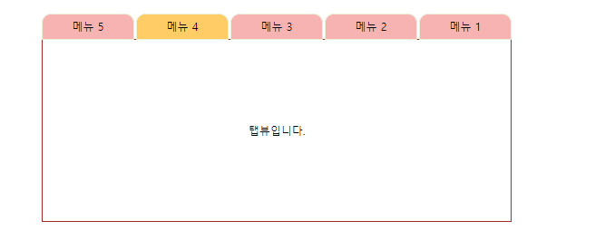

[TOC]

---

# 자바스크립트

## [1]

```html
<!DOCTYPE HTML>
<html>
<head>
<meta charset="utf-8">
<title>리스트를 이용한 메뉴 만들기</title>
<style type="text/css">
*                  { margin:0; padding:0 }
body{font-family: '맑은 고딕'; font-size: 12px;}
ol,li {list-style-type: none;}
.tab-box{
   width:520px;
   /* border: 1px solid blue; */
   margin:20px auto;
}

.tab-box ul{
   height: 29px;
}
.tab-box ul li{
   float:right;
   width:100px;
   height: 22px;
   border: 1px solid rgb(233, 243, 218);
   background-color: rgb(247, 178, 178); 
   text-align: center;
   padding-top: 5px;
   margin-right:2px;
   border-top-left-radius: 10px;
   border-top-right-radius: 10px;
   cursor: pointer;

}
.tab-box ul li.selected{
   background-color: #fc6;
}
.tab-box div{
   width: 516px;
   margin-top:-1px;
   border:1px solid brown;
   text-align: center;
   height: 200px;
   line-height: 200px;
}


</style>
<script >

 
var liSelected = null;
function onTabclicked(li){
   // unselect
   if(liSelected!=null){
      liSelected.className='';
   }
   // selected
   li.className= 'selected';
   liSelected=li;
}
 

</script>
</head>
<body>
<div class="tab-box">
   <ul>
        <li onclick="onTabclicked(this)">메뉴 1</li>
        <li onclick="onTabclicked(this)">메뉴 2</li>
        <li onclick="onTabclicked(this)">메뉴 3</li>
        <li onclick="onTabclicked(this)">메뉴 4</li>
        <li onclick="onTabclicked(this)">메뉴 5</li>
    </ul>
    <div>
       탭뷰입니다.
    </div>
</div>    
</body>
</html>
```

> 

---

## [2]

```html
<!DOCTYPE HTML>
<html>
<head>
<meta charset="utf-8">
<title>리스트를 이용한 메뉴 만들기</title>
<style type="text/css">
*                  { margin:0; padding:0 }
body{font-family: '맑은 고딕'; font-size: 12px;}
ol,li {list-style-type: none;}
.tab-box{
   width:520px;
   /* border: 1px solid blue; */
   margin:20px auto;
}

.tab-box ul{
   height: 29px;
}
.tab-box ul li{
   float:right;
   width:100px;
   height: 22px;
   border: 1px solid rgb(233, 243, 218);
   background-color: rgb(247, 178, 178); 
   text-align: center;
   padding-top: 5px;
   margin-right:2px;
   border-top-left-radius: 10px;
   border-top-right-radius: 10px;
   cursor: pointer;

}
.tab-box ul li.selected{
   background-color: #fc6;
}
.tab-box div{
   width: 516px;
   margin-top:-1px;
   border:1px solid brown;
   text-align: center;
   height: 200px;
   line-height: 200px;
}


</style>
<script >
var onTabClicked = function(event){
	var lisSelected = document.getElementsByClassName('selected');
   // unselect
   (lisSelected.length == 1) && (lisSelected[0].className='');  
   
   // selected
   this.className= 'selected';
}
  
window.onload = function(){
	var divTabBox = document.getElementsByClassName('tab-box')[0]
	var ulTabBox = divTabBox.childNodes[1]; 
	var lisTab =  ulTabBox.getElementsByTagName('li')
	
	for(i = 0; i < lisTab.length ; i++){
		lisTab[i].addEventListener('mouseover', onTabClicked);
	}
} 
</script> 

</head>
<body>
<div class="tab-box">
	안녕
   <ul> 
        <li>메뉴 5</li>
        <li>메뉴 4</li>
        <li>메뉴 3</li>
        <li>메뉴 2</li>
        <li>메뉴 1</li>
    </ul>
    <div>
       탭뷰입니다.
    </div>
</div>    
</body>
</html>
```

> 


