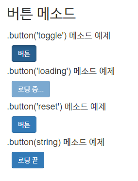

[TOC]

---

[전체 코드 보기](<https://github.com/jungeunlee95/bootstrap-example/tree/master/bootstrap-example2/src/main/webapp>)

**button-method.html** - 클릭이벤트 만들기

```html
<div class="container">

    <h2>버튼 메소드</h2>
    <h4>.button('toggle') 메소드 예제</h4>
    <div id="my-buttons-1" class="bs-example">
        <button type="button" class="btn btn-primary">버튼</button>
    </div>
    <div class="clearfix"></div>

    <h4>.button('loading') 메소드 예제</h4>
    <div id="my-buttons-2" class="bs-example">
        <button type="button" class="btn btn-primary" data-loading-text="로딩 중...">버튼</button>
    </div>
    <div class="clearfix"></div>

    <h4>.button('reset') 메소드 예제</h4>
    <div id="my-buttons-3" class="bs-example">
        <button type="button" class="btn btn-primary" data-loading-text="로딩 중 ...">버튼</button>
    </div>
    <div class="clearfix"></div>

    <h4>.button(string) 메소드 예제</h4>
    <div id="my-buttons-4" class="bs-example">
        <button type="button" class="btn btn-primary"  
                data-finish-text="로딩 끝">여기를 누르세요.</button>
    </div>

</div>
```

---

```javascript
$btn.on('click', function(){
});

$btn.click(function(){
})
```

> 두 개 같은 코드
>
> 위에 코드를 습관 들이는 것이 좋음 `.click`은 클릭 이벤트에 종속적이기 때문이다.
>
> [참고1](https://lookingfor.tistory.com/entry/JQuery-클릭-이벤트-onclick-과-click-의-차이)
>
> [참고2](https://win100.tistory.com/221)

---


**버튼 1 toggle 효과주기** 

```javascript
$(function(){
    /* 변수 이름에 $ 붙으면 제이쿼리 객체구나! -> 관례임 */
    var $btn = $('#my-buttons-1 .btn');

    $btn.click(function(){
        $btn = $(this); /* <button type="button" class="btn btn-primary">버튼</button> */
        $btn.button('toggle'); 
    })	
})
```

```javascript
$(function(){
    $('#my-buttons-1 .btn').click(function(){
        $btn = $(this); /* <button type="button" class="btn btn-primary">버튼</button> */
        $btn.button('toggle'); 
    })
})
```

> 위 아래 같은 코드!!!

---


**버튼2 효과주기**

```javascript
$(function(){
    $('#my-buttons-2 .btn').click(function(){
        $(this).button('loading'); 
    })
})
```


---

**버튼3 효과주기**

```javascript
$(function(){		
    $('#my-buttons-3 .btn').click(function(){
        var $btn = $(this);
        $btn.button('loading');

        setTimeout(function(){
            $btn.button('reset');  
        }, 1000); 
    })
})
```

---


**버튼4 효과주기**

```javascript
$(function(){		
    $('#my-buttons-3 .btn').click(function(){
        var $btn = $(this);
        $btn.button('loading');

        setTimeout(function(){
            $btn.button('reset');  
        }, 1000); 
    })
})
```

> 

