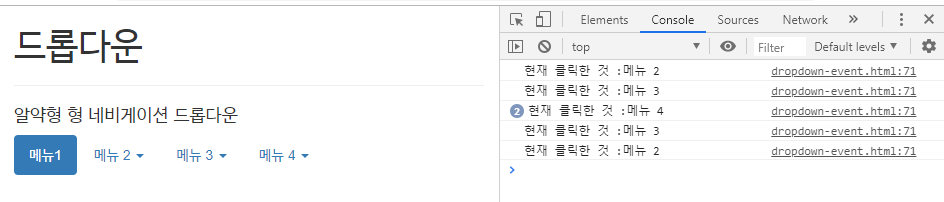
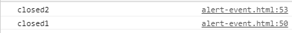
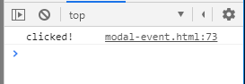
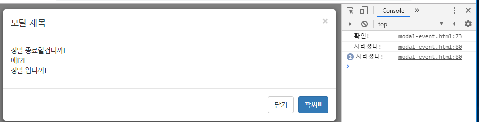

[TOC]

---

[전체 코드 보기](<https://github.com/jungeunlee95/bootstrap-example/tree/master/bootstrap-example2/src/main/webapp>)

**dropdown-event.html**

```html
<div class="container">
    <h1>드롭다운</h1>
    <hr>
    <h4>알약형 형 네비게이션 드롭다운</h4>
    <ul class="nav nav-pills">
        <li class="active"><a href="#">메뉴1</a></li>
        <li class="dropdown">
            <a data-toggle="dropdown" data-target="#" href="dropdown.html">메뉴 2 <span class="caret"></span></a>
            <ul class="dropdown-menu" role="menu">
                <li><a role="menuitem" href="#">메뉴 1</a></li>
                <li><a role="menuitem" href="#">메뉴 2</a></li>
                <li><a role="menuitem" href="#">메뉴 3</a></li>
                <li class="divider"></li>
                <li><a role="menuitem" href="#">분리된 메뉴 </a></li>
            </ul>
        </li>
        <li class="dropdown">
            <a data-toggle="dropdown" href="#">메뉴 3 <span class="caret"></span></a>
            <ul class="dropdown-menu" role="menu">
                <li><a role="menuitem" href="#">메뉴 1</a></li>
                <li><a role="menuitem" href="#">메뉴 2</a></li>
                <li><a role="menuitem" href="#">메뉴 3</a></li>
                <li class="divider"></li>
                <li><a role="menuitem" href="#">분리된 메뉴 </a></li>
            </ul>
        </li>
        <li class="dropdown">
            <a data-toggle="dropdown" href="#">메뉴 4 <span class="caret"></span></a>
            <ul class="dropdown-menu" role="menu">
                <li><a role="menuitem" href="#">메뉴 1</a></li>
                <li><a role="menuitem" href="#">메뉴 2</a></li>
                <li><a role="menuitem" href="#">메뉴 3</a></li>
                <li class="divider"></li>
                <li><a role="menuitem" href="#">분리된 메뉴 </a></li>
            </ul>
        </li>
    </ul>
</div>
```

---

**선택 드롭다운 확인** 

```javascript
$(function(){
    $('.dropdown').on("show.bs.dropdown", function(event){
        var linkText = $(event.relatedTarget).text();
        console.log("현재 클릭한 것 :" + linkText) 
    });
})

```



---


**collapse-event.html** **선택 collapse 이벤트**

```html
<div class="container">
    <h2>컬랩스 이벤트</h2>
    <div class="panel-group" id="accordion">
        <div class="panel panel-info">
            <div class="panel-heading">
                <h4 class="panel-title">
                    <a data-toggle="collapse" data-parent="#accordion" href="#collapsesample1"> 여기 클릭하면 펼쳐지고, 다시 클릭하면 접힙니다.</a>
                </h4>
            </div>
            <div id="collapsesample1" class="panel-collapse collapse">
                <div class="panel-body">Lorem ipsum dolor sit amet,
                    consectetur adipiscing elit. Nunc suscipit velit sit amet
                    tristique tincidunt. Fusce dapibus tortor ut est ornare porttitor.
                    Aliquam auctor bibendum posuere. Fusce laoreet tincidunt lacinia.
                    Aliquam posuere pharetra auctor. Pellentesque et eleifend nibh, a
                    bibendum lacus. Pellentesque sit amet dignissim mauris.
                    Suspendisse a erat congue nunc auctor malesuada. Mauris ultricies
                </div>
            </div> 

            <div class="panel-heading">
                <h4 class="panel-title">
                    <a data-toggle="collapse" data-parent="#accordion" href="#collapsesample2"> 여기 클릭하면 펼쳐지고, 다시 클릭하면 접힙니다.</a>
                </h4>
            </div>
            <div id="collapsesample2" class="panel-collapse collapse">
                <div class="panel-body">Lorem ipsum dolor sit amet,
                    consectetur adipiscing elit. Nunc suscipit velit sit amet
                    tristique tincidunt. Fusce dapibus tortor ut est ornare porttitor.
                    Aliquam auctor bibendum posuere. Fusce laoreet tincidunt lacinia.
                    Aliquam posuere pharetra auctor. Pellentesque et eleifend nibh, a
                    bibendum lacus. Pellentesque sit amet dignissim mauris.
                    Suspendisse a erat congue nunc auctor malesuada. Mauris ultricies
                </div>
            </div>


        </div>
    </div>
</div>
```

```javascript
$(function(){
    $('#collapsesample1').on('show.bs.collapse', function(){
        console.log('펼쳐질 때 이 메세지가 보입니다.');
    })
})
```

---


**alert-event.html** 선택 알림창

```html
<div class="container">
    <h3>경보 이벤트 예제</h3>
    <div id="myAlert" class="alert alert-success">
        <a href="#" class="close" data-dismiss="alert">&times;</a>
        <h2>성공!</h2>
        <p>성공적으로 작업이 수행되었습니다.</p>
    </div>
</div>
```

```javascript
$(function(){
    $('#my-alert')
        .on('closed.bs.alert', function(){
        console.log('closed1');
    })  
        .on('close.bs.alert', function(){
        console.log('closed2');  
        //return false; // 창 안닫힘
    })
});
```



---

확인창 받기

```javascript
$(function(){
    $('#my-alert')
        .on('closed.bs.alert', function(){
        console.log('closed1');
    })  
        .on('close.bs.alert', function(){
        return isOK = confirm("정말 닫을거야?");
    })
});
```

---

**modal-event.html**

```html
<div class="container">


    <h1>모달</h1>

    <hr>
    <!-- Button trigger modal -->
    <button id='btn-show-modal' class="btn btn-primary btn-lg" data-toggle="modal"
            data-target="#myModal">여기를 클릭하시면 모달 윈도우가 실행됩니다.</button>

    <hr>


    <a href="#myModal" data-toggle="modal">여기를 클릭하시면 모달 윈도우가 실행됩니다. </a>

    <!-- Modal -->
    <div class="modal fade" id="myModal" tabindex="-1" role="dialog" aria-labelledby="myModalLabel" aria-hidden="true">
        <div class="modal-dialog">
            <div class="modal-content">
                <div class="modal-header">
                    <button type="button" class="close" data-dismiss="modal">
                        <span aria-hidden="true">&times;</span><span class="sr-only">Close</span>
                    </button>
                    <h4 class="modal-title" id="myModalLabel">모달 제목</h4>
                </div>
                <div class="modal-body">
                    <p>
                        정말 종료할겁니까!<br>
                        예!?!<br>
                        정말 입니까!<br> 
                    </p> 
                </div>
                <div class="modal-footer">
                    <button type="button" class="btn btn-default" data-dismiss="modal">닫기</button>
                    <button type="button" class="btn btn-primary">팍씨!!</button>
                </div>
            </div>
            <!-- 모달 콘텐츠 -->
        </div>
        <!-- 모달 다이얼로그 -->
    </div>
    <!-- 모달 전체 윈도우 -->


</div>
```

---

```javascript
$(function(){ 
    $('#btn-show-modal').click(function(event){
        console.log('clicked!');
    }); 
}) 
```



---

모달 직접 제이쿼리로 처리하기

```html
<!-- Modal -->
<div class="modal fade" id="myModal" tabindex="-1" role="dialog" aria-labelledby="myModalLabel" aria-hidden="true">
```

-> id 바꿔서 실험해보자

```html
<!-- Modal -->
<div class="modal fade" id="my-modal" tabindex="-1" role="dialog" aria-labelledby="myModalLabel" aria-hidden="true">
```

```javascript
$(function(){ 
    $('#btn-show-modal').click(function(event){
        $('#my-modal')
            .on('hide.bs.modal', function(){
            console.log('사라졌다!')
        }) 
            .modal('show');
    }); 
}) 
```

> 

---

**모달 버튼 조작** -> 버튼에 id 주기

```html
<button id='modal-ok' type="button" class="btn btn-primary">팍씨!!</button>
```

```javascript
$('#modal-ok').click(function(event){
    console.log("확인!");
    $('#my-modal').modal('hide');
}); 
```

> 
>
> 팍씨 누르면 확인! 출력
>
> 그냥 esc로 끄면 사라졌다! 만 출력


