[TOC]

---

# 리눅스에 Python 설치

python virtual environment 구축하는 다양한 방법(isolation)

```
1. python -m venv {}
2. virtualenv
3. pyenv X
4. conda X
```

/usr/local/cafe24/python3.7 에 다운로드!

(yum이 python을 쓰기에 기존 파이썬은 삭제하지 말자!)

`python3` - 3.7버전 파이썬 명령어로

---

## 1 Python 설치(CentOS 6.9)(컴파일)

### 1-1 기본 라이브러리 

`# yum -y install openssl`

`# yum -y install openssl-devel`

`# yum -y install bzip2-devel`

`# yum -y install sqlite-devel`

`# yum -y install zlib-devel`

`# yum -y install libffi-devel`

---

openssl(1.0, 1.2) -> ....

​							|- > libressl -> 2.1    -> 2.6.4 -> 2.9..

​																 (python3.7)이 2.6.4이상을 요구함

:star:python 3.7.x 버전에서는 libressl 2.6.4 이상이 필요

> 다운 : <https://ftp.openbsd.org/pub/OpenBSD/LibreSSL/>
>
> 1, 소스다운
>
> `# wget https://ftp.openbsd.org/pub/OpenBSD/LibreSSL/libressl-2.9.2.tar.gz`
>
> `# tar xvfz libressl-2.9.2.tar.gz`
>
> 2, 빌드 환경 설정
>
> `# cd libressl-2.9.2`
>
> `# ./configure --prefix=/usr/local/ssl`
>
> > `./configure` 은 인스톨 하기 위한 환경을 설정하는 것
> >
> > `--prefix={경로}`는 컴파일 된 프로그램을 설치하는 위치
>
> 3, 컴파일 및 설치
>
> `# make`
>
> `# make install`

4, 공유 라이브러리 자동 로딩 설정

`# cd /usr/local/ssl/`

---

:star:**공유라이브러리란!?!?!**

**파이썬 라이브러리 - 공유 라이브러리 - 속도 느릴수있음 - 하지만 어쩔수없는 상황**

> 공유 라이브러리는 프로그램이 시작할때 적재되는 라이브러리이다. 공유 라이브러리가 제대로 설치된다면, 그다음에 시작하는 모든 프로그램은 자동적으로 새 공유 라이브러리를 사용한다.

> 프로그램들은 일반적으로 필요한 기능을 전부 구현하기 보다는 특정 기능이 이미 구현되어 있으면 그 기능이 구현된 파일을 메모리에 올린 후 그 기능을 사용하게 된다. 예를 들면 , 인터넷에서 파일을 다운로드 받는 기능이 필요하면 그 기능이 구현된 파일을 메모리에 올린 후 그 기능을 사용하게 되는 것이다. 이처럼 한 프로그램이라 하더라도 일반적으로 사용되는 여러 기능이 내부에서 다른 so 파일들을 통해서 이루어 지게 된다.

> 공유라이브러리와 연결된 프로그램을 실행하면 내부적으로 dynamic loader 프로그램이 먼저 동작해서
>
> 1, dynamic link된 공유 라이브러리 찾아 메모리에 로딩
>
> 2, entry function을 찾아 호출
>
> 3, 프로그램 실행
>
> 로더 이름 : `ld.so` >>>>> so = shared object
>
> ```
> so 파일을 찾는 경로 설정
> 1. system default 경로
> 2. LD_LIBRARY_PATH
> 3. binary code 에 hard-coding 된 경로
> 
> 1. system default
> > 일반적으로 /usr/local/bin 과 /usr/bin 이다. 이 값은 /etc/ld.so.conf 파일에 설정이 된 값이다.
> > 만약 내가 어떤 프로그램을 만들었고, 그것을 내 프로그램이 설치된 경로 밑의 lib 경로에 넣고 그것을 ld.so.conf 에 넣고 싶으면, /etc/ld.so.conf.d/ 경로 밑에 *.conf 파일 이름으로 저장 후 그 파일에 그 경로를 집어 넣으면 된다.
> 
> 2. LD_LIBRARY_PATH - 환경변수 -> 권장되는 방법은 아님
> /etc/profile파일에 아래 추가
> export LD_LIBRARY_PATH=$LD_LIBRARY_PATH:/usr/local/ssl/lib
> 
> 3. binary code 에 hard-coding 된 경로
> 
> ```
>
> 

`# vi /etc/ld.so.conf.d/ssl.conf`

​	/usr/local/ssl/lib   -> 이 라이브러리 전부 메모리에 올려

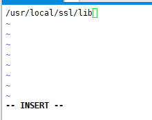

`# ldconfig -v | grep ssl` : 확인


---


### 1-2 Python 3.7.3 설치

1, 다운로드
`# cd`

`# wget https://www.python.org/ftp/python/3.7.3/Python-3.7.3.tgz`

`# tar xvfz Python-3.7.3.tgz `


2, 빌드

`# cd Python-3.7.3`

`# ./configure --prefix=/usr/local/cafe24/python3.7.3 --with-openssl=/usr/local/ssl --enable-shared`  

>  openssl -> 공유라이브러리
>
> 파이썬 핵심 모듈 아파치도 써야하니까 쉐어?

`# make`

> 여기에 ssl이 있으면 안돼
>
> 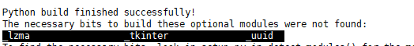

`# make install`


3, 공유 라이브러리 로딩 설정

`# vi /etc/ld.so.conf.d/python.conf`에

​	/usr/local/cafe24/python3.7/lib 


`# ldconfig -v | grep python` 


4, 링크설정

`# cd /cafe24`

`# ln -s python3.7.3/ python3.7`


5, PATH 작업

`# vi /etc/profile`

 export PATH=$PATH:/usr/local/cafe24/python3.7/bin

> 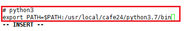

`# source /etc/profile`


6, python 설치 완료!

`# python3 --version`

---


---

## 2 Python Isolation Tools (Virtual Environments)

```
1. venv		  : python 3.3 이후부터 기본 모듈
2. virtualenv : python2 부터 사용하던 가상환경 라이브러리
3. pyenv	  : Python Interpretor Version Manager
4. conda	  : Anaconda Python 설치했을 때 사용할 수 있다.
5. etc		  : virtualenvwrapper, buildout .. . .
```

### 2-1 virtualenv

1, 설치

원래 모듈 실행 : `python3 -m pip` 이렇게 해야하는데 스크립트 제공해줘서 `pip3`

`# cd`

`# pip3 install virtualenv`


2, 프로젝트 생성

`# cd dowork/`

`# mkdir python-projects`

`# cd python-projects`

`# mkdir loganalysis`  


3, 가상환경 생성

`# cd loganalysis`

`# virtualenv venv` 

> : 중앙에 있는 걸(/cafe24/python3.7/) 우리 프로젝트에 venv라는 디렉토리 밑으로 복사
>
> 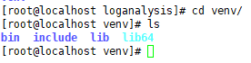


4, 가상환경 구동

`# source venv/bin/activate` 


5, 가상환경 확인

`(venv) # python --version `


6, 가상환경 나가기 : `# deactivate`

> 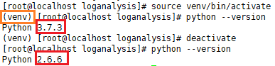


### 2-2 python -m venv

`# deactivate`

`# cd ..`

`# mkdir loganalysis2` 

`# cd loganalysis2/`

`# python3 -m venv venv`

`# source venv/bin/activate`


### 2.3 간단한 postgres 연결 모듈 테스트 해보기

연습

`# cd loganalysis`

`# source venv/bin/activate`

`# pip install psycopg2`

> 여기서 install한 psycopg2는 어디에 다운된거야?
>
> `/root/dowork/python-projects/loganalysis/venv/lib/python3.7/site-packages`
>
> 해당 프로젝트 가상환경 밑에!


`(venv) [root@localhost loganalysis]# vi test_connect.py`

```python
try:
    conn = psycopg2.connect(
        user='webdb',
        password='webdb',
        host='192.168.1.52',
        port='5432',
        database='webdb',
        )
    cursor = conn.cursor()
    cursor.execute('select version()')
    record = cursor.fetchone()
    print(f'connected to - {record}')

except Exception as e:
    print(f'error : {e}')

finally:
    'conn' in locals() \
    and conn \
    and conn.close()

    'cursor' in locals() \
    and cursor\
    and cursor.close()
```


error :x:


> import 할 수 없다!?
>
> python path가 안잡혀서 에러나는거임!!!
>
> pgsql 링크가 잘못 되어있었다.

> :star:**postgres < 10.8인 경우 다음 사항 확인**
>
> `# cd /usr/lib64`
>
> `# rm -f libpq.so.5`
>
> ` # ln -s /cafe24/pgsql/lib/libpq.so.5 libpq.so.5`


에러 해결! :o:

```powershell
(venv) [root@localhost loganalysis]# python test_connect.py 
connected to - ('PostgreSQL 10.2 on x86_64-pc-linux-gnu, compiled by gcc (GCC) 4.4.7 20120313 (Red Hat 4.4.7-23), 64-bit',)
```

---


---


### 2.4 리눅스에서 git clone python 프로젝트 test

1, pycharm에서 upgsql_crud 프로젝트 생성


2, 패키지 의존성 파일 생성

> `pip freeze > requirement.txt`
>
> 원래 requirements임!


3, github commit (venv 및 프로젝트 설정 파일 ignore)

> ignore all files under

> 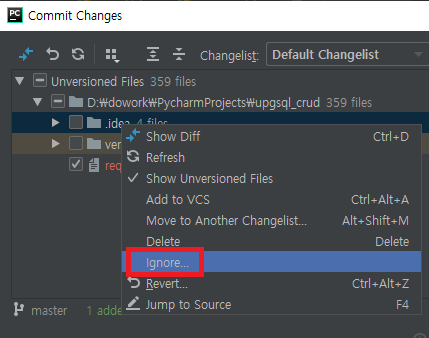


4, git clone 받기

`git clone https://github.com/jungeunlee95/upgsql_crud.git`

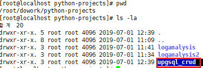


5,  가상환경 생성(isolationize)

`[root@localhost upgsql_crud]# virtualenv venv`

실행 : `# source venv/bin/activate`


6, 의존성 설치

`(env) [root@localhost upgsql_crud]# pip install -r requirement.txt`

> 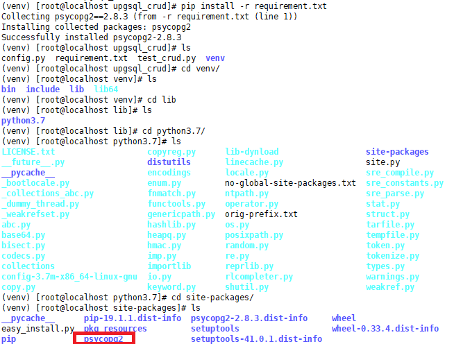


7, 실행

> 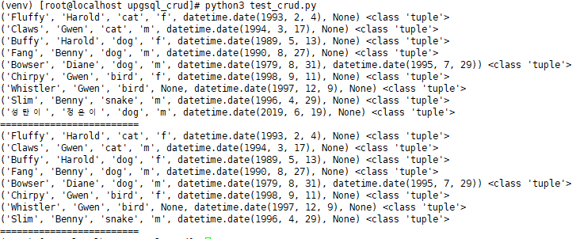
>
> 됨

---

다시 집에서 리눅스 python프로젝트를 pycharm에 git pull 해온다면!?

settings -> project interpretor

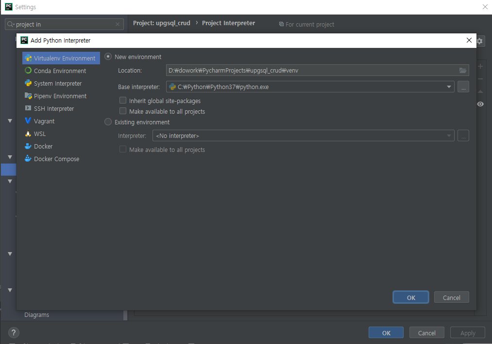

terminal 

`call venv/scripts/activate`

 `pip install -r requirement.txt`

`pip list`

---


---


### 2.5 upgsql_crud프로젝트의 test_crud.py를 고립시키지 않고(venv 사용 X) 실행하기

아래 루트가 sys path에 걸려있으면 됨

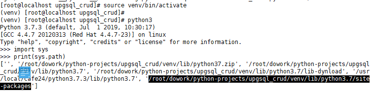


`# cd /root/dowork/python-projects`

`# export PYTHONPATH='/root/dowork/python-projects/upgsql_crud/venv/lib/python3.7/site-packages'`

실행 : `[root@localhost python-projects]# python3 upgsql_crud/test_crud.py`

---


---

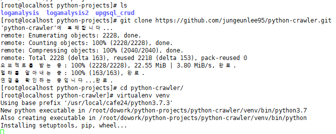

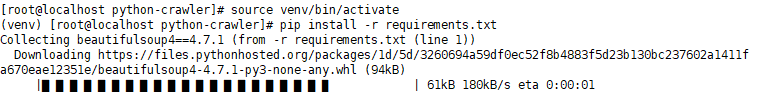

---


