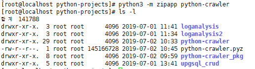
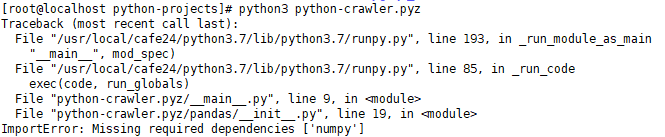
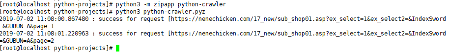

[TOC]

---

`(venv) [root@localhost python-crawler]# python3 __main__.py `

--> 실행 O

`(venv) [root@localhost python-projects]# python python-crawler` (자동으로 그 프로젝트의 `__main__.py` 실행)

--> 오류 -> `__results__` 디렉토리를 찾을 수 없음


`python_crawler/__main__`실행할 때, `__results__` 디렉토리를 못찾아서, 프로젝트 밖에서는 실행할 수 없음 -> 절대경로 찾아줘야함 

:heavy_check_mark:**python 모듈의 절대 경로**

`print(os.path.abspath(__file__))`

> ```
> D:\dowork\PycharmProjects\python_crawler\__main__.py
> ```

:heavy_check_mark:**상위 디렉토리**

`BASE_DIR = os.path.dirname(os.path.abspath(__file__))`

> D:\dowork\PycharmProjects\python_crawler

```python
# 모듈의 절대위치 구하기(다른 환경에서 실행할 때)
# print(os.path.abspath(__file__)) # 모듈의 절대경로
BASE_DIR = os.path.dirname(os.path.abspath(__file__))
RESULT_DIR = f'{BASE_DIR}/__results__'
table.to_csv(f'{RESULT_DIR}/nene.csv', encoding='utf-8', mode='w', index=0)
```

근데 나중에 zip 파일 만들 때, 프로젝트 내부에 두지 말자

`table.to_csv('/root/crawling-results/nene.csv', encoding='utf-8', mode='w', index=0)`  --> `/root`경로에 crawling-results 디렉토리 만들면 된다!

---

:heavy_check_mark:git에서 잘못 올라간 파일 삭제할 때

> git rm -rf --cached {디렉토리 이름}
>
> git rm -f --cached {파일 이름}

---


---

:heavy_check_mark: python 프로젝트 clone하기 (venv아닌 상황에 python application 실행)

### 1, ` export PYTHONPATH='application 의존성 경로`' 

ex)

1, `git clone https://github.com/jungeunlee95/python-crawler.git`

2, ` pip3 install -r python_crawler/requirements.txt --target=python_crawler/packages`

3, `export PYTHONPATH='/root/python-projects/python_crawler/packages'`

3, `python3 python_crawler`


### 2, 꼭 exprot PYHONPATH를 해야하나?

ex)

1, `git clone https://github.com/jungeunlee95/python-crawler.git`

2, ` pip3 install -r python-crawler/requirements.txt --target=python-crawler`

3, `python3 python-crawler`


### 3, 압축(packing)

ex)

1, `git clone https://github.com/jungeunlee95/python-crawler.git`

2, ` pip3 install -r python-crawler/requirements.txt --target=python-crawler`

3, `python3 -m zipapp python-crawler`

> 

4, `python3 python-crawler.pyz`

> 
>
> 압축했을 때, numpy 문제가 생김 
>
> > pandas, numpy 관련 다 주석하고 다시 pull받으면 실행 됨!
> >
> > 


### 4, 실행 가능 파일로 packing

ex)

1, `git clone https://github.com/jungeunlee95/python-crawler.git`

2, ` pip3 install -r python-crawler/requirements.txt --target=python-crawler`

3, `python3 -m zipapp -p "/cafe24/python3.7/bin/python3" python-crawler`

4, `python3 python-crawler.pyz`

---


