[TOC]

---

## apache

**아파치 포트 확인하기 :**

`/cafe24/apache`

`vi conf/httpd.conf`-> /Listen검색 -> 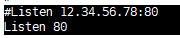

---

**아파치 : 톰캣과 연결 확인** => :star:AJP

`/cafe24/apache/conf`

`vi workers_jk.properties`

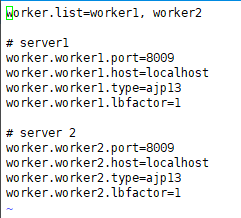

매핑된 uri 확인

`vi uriworkermap.properties`

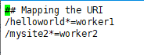

---

**톰캣 프로젝트 로그 확인:**

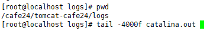

**아파치 url 접근 확인 :**

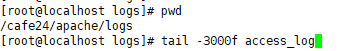

---

**톰캣-cafe24 포트 확인:**

`/cafe24/tomcat-cafe24/`

`vi conf/server.xml`   -> 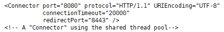

**AJP포트**

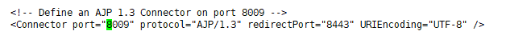

---

**톰캣-jenkins 포트 확인 :**

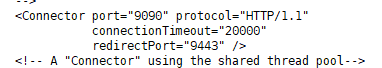

---

**내가 방화벽 열고 있는 port 확인:**

`vi /etc/sysconfig/iptables`

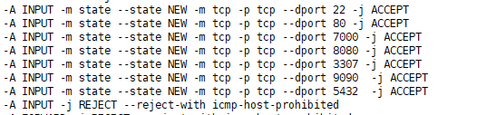

---

현재 상황! (사실 8080포트는 막고있어야해, 아파치(80)을 통해서 AJP 프로토콜로 8009를 찔러서 프로젝트에 들어가야함!!!)				 	

​																/helloworld, /mysite2

​																            <---AJP----

외부 --HTTP--> [8080:tomcat-cafe24 :8009] <---AJP----

​																					  [:apache:80]   <--HTTP-- 외부

외부 --HTTP--> [9090:tomcat-jenkins :9009]

---

여기서 80/mysite2 접근이 자꾸 not found 떴었는데,

아파치 설정이 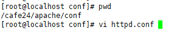

> 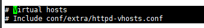										

vritual hosts의 주석이 풀려있었음. 다시 주석 넣어주면됨(한개의 서버에서 여러개의 웹사이트를 연결)

---

---

아파치-장고에서는 wsgi.py 가 실행됨 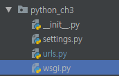

**이제 아파치에 django project를 넣어보자!** 

​																/helloworld, /mysite2

​																            <---AJP----

외부 --HTTP--> [8080:tomcat-cafe24 :8009] <---AJP----

​																					  [:apache:80]   <--HTTP-- 외부

외부 --HTTP--> [9090:tomcat-jenkins :9009]	

​																					  [:apache:8888]   <--HTTP-- 외부

​																	  	(mod_wsgi)    |    (execute)

​																								WSGI

​																								  |

​																					django App's wsgi.py

---

## apache vhost 설정

- 도메인 기준 (같은 포트, 다른 도메인)
- 포트 기준(다른 포트, 같은 도메인 or 다른 도메인) : apache 멀티포트 서비스

> 다른 포트로 test하기(도메인이 없기때문에 포트를 2개로)

### 1, httpd.conf

**1) Listen 80**

​    Listen 8888 (추가)

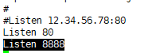

**2) DocumentRoot 디렉토리 권한 설정 주석처리**

이제 DocumentRoot는 의미가 없으니까 주석처리

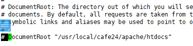

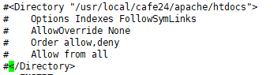

**3) Virtual Host 설정파일 주석 해제**

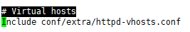

 **4) vi extra/httpd-vhosts.conf  설정**

> NameVirtualHost *:8888 추가
>
> 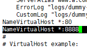

> 1, 80 포트 vhosts경로 설정
>
> 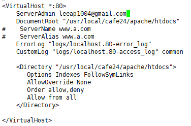

> 2, 8888 포트 vhosts경로 설정
>
> 일단 디렉토리 만들기(원래 git clone 해올건데 일단 test로 직접 만들자)
>
> 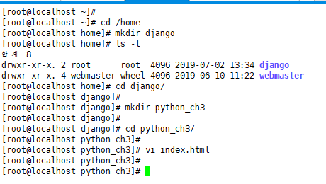
>
> 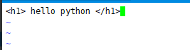
>
> 경로 설정
>
> 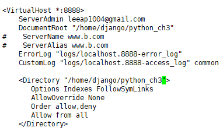

### 2, 포트열기

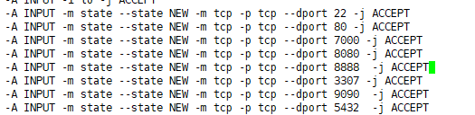

서버 재시작 : `# /etc/init.d/httpd stop`, `# /etc/init.d/httpd start`

방화벽 재시작 : `# /etc/init.d/iptables stop`, `# /etc/init.d/iptables start`

> 80
>
> 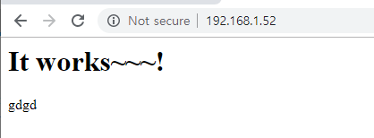

> 8888
>
> 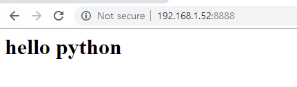

### 3, JKMountFile 주석

django-톰캣 연동과 함께 할 경우 JKMountFile  설정은 extra/httpd-vhosts.conf에 할 것!!!!!

---

/cafe24/apache/conf/httpd.conf

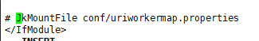

`# JkMountFile conf/uriworkermap.properties` 주석

---

/cafe24/apache/conf/extra/httpd-vhosts.conf

80포트 설정 안에 넣어주면 됨!!!

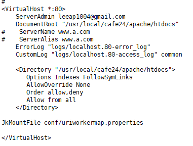

---

