[TOC]

---

## 1. mod_wsgi 설치

[다운로드](https://github.com/GrahamDumpleton/mod_wsgi/releases/tag/4.6.4)

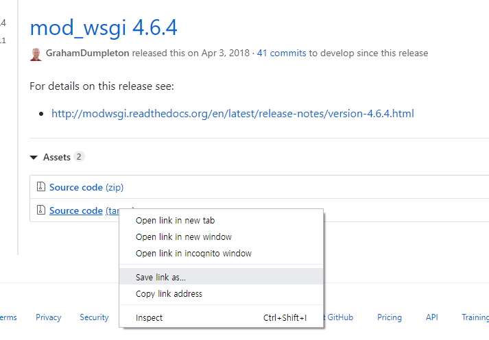

copy link address

`# wget https://github.com/GrahamDumpleton/mod_wsgi/archive/4.6.4.tar.gz`

`# mv 4.6.4.tar.gz mod_wsgi_4.6.4.tar.gz`

`# tar xvfz mod_wsgi_4.6.4.tar.gz`

`# cd mod_wsgi-4.6.4/`

`# ./configure --with-apxs=/usr/local/cafe24/apache/bin/apxs --with-python=/usr/local/cafe24/python3.7/bin/python3`

​		` --with-apxs`: 모듈 만드는 아파치 도구 

​		`--with-python`: 파이썬 라이브러리 위치 알려주기

`# make`

`# make install`


## 2, 설정

**1) httpd.conf** 

모듈 로딩 위치 :    `/cafe24/apache/conf`

httpd.conf에서 /LoadMod 검색해서 LoadModule맨 아래에 추가

`# vi httpd.conf `

`LoadModule wsgi_module modules/mod_wsgi.so`

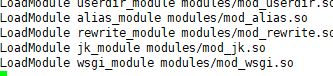


**2) extra/httpd-vhosts.conf 설정**

`# vi extra/httpd-vhosts.conf`

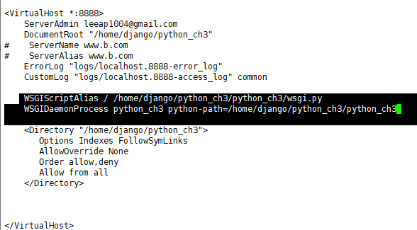

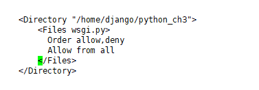

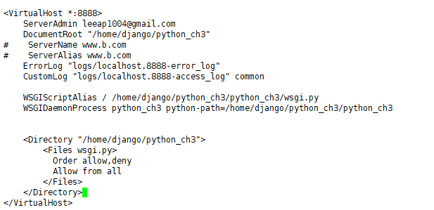

---


## 3, clone 해오기

pycharm 프로젝트에서 `pip3 freeze > requirements.txt` 만들어서 git에 올리기

```
[root@localhost django]# pwd
/home/django
```

`# git clone https://github.com/jungeunlee95/django-basic.git`

`# mv django-basic/ python_ch3`

`# cd python_ch3`

`# virtualenv venv`

`# source venv/bin/activate`  가상환경 실행

`(venv) [root@localhost python_ch3]# pip3 install -r requirements.txt `


port 9999 열기

`# vi /etc/sysconfig/iptables`

​    `-A INPUT -m state --state NEW -m tcp -p tcp --dport 9999  -j ACCEPT`

`# /etc/init.d/iptables restart`

> pycharm settings.py `ALLOWED_HOSTS = ['*']` 설정해주기 -> 다시 git pull


## 서버 실행하기

`# python manage.py runserver 0.0.0.0:9999`

> 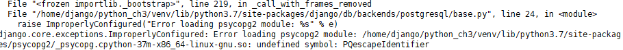
>
> 오류났어요 ㅠㅠ [오류 이유](http://www.leeladharan.com/importerror-psycopg-so:-undefined-symbol:-lo-truncate64)
>
> 해결 : 
>
> ```
> cd /usr/lib64
> rm libpq.so.5
> ln -s /usr/local/cafe24/pgsql/lib/libpq.so.5 libpq.so.5
> /etc/init.d/postgres stop
> /etc/init.d/postgres start
> ```
>
> 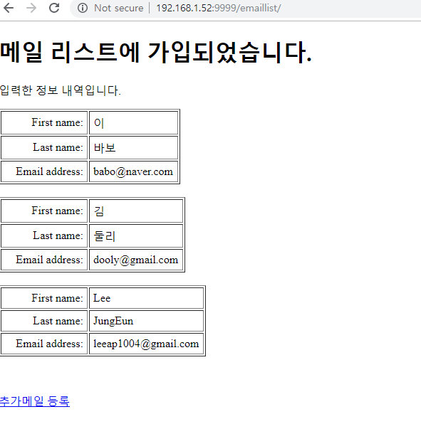
>
> 됐따@!!!!

---


---

venv 영향 안받고 runserver시키기

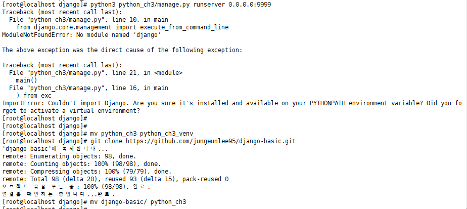

`# pip3 install -r python_ch3/requirements.txt --target=python_ch3`

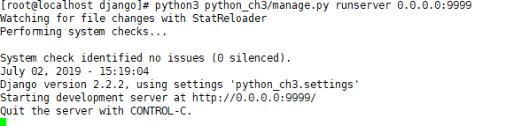


---


아파치-django 연동

`# git clone https://github.com/jungeunlee95/django-basic.git`

`# mv django-basic/ python_ch3`

`# pip3 install -r python_ch3/requirements.txt --target=/home/django/python_ch3`

`# export PYTHONPATH='/home/django/python_ch3'`

`# /etc/init.d/httpd restart`

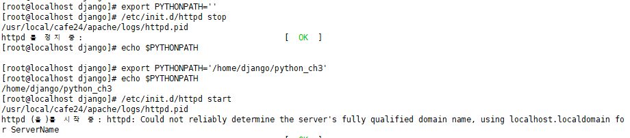

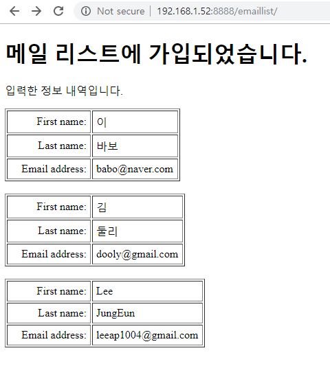

---

한번더

`# git clone https://github.com/jungeunlee95/django-basic.git`

`# mv django-basic/ python_ch3`

`# pip3 install -r /home/django/python_ch3/requirements.txt --target=/home/django/python_ch3`

`# export PYTHONPATH=''`

`# /etc/init.d/httpd restart`

> 에러남:
>
> 로그 확인해보기
>
> 
>
> 
>
> 모듈 장고를 알 수 없다1?!!
>
> **python_ch3/python_ch3/wsgi.py**에 코드 추가하기
>
> ```python
> import sys
> sys.path.append(os.path.dirname(os.path.dirname(os.path.abspath(__file__))))
> # 프로세스 내에서만 사용하는 환경변수(프로세스가 내려가면 사라지는 path)
> ```
>
> ```python
> import os
> import sys
> 
> sys.path.append(os.path.dirname(os.path.dirname(os.path.abspath(__file__))))
> 
> from django.core.wsgi import get_wsgi_application
> 
> os.environ.setdefault('DJANGO_SETTINGS_MODULE', 'python_ch3.settings')
> 
> application = get_wsgi_application()
> ```
>
> 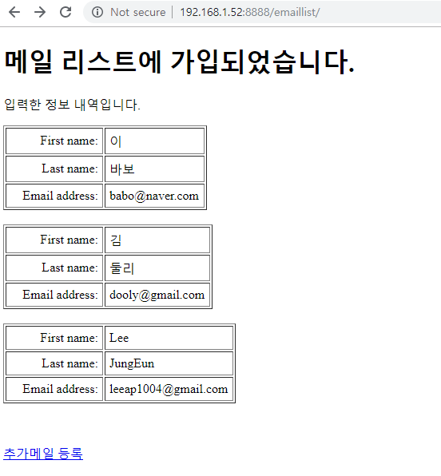


