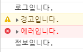
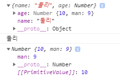
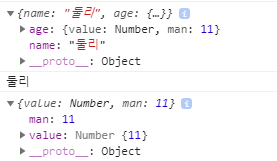
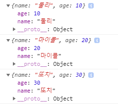
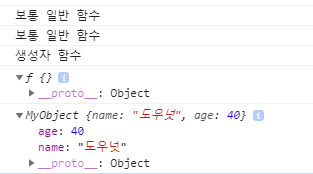
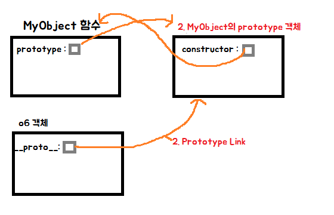
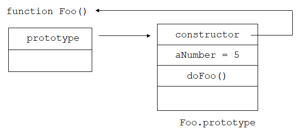
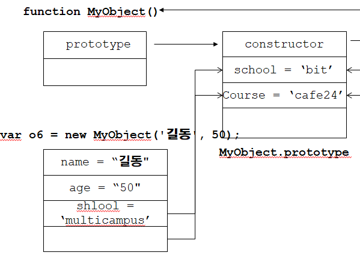
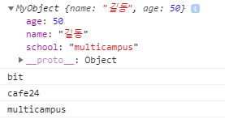

[TOC]

---

# javascript 기본

## [1] 자바스크립트 사용법

1) 본문 혹은 head안에 사용

```html
<head>
<script type="text/javascript">
   자바스크립트 소스코드
</script>
</head>
<body>
... 
</body>
```

2) 외부 파일 불러서 실행 ( 보통 이렇게 자바스크립트를 관리) 

```html
<head>
<script type="text/javascript" src="hello.js"></script>
</head>
<body>
... 
</body>
```

---

<br>

[자바스크립트 Object 이해하기 참고](<http://insanehong.kr/post/javascript-object/>)

## [2] Javascript 기본 데이터 타입

**✔ [특징]**

- Javascript의 `class free` : class가 없어도 객체 생성이 가능하다.

- 객체가 객체를 포함하기 쉬운 구조이다. (그래프, 트리, 맵 등을 쉽게 표현할  수 있다.)

- 객체 하나에 있는 속성들을 다른 객체에 상속해 주는 프로토 타입 연결 특성이 있다.

  > 초기화 시간 단축, 메모리 절약가능
  >
  > ex) 테이블 데이터가 무수히 많아지면 원페이지 처리를 어떻게 할 것인가

- Object Literal -> JSON


**✔ [1] Primitive Data Type (기본 자료형)**

- Number
- Boolean
- String
- null 
- undefined


**✔ [2]  객체**

- Array
- Date
- Math
- RegExp
- Function
- Object


**✔ [3] 유사 객체** - 기본타입도 객체와 유사한 성질을 갖고있는 것

- Number
- String
- Boolean

```js
var number = 5;
console.log(number + ' : ' + typeof(number));
```

> 5 : number 

<br>

함수는 생성자처럼 쓰는 '그냥' 함수 객체이다. 함수에 new를 다 붙일 수 있다. 

```js
var number2 = new Number(5); 
console.log(number2 + ' : ' + typeof(number2));

console.log(number + number2); 
```

> 5 : object
>
> 10

<br>

**자바스크립트 타입 확인해보기**

```js
var n = 10;
var f = 3.14;
var b = true;
var s = 'hello world';
var fn = function(){};
var o = {};
var a = [];

console.log(n + ' : ' + typeof(n));
console.log(f + ' : ' + typeof(f));
console.log(b + ' : ' + typeof(b));
console.log(s + ' : ' + typeof(s));
console.log(fn + ' : ' + typeof(fn));
console.log(o + ' : ' + typeof(o));
console.log(a + ' : ' + typeof(a));
```

> 10 : number
>
> 3.14 : number
>
> true : boolean
>
> hello world : string
>
> function(){} : function
>
> [object Object] : object
>
>  : object

<br>

### - new 생성자 함수()를 사용해서 객체를 생성

```js
// new 생성자 함수()를 사용해서 객체를 생성할 때, 
var n2 = new Number(5);
var f2 = new Number(3.14);
var b2 = new Number(false);
var s2 = new String('hello world');
var fn2 = new Function('a', 'b', 'return a + b;'); 
				// 파라미터 a, b, 함수 본문
var o2 = new Object();
var a2 = new Array();
```

> new를 사용해도 '그냥' 함수객체임! 객체를 만드는 거임!
>
> 5 : object
>
> 3.14 : object
>
> 0 : object
>
> hello world : object
>
> function anonymous(a,b
>
> ) {
>
> return a + b;
>
> } : function
>
> [object Object] : object
>
>   : object

---

### - 내장객체, object 객체, 브라우저 내장객체 

<b style="color:blue;">내장 타입의 객체는 확장이 불가능</b>

new로 함수를 이용햐서 object타입의 객체를 생성하면 가능

(object 타입의 객체는 확장이 가능)

```js
# 불가능
j = 10
j.abs = -10
# 가능
i = new Number(10)l
i.abs = -10
```

```js
// 내장 타입의 객체는 확장이 불가능
var n = 10;
n.myVal = 20;
console.log(n.myVal);

// object 타입의 객체는 확장이 가능
var n2 = new Number(5);
n2.myVal = 20;
console.log(n2.myVal);
```

> undefined
>
> 20

<br>

<b style="color:blue;">브라우저 내장객체 console만 알아보고 나머지는 더 공부 후에 알아보기로</b>

```js
// 브라우저 내장 객체
console.log('로그입니다.');
console.warn('경고입니다.');
console.error('에러입니다.');
console.info('정보입니다.'); 
```

> 

---

### - null VS undefined

**ex2.html**

```js
var myVar1;
var myVar2 = null;

console.log(myVar1 + " : " + myVar2);
console.log(typeof(myVar1) + " : " + typeof(myVar2));
console.log(myVar1 == myVar2); // 값 비교
console.log(myVar1 === myVar2); // type까지 비교
```

> undefined : null
>
> undefined : object
>
> true
>
> false

```js
//== (!, equality, 값의 등치성, 형변환o)
console.log("2" == 2); // true
console.log(true == 1); // true
console.log('abc' == new String('abc')); // true

//형변환
console.log(2 + "2"); // 22
console.log("2" + 2); // 22

console.log(true + 10); // 11
console.log('abc' + new String('abc')); // abcabc

console.log('========================================')
//== (!, identity, 객체의 동일성, 형변환x)
console.log("2" === 2); // fasle
console.log(true === 1); // fasle
console.log('abc' === new String('abc')); // fasle


//추천:
//== 연산자를 사용할 때는 엄격하게 형변환을 해서
//두 피연산자의 타입을 맞춘다.
str = "5";
console.log(parseInt(str) == 5); // true
```

---

### - 변수범위

```js
// 변수 범위(Scope) // 변수에는 무조건 var를 붙인다.
// 1. var 사용 여부에 영향을 받는다.
// 2. 특히 local(함수 내부)에서 var를 사용해서 변수를 정의하면 local 범위를 가진다.
var i = 5; 
var f = function(){
	var i = 20;
	console.log(i);
	i = i - 1; 
} 
f();
console.log(i);
```

> 20
>
> 5

---

### - statement - js engine이 읽어들여서 실행하는 단위
js는 `\n` or `;(세미콜론)`을 기준으로 단위를 읽어 실행한다.

```js
// statement
// js engine이 읽어들여서 실행하는 단위
// js는 `\n` or `;(세미콜론)`을 기준으로 단위를 읽어 실행한다.
var s = 'hello world'; console.log(s);

// 전역(global) 객체 window
// console.log(s);
console.log(window.s);
```

> hello world
>
> hello world

---

### - 전역객체(window)

```js
var o = {};
o.name = '둘리';
o.age = new Number(10);
o.age.man = 9; // 만 나이

console.log(window.o);
console.log(window.o.name);
console.log(window.o.age);
```

> 

```js
// json으로 작성
var o2 = {
	'name' : '둘리',
	'age' : {
		'value' : new Number(11),
		'man' : 11
	}
}
console.log(window.o2);
console.log(window.o2.name);
console.log(window.o2.age);
```

> 

---

## [3] 객체 정의, 생성

```js
// 객체(type object)를 생성하는 방법 1
// new 키워드를 사용하는 방법
var o1 = new Object();
o1.name = '둘리';
o1.age = 10;
console.log(o1);

//객체(type object)를 생성하는 방법 2
// literal
var o2 = {};
o2.name = '마이콜';
o2.age = 20;
console.log(o2);

// 객체(type object)를 생성하는 방법 3
// (J)ava(S)cript (O)bject (N)otation
var o3 = {
    name : '또치',
    age : 30
}
console.log(o3);
```

> 

**함수 사용**

```js
// 객체(type object)를 생성하는 방법 4
// 커스텀 생성 함수를 사용하는 방법

// 보통 일반 함수 관례 소문자 시작
var f = function(){
    console.log('보통 일반 함수');
}

// 생성자 함수 관례 : 대문자 시작
var MyObject = function(name, age){ // 객체 지향을 흉내
    console.log('생성자 함수');
    this.name = name;
    this.age = age;
}

f();
// MyObject(); // 이렇게 호출 용도가 아님 

var o4 = new f();
var o5 = new MyObject('도우넛', 40);
console.log(o4);
console.log(o5);
```

> 

---

## [4] JavaScript의 프로토타입(prototype)

<b style="color:red">프로토 타입 객체란?</b>

함수를 정의하면 다른 곳에 생성되며, 프로토 타입 객체는 다른 객체의 원형이 되는 객체이다. 모든 객체는 프로토타입 객체에 접근할 수 있으며 프로토타입 객체도 동적으로 런타임동안 멤버를 추가할 수 있다. 

자바스크립트에서는 만들어진 객체 안에 `__proto__`(비표준) 속성이 자신을 만들어낸 원형을 의미하는 프로토타입 객체를 참조하는 숨겨진 링크가 있다.

> 
>
> ```
> 프로토 타입 역할 2가지
> 1. Prototype Object : 함수의 멤버인 prototype 속성은 -> prototype객체를 지정하는 역할
> 
> 2. Protoype Link : 객체안의 __proto__(비표준) 속성은 자신을 만들어낸 원형인 프로토 타입 객체를 참조하는 숨겨진 링크로써 프로토타입
> 
> prototype 속성은 함수만 가지고 있지만(ex. MyObject.prototype),
> __proto__ 속성은 모든 객체가 빠짐없이 가지고 있다.(조상 함수의 prototype Object를 가리킴)
> ```

<br>



> javascript에서 함수를 정의하면 함수 멤버로 prototype 속성이 있다.
>
> 이 속성은 함수이름의 prototype 객체를 참조하고, prototype 객체의 멤버인 constructor 속성은 함수 내부를 참조하는 내부 구조를 가진다.

<br>

### 1) prototype 기반 상속



>  MyObject를 통해 생성되는 모든 객체는 MyObject함수의 prototype 속성이 참조하는 프로토 타입 객체를 참조한다.

```js
// MyObject 함수 생성
var MyObject = function(name, age){
    console.log('생성자 함수');
    this.name = name;
    this.age = age;
}

// MyObject의 prototype 속성 추가
MyObject.prototype.school = 'bit';
MyObject.prototype.course = 'cafe24';
// 이렇게 하면 MyObject의 prototype의 constructor에 들어감

// MyObject로 객체 생성
var o6 = new MyObject('길동', 50);
console.log(o6);
console.log(o6.school) // 객체에서 속성을 찾고 속성이 없으면, 이 객체의 생성자의 객체를 찾음, 없으면 undefine
console.log(o6.course)

// 해당 객체의 속성에 넣음
o6.school = 'multicampus'
console.log(o6.school)
```

> 

<br>

```js
// 생성자의 prototype 속성 추가
MyObject.prototype.info = function(){
    console.log(
        this.name + ", " +
        this.age + ", " +
        this.school + ", " +
        this.course
    );
}

// 객체의 info
o6.info();

o6.school = 'multicampus'
o6.info();

// 오버라이딩 개념과 비슷
o6.info = function(){
    console.log('비밀!');
}

o6.info();
```

> 길동, 50, bit, cafe24
>
> 길동, 50, multicampus, cafe24
>
> 비밀!

---


### 2) 실습

```
다음 속성과 함수(메서드)를  가지고 있는 Class 개념을  function과 프로토타입을 사용하여 구현해 보세요.
1) 생성자  함수 Rectangle (클래스 Rectangle)
2) LeftTop 좌표 x1, y1
3) RightBottom 좌표 x2, y2
4) backgroundColor  ( #fff )
5) show 함수 : 화면에 사각형을 표시
```

**rect.js**

```javascript
// Rect 생성자 함수
var Rect = function(x1, y1, x2, y2, bg){
    this.x1 = x1;
    this.y1 = y1;
    this.x2 = x2;
    this.y2 = y2;
    this.bg = bg;
}

Rect.prototype.show = function(){
    document.write(
        "<div style='position:absolute; " +
        "left:" + this.x1 +"px; " +
        "top:" + this.y1 + "px; " +
        "width:" + (this.x2-this.x1) + "px; " +
        "height:"+ (this.y2-this.y1) + "px; " +
        "background-color:" + this.bg + "; '>" +
        "</div>"
    );
}

```

**ex4.html**

```html
<!DOCTYPE html>
<html>
<head>
<meta charset="UTF-8">
<title>Insert title here</title>
<script src='rect.js' type="text/javascript"></script>
<script>

    window.onload = function () {
        var rects = [
            new Rect(100, 100, 200, 300, "RGB(0,0,255)"),
            new Rect(250, 250, 400, 400, "#f00")
        ]
        var index = 0;
        var intervalId = setInterval(function(){
            if(index >= rects.length){
                clearInterval(intervalId);
                return;
            }
            rects[index++].show();
            
        }, 1000);
    }

</script>
</head>
<body>
</body>
</html>
```


