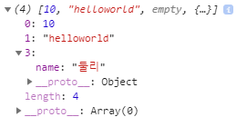

[TOC]

---

# Javascript 연산자 / 배열 / String / URL 공부

### [1] in 연산자

```js
var o = {
    name : '마이콜',
    age : 20,
    hasProperty:function(property){
        return property in this
    }
}
console.log(o.hasProperty('name'));
console.log(o.hasProperty('age'));
console.log(o.hasProperty('email'));
```

> true
>
> true
>
> false

<br>

### [2] 객체는 hasOwnProperty 속성을 기본으로 갖고있음

> `in` 연산자와 같은 역할 

```js
console.log(o.hasOwnProperty('name'));
console.log(o.hasOwnProperty('age'));
console.log(o.hasOwnProperty('email'));
```

> true
>
> true
>
> false

<br>

### [3] with()

> 잘 쓰지 않는 명령어
>
> -   with 이후에 오는 구문을 위해 scope chain에 인자로 받는 object를 추가한다.
>
>   => 속성들을 바로 접근 가능하도록 설정

```js
var o = {
    name : '둘리',
    age : 10,
    info : function(){
        console.log(this.name + " : " + this.age) // this = 호출자
    },
    info2 : function(){
        with(this){
            console.log(name + " : " + age)
        }
    },
    info3 : function () {
        var str = '';
        for(var data in this){
            str += (data + " & ");
        }
        console.log(str.substring(0, str.length-1));
    }
}
o.info();
o.info2();
o.info3();
```

> 둘리 : 10
>
> 둘리 : 10
>
> name & age & info & info2 & info3 &

**보통 `with`보다는 아래와 같은 형식으로 변수로 저장해 with처럼 사용한다.**

```js
var s = document.getElementById("title").style; 
s.background = "black"; 
s.color = "white"; 
s.border = "1px solid yellow";
```

<br>

**💥 javascript에서 변수를 쓸 때는 `var`를 붙이자**

만약 위의 코드에서 변수에 var를 안붙이면 글로벌에서 사용할 수 있음

```js
    info3 : function () {
        var str = '';
        for(data in this){ // data에 var 안붙이면
            str += (data + " & ");
        }
        console.log(str.substring(0, str.length-1));
    }

console.log(data); // info3 출력
// data에 var 붙이면 지역변수로 사용하기때문에 global에서 못씀 
```

---


---

## 배열 정의

### [1] 생성자 함수

배열의 크기는 동적으로 변한다. (오류가 나지 않는다.)

`new Array(size)`에서 size를 지정해주는 것은 별다른 의미가 없지만,

 고정 사이즈를 주면 성능이 향상한다.

> 배열 정의할 때, 크기 지정은 의미가 없다. 동적으로 늘어난다.

```js
var a1 = new Array(10); // !10)은 의미가 없다
a[0] = 0;
a1[11] = 0;
a1[12] = 0;
console.log('Array a1 : ' + a1);
console.log('a1 length : ' + a1.length);
```

> Array a1 : 0,,,,,,,,,,,0,0,,,,,,,,0
>
> a1 length : 21

**배열과 객체에 아래처럼 동일하게 값 넣을 수 있다.**

```js
// 배열
a = []
a["0"] = 0;
a["1"] = 1;
console.log(a);
a[0] = 10;
console.log(a);

// 객체
o = {}
o["0"] = 0;
o["1"] = 1;
console.log(o);
o[0] = 10;
console.log(o);
```

> (2) [0, 1]
>
> (2) [10, 1]
>
> {0: 0, 1: 1}
>
> {0: 10, 1: 1}

<br>

### [2] literal

- Array 내부 저장 타입은 정해져 있지 않다.
- 중간에 비어져 있는 값은 오류가 나지 않고, undefined이다.

```js
var a2 = [];
console.log('a2 length : ' + a2.length);

a2[0] = 10;
a2[1] = 'helloworld';
a2[3] = {
    name : '둘리'
}
console.log('Array a2 : ' + a2);
console.log('a2 length : ' + a2.length);
console.log('a2[2] : ' + a2[2]); // undefined : 오류는 안남!
```

> a2 length : 0
>
> Array a2 : 10,helloworld,,[object Object]
>
> a2 length : 4
>
> a2[2] : undefined

```js
console.log(a2);
```

> 

<br>

### [3] 배열 초기화 & 순회

```js
console.log('-------------초기화---------------')
var a3 = [1, 'abc', true];
console.log(a3);

var a4 = new Array(1, 'abc', true);
console.log(a4);

console.log('------------순회----------------')
for(var i=0; i < a4.length; i++){
    console.log(a4);
}
```

> -------------초기화---------------
>
> [1, "abc", true]
>
> [1, "abc", true]
>
> ------------순회----------------
>
> (3) [1, "abc", true]
>
> (3) [1, "abc", true]
>
> [1, "abc", true]

<br>

## 배열 함수

#### 1) concat

```js
var colors = ['black', 'white', 'yellow'];
var fruits= ['mango', 'banana', 'apple'];

var test = fruits.concat(colors);
console.log(test);
```

> (6) ["mango", "banana", "apple", "black", "white", "yellow"]

<br>

#### 2) join

```js
var str = fruits.join(', ');
console.log(str);
```

> mango, banana, apple

<br>

#### 3) pop(stack)

```js
var color = colors.pop();
console.log(color);
console.log(colors);
```

> yellow
>
> (2) ["black", "white"]

<br>

#### 4) push(stack)

```js
colors.push('red')
console.log(colors);
```

> (3) ["black", "white", "red"]

<br>

#### 5) reverse

```js
console.log(fruits);
fruits.reverse();
console.log(fruits);
```

> (3) ["mango", "banana", "apple"]
>
> (3) ["apple", "banana", "mango"]

<br>

#### 6) shift

```js
var numbers = [4000, 8000, 3000, 5000, 1000];
console.log(numbers);
numbers.shift();
console.log(numbers);
```

> (5) [4000, 8000, 3000, 5000, 1000]
>
> (4) [8000, 3000, 5000, 1000]

<br>

#### 7) slice

```js
var numbers2 = numbers.slice(0, 2);
console.log(numbers)
console.log(numbers2)
```

> (4) [8000, 3000, 5000, 1000]
> (2) [8000, 3000]

<br>

#### 8) sort

```js
numbers.sort();
console.log(numbers);
```

> (4) [8000, 3000, 5000, 1000]
>
> (4) [1000, 3000, 5000, 8000]

<br>

#### 9) splice

```js
console.log(fruits);
var fruits2 = fruits.splice(0/*index*/, 2/*count*/); // index부터 count개 삭제 후 삭제 값 리턴
console.log(fruits);
console.log(fruits2);
```

> (3) ["apple", "banana", "mango"]
>
> ["mango"]
>
> (2) ["apple", "banana"]

<br>

## prototype으로 배열 확장 

```js
// 배열 확장(remove, insert)
Array.prototype.insert = function(index, value){
    this.splice(index, 0, value);
}

Array.prototype.remove = function(index){
    this.splice(index, 1);
}

// 배열을 리스트 처럼 사용하기
// insert(index, val), remove(index)
a = [1, 2, 4];
a.insert(2, 3);
console.log(a); // (4) [1, 2, 3, 4]

a.remove(3);
console.log(a); // (3) [1, 2, 3]

a.insert(2, ['a', 'b', 'c']) // 2번지에 ['a', 'b', 'c'] 레퍼런스 값이 저장됨
console.log(a); // (4) [1, 2, Array(3), 3] 
console.log(a[2]); // (3) ["a", "b", "c"]
```

**[1, 2, Array(3), 3]**  이렇게 말고, **[1, 2, ["a", "b", "c"], 3]** 이렇게 넣고 싶으면

**[1] var _this = this; 사용**

```js
Array.prototype.insert = function(index, value){
    if(value instanceof Array){
        var _this = this;
        value.forEach(function(element){ // callback function
            // this.splice(index++, 0, element); // 이 코드는 오류 = 현재 this 는 [object Window]임
            _this.splice(index++, 0, element);
        });
    } else{
        this.splice(index, 0, value);
    }
}
```

**[2] bind 사용**

**bind : 함수와 객체를 서로 묶는 것**

`.bind(obj)` 로 함수를 호출하면 인자로 넘겨눈 객체가 `this`가 된다.

```js
Array.prototype.insert = function(index, value){
    if(value instanceof Array){
        value.forEach(function(element){ 
            this.splice(index++, 0, element);
        }.bind(this/*if의 this = 배열객체*/));
    } else{
        this.splice(index, 0, value);
    }
}
```

<br>

## 연관 배열(Associted Array) 사용 예

```js
// 연관 배열(Associted Array)
var employee = {
    name : '홍길동',
    title : '과장',
    info : function(){
        console.log(this.name + " : " + this.title);
    }
}

console.log(employee.name); 	//홍길동
console.log(employee['name']);  //홍길동

// 사용 예 1
// 메소드 이름(문자열)로 호출할 때
var s = 'info';
console.log(s); //info
employee[s](); //홍길동 : 과장 // 스트링 변수로 함수 호출

// 사용 예 2
// map(Java), dict(Python)
var map = {}
map['one'] = 1;     // 호출할 때 : map.one = 1
map['two'] = 2;     // 호출할 때 : map.two = 2
map['three'] = 3;   // 호출할 때 : map.three = 3

console.log(map['three']);  // 3
console.log(map)			// {one: 1, two: 2, three: 3}
```

---


## **String**

```js
// 배열처럼 접근 가능
var str = 'hello world';
for(var i = 0; i < str.length; i++){
    console.log(str[i]);
}

// 문자열 합치기(+)
var str1 = "Hello";
var str2 = "World";
var str3 = str1 + " " +str2;
console.log(str3);

var number = 5;
var str4 = "5" + number;
console.log(str4, " : ", typeof(str4))

var str5 = "boolean : " + true;
console.log(str5);
```

> h
>
> e
>
> l
>
> l
>
> o
>
> 
>
> w
>
> o
>
> r
>
> l
>
> d
>
> Hello World
>
> 55  :  string
>
> boolean : true

### String 객체 함수

```js
// 객체 함수
var str6 = "string1 string2 string3";
console.log(str6.length); // 23

var index = str6.indexOf('string4');
console.log(index); // -1 : 없는 값이면 -1반환
index = str6.indexOf('string2');
console.log(index); // 8

var str7 = str6.substr(index) // index ~ 부터
console.log(str7); // string2 string3

var str8 = str6.substr(index, 7/*count*/) // 8부터 7개
console.log(str8); // string2

var str9 = str6.substring(index, 10/*last index -1*/)
console.log(str9); // st

var a = str6.split(' ')
console.log(a); // (3) ["string1", "string2", "string3"]

var str10 = 'abcdefg';
a = str10.split(':');
console.log(a); //["abcdefg"]
```

---

## **url**

### redirection

자바스크립트를 이용해서 특정 URL로 접속했을 때 다른 URL로 이동

```js
// client side redirection
location.href = url;
```

### escape

**escape 사용금지**

- 아스키문자에 해당하지 않는 문자들은 모두 유니코드 형식으로 변환

```js
var url = 'http://localhost:8080/mysite3?n=이"정"은
var url2 = escape(url); // Deprecated
console.log(url2);
```

> http://127.0.0.1:8989/WebContent/http%3A//localhost%3A8080/mysite3%3Fn%3D%uC774%22%uC815%22%uC740%26e%3Dleeap1004@gmail.com

<br>

### encodeURI

**전체 URL -> parameter 부분만 encoding**

- URL 주소표시를 나타내는 앞자리 특수문자는 인코딩하지 않음

```js
var url = 'http://localhost:8080/mysite3?n=이"정"은
var url3 = encodeURI(url);
console.log(url3);
```

> http://localhost:8080/mysite3?n=%EC%9D%B4%22%EC%A0%95%22%EC%9D%80&e=leeap1004@gmail.com

<br>

### encodingURIComponent

**전체 URL -> 전체 URL encoding**

- 주소를 나타내는 특수문자도 인코딩

```js
var url = 'http://localhost:8080/mysite3?n=이"정"은
var url4 = encodeURIComponent(url);
console.log(url4);
```

> http://127.0.0.1:8989/WebContent/http%3A%2F%2Flocalhost%3A8080%2Fmysite3%3Fn%3D%EC%9D%B4%22%EC%A0%95%22%EC%9D%80%26e%3Dleeap1004%40gmail.com

<br>

 **encodingURIComponent 사용 예**

```js
var url = 'http://localhost:8080/mysite3';
var queryString = '?' + 
		 'n=' + encodeURIComponent('이"정"은') + 
		 '&e=' + encodeURIComponent('leeap1004@gmail.com');
var url5 = url + queryString
console.log(url5);
```

> http://localhost:8080/mysite3?%3Fn%3D%25EC%259D%25B4%2522%25EC%25A0%2595%2522%25EC%259D%2580%26e%3Dleeap1004%2540gmail.com

<br>

**사용예 2**

```js
var toQueryString = function(o){
	var qs = [];
	for(key in o){
		qs.push(key + "=" + encodeURIComponent(o[key]));
	}
	return "?" + qs.join('&');
}

var url = 'http://localhost:8080/mysite3';
var url6 = url + toQueryString({
	name: "이정은",
	e: "leeap1004@gmail.com"
}); 
console.log(url6);
setTimeout(function(){
	// client side redirection
	// location.href = url6;
}, 5000);
```

<br>

<br>

<br>

