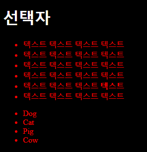
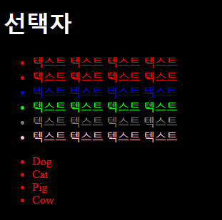
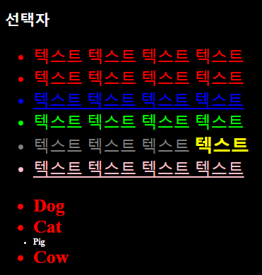
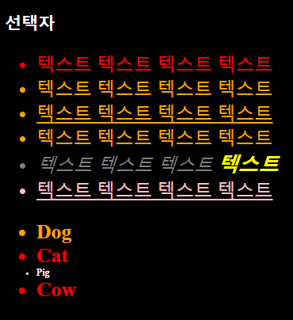
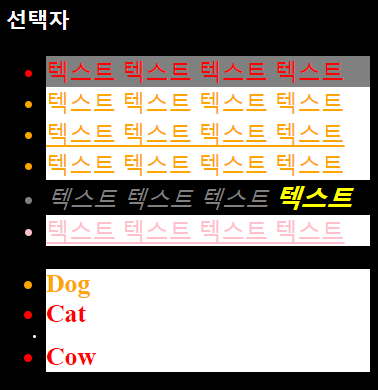
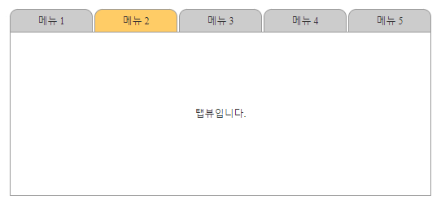

[TOC]

---

# jQuery 기본 (객체, 선택자)

jQuery는 자바스크립트의 주요 라이브러리이다.

<br>

## [1] jQuery 로딩하기

1. 파일 다운로드 후 가져오기

   `<script type="text/javascript" src="assets/js/jquery/jquery-3.1.1.js"></script>`

2. CDN 

   `<script src="https://code.jquery.com/jquery-3.1.1.js"></script>`

---

## [2] jQuery Element 선택 시점

```html
<body>
	<h1 id="header">Element를 선택해야 하는 시점</h1>
</body>
```

위의 코드의 `id="header"` 선택하기.

<br>

**1, Vanila JS - window.onload = function(){}**

```js
window.onload = function(){
    console.log(document.getElementById('header'));
}
```

<br>

**2, jQuery 함수 사용 - jQuery(document).ready(function(){});**

```js
jQuery(document).ready(function(){
    console.log($('header'));
});
```

<br>

**3, $ 함수 사용1 - $(document).ready(function(){});**

```js
$(document).ready(function(){
    console.log($('header'));
});
```

<br>

**4, $ 함수 사용2 - $(function(){}); =>** <b style="color:blue">가장 많이 사용</b>

```js
$(function(){
    console.log($('header'));
});
```

---

## [3] jQuery Object

```html
<script>
    var $obj = {
        "0" : document.getElementById('header'),
        length : 1
    } // $h1 과 동일
        
	$(function(){
		var $h1 = $('#header');
		console.log($h1.length); // 1
		console.log(typeof($h1) + " : "+ ($h1 instanceof Array)); // object : false
		console.log($h1[0]); // <h1 id="header">jQuery Object</h1>
		console.log($h1[0] + " : " + typeof($h1[0])); // [object HTMLHeadingElement] : object
		console.log($h1.get(0)+ " : "+ typeof($h1.get(0))); // [object HTMLHeadingElement] : object

		$h1.click(function(){
			this
		});
	});
</script>
<body>
	<h1 id="header">jQuery Object</h1>
</body>
```

------

## [4] jQuery 선택자 연습

```html
<body>
    <h1>선택자</h1>
    <ul>
        <li>텍스트 텍스트 텍스트 텍스트 </li>
        <li id="">텍스트 텍스트 텍스트 텍스트 </li>
        <li id="third">텍스트 텍스트 텍스트 텍스트 </li>
        <li id="fourth">텍스트 텍스트 텍스트 텍스트 </li>
        <li class="gray">텍스트 텍스트 텍스트 <strong>텍스트</strong> </li>
        <li class="pink">텍스트 텍스트 텍스트 텍스트 </li>
    </ul>

    <div>
        <ul>
            <li id="first"> Dog </li>
            <li> Cat </li>
            <li> Pig </li>
            <li> Cow </li>
        </ul>
    </div>
</body>
```

<br>

**1, body 전체 선택**

```js
$(function(){
    setTimeout(function(){
        $('body').css('background-color', 'black').css('color', 'white');
    }, 2000);
});
```

> 

<br>

**2, 태그 선택자**

```js
var $li = $('li');
$li.css('color', '#f00');
```

> 

<br>

**3, ID 선택자 (hashing이 되어있어 가장 빠른 탐색)**

id 선택자 : `#id`

```js
$('#third').css('color', '#00f');
$('#fourth').css('color', '#0f0');
```

> 

<br>

**4, class 선택자**

class 선택자 : `.class`

```js
$('.gray').css('color', 'gray');
$('.pink').css('color', 'pink');
```

> 

<br>

**5, 전체 선택자**

```js
// 전체 선택
$('*').css('font-size', '1.1em');
```

> 

<br>

---- 1, 2, 3, 4의 조합----

**6, 자식 선택자**

```js
// div 밑의 ul 밑의 li 글자 두껍게 적용
$('div > ul > li').css('font-weight', 'bold');
```

> 

<br>

**7, 하위(자손) 선택자**

 ```js
// ul밑의 strong 태그
$('ul strong').css('color', 'yellow');
 ```

> 

<br>

**8, 그룹 선택자**

```js
// id=third와 class=pink 선택
$('#third, .pink').css('text-decoration', 'underline');
```

> 

<br>

**9, 인접 선택자**

```js
// id=first의 다음 li의 다음 li
$('#first  + li + li').css('color', 'white').css('font-size', '0.5em');
```

> 

<br>

**10, 속성**

```js
// li중 id가 있는 녀석
$('li[id]').css('color', 'orange');
```

> 

```js
// li중 class가 gray인 녀석
$('li[class=gray]').css('font-style', 'italic');
```

> 

```js
// li중 class가 gray가 아닌 녀석(id 없는 애도 적용 됨)
$('li[class!=gray]').css('background-color', 'white')
```

> 

<br>

**11, filter**

```js
// 전체 li중 첫번 쨰 녀석만
$('li:first').css('background-color', 'gray');
```

> 

```js
// ul의 모든 li의 첫번째 자식들
$('ul li:first-child').css('background-color', 'gray');
```

> 

```
각 종 filter 사용하기
$('li:last') 			// 마지막
$('li:odd') 			// 홀수
$('li:even') 			// 짝수
$('li:contains("Cat")') // text
$('li:has("strong")')	// tag
```

<br>

**전체코드**

```html
<!DOCTYPE html>
<html>
<head>
<meta charset="UTF-8">
<title>Insert title here</title>
<!-- CDN을 사용하는 방 -->
<!-- script src="https://code.jquery.com/jquery-3.1.1.js"></script-->
<!-- 내려받아 사용하기 -->
<script type="text/javascript" src="assets/js/jquery/jquery-3.1.1.js"></script>
<script>
	$(function(){
		setTimeout(function(){
			$('body').css('background-color', 'black');
			$('h1').css('color', 'white');

			// 1. 태그 선택자
			var $li = $('li');
			$li.css('color', '#f00');

			// 2. ID 선택자 (hashing이 되어있어 가장 빠른 탐색)
			$('#third').css('color', '#00f');
			$('#fourth').css('color', '#0f0');

			// 3. class 선택자
			$('.gray').css('color', 'gray');
			$('.pink').css('color', 'pink');

			// 4. 전체 선택자
			$('*').css('font-size', '1.1em');

			// --- 1, 2, 3, 4 조합 ---
			// 5. 자식
			$('div > ul > li').css('font-weight', 'bold');

			// 6. 하위(자손)
			$('ul strong').css('color', 'yellow');

			// 7. 그룹
			$('#third, .pink').css('text-decoration', 'underline');

			// 8. 인접
			$('#first  + li + li').css('color', 'white').css('font-size', '0.5em');

			// 9. 속성
			// li중 id가 있는 녀석
			$('li[id]').css('color', 'orange');

			// li중 class가 gray인 녀석
			$('li[class=gray]').css('font-style', 'italic');

			// li중 class가 gray가 아닌 녀석(id 없는 애도 적용 됨)
			// $('li[class!=gray]').css('background-color', 'white')


			// 10. filter
			// 전체 li중 첫번 쨰 녀석만
			$('li:first').css('background-color', 'gray');
			$('ul li:first-child').css('background-color', 'gray');
			$('li:last')
			$('li:odd')
			$('li:even')
			$('li:contains("Cat")') // text
			$('li:has("strong")')	// tag

			/*$('div li:first').css('background-color', 'gray');
			$('div:first').css('background-color', 'gray');*/


		}, 2000);
	});
</script>
</head>
<body>
	<h1>선택자</h1>
	<ul>
		<li>텍스트 텍스트 텍스트 텍스트 </li>
		<li id="">텍스트 텍스트 텍스트 텍스트 </li>
		<li id="third">텍스트 텍스트 텍스트 텍스트 </li>
		<li id="fourth">텍스트 텍스트 텍스트 텍스트 </li>
		<li class="gray">텍스트 텍스트 텍스트 <strong>텍스트</strong> </li>
		<li class="pink">텍스트 텍스트 텍스트 텍스트 </li>
	</ul>

	<div>
		<ul>
			<li id="first"> Dog </li>
			<li> Cat </li>
			<li> Pig </li>
			<li> Cow </li>
		</ul>
	</div>
</body>
</html>
```


---

## [5] jQuery를 이용해 selected 옵션 주기



**코드**

```html
<!DOCTYPE HTML>
<html>
<head>
	<meta charset="utf-8">
	<title>리스트를 이용한 메뉴 만들기</title>
	<style type="text/css">
		*		{ margin:0; padding:0 }
		body	{ font-family: '맑은 고딕' 돋움; font-size:0.75em; color:#333 }
		ol, ul	{ list-style-type: none }
		.tab-box {
			width: 520px;
			margin: 20px auto;
		}
		.tab-box ul {
			height: 29px;
		}
		.tab-box ul li {
			float: right;
			width:100px;
			height:22px;
			border:1px solid #999;
			background-color:#ccc;
			text-align: center;
			padding-top: 5px;
			margin-right: 2px;
			border-top-left-radius:10px;
			border-top-right-radius: 10px;
			cursor: pointer;
		}
		.tab-box ul li.selected {
			background-color:#fc6;
		}
		.tab-box div {
			width: 516px;
			margin-top: -1px;
			border: 1px solid #999;
			text-align: center;
			height: 200px;
			line-height: 200px;
		}
	</style>
	<script type="text/javascript" src="assets/js/jquery/jquery-3.1.1.js"></script>
	<script>
		var tabBox = {
			init: function(){
				$('.tab-box li').click(function(){
					$('li.selected').removeClass('selected');
					$(this).addClass('selected');
				});
			}
		}
		$(function(){
			tabBox.init();
		});
	</script>
</head>
<body>
<div class="tab-box">
	<ul>
		<li>메뉴 5</li>
		<li>메뉴 4</li>
		<li>메뉴 3</li>
		<li>메뉴 2</li>
		<li>메뉴 1</li>
	</ul>
	<div>
		탭뷰입니다.
	</div>
</div>
</body>
</html>
```

<br>

<br>


