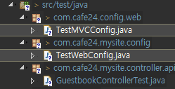
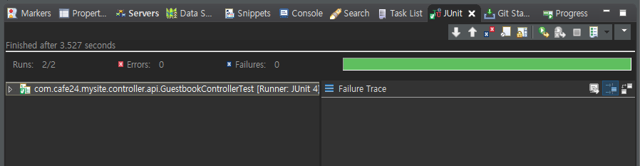

[TOC]

---

TDD

   View         -----     Controller <--> Service <--> Repository	

(selenium)	           	(JUnit + Spring Test + Mockito)

**pom.xml** 

```xml
<!-- Test -->
<dependency>
    <groupId>org.springframework</groupId>
    <artifactId>spring-test</artifactId>
    <version>4.3.20.RELEASE</version>
</dependency>
<dependency>
    <groupId>junit</groupId>
    <artifactId>junit</artifactId>
    <version>4.12</version>
    <scope>test</scope>
</dependency>
```

---


new package 

**GuestbookControllerTest.java**

```java
package com.cafe24.mysite.controller.api;

import static org.junit.Assert.assertNotNull;
import static org.springframework.test.web.servlet.request.MockMvcRequestBuilders.get;
import static org.springframework.test.web.servlet.result.MockMvcResultMatchers.status;


@RunWith(SpringJUnit4ClassRunner.class)
@ContextConfiguration(classes={AppConfig.class, WebConfig.class})
@WebAppConfiguration
public class GuestbookControllerTest {

	private MockMvc mockMvc;
	
	@Autowired
	private WebApplicationContext webApplicationContext;
	
	@Autowired
	private GuestbookService guestbookService;
	
	@Before
	public void setup() {
		mockMvc = MockMvcBuilders.webAppContextSetup(webApplicationContext).build();
	}
	
	@Test
	public void testDIGuestbookService() {
		assertNotNull(guestbookService);
	}
	
	@Test
	public void testFetchGuestbookList() throws Exception {
		mockMvc
		.perform(get("/api/guestbook/list")) // 없는 url
		.andExpect(status().isNotFound());
	}
}
```

`isOk` 찍어보기

```java
import static org.springframework.test.web.servlet.result.MockMvcResultHandlers.print;

@Test
public void testFetchGuestbookList() throws Exception {
    mockMvc
        .perform(get("/api/guestbook/list")) // 없는 url
        .andExpect(status().isOk()).andDo(print());
}
```

> MVCConfig.java의 Default Servlet Handler때문에 200이 무조건 날라오니까
>
> ```java
> // Default Servlet Handler
> @Override
> public void configureDefaultServletHandling(DefaultServletHandlerConfigurer configurer) {
>     //		configurer.enable();
> }
> ```
>
> TestMVCConfig(Default Servlet Handler제외)와 TestWebConfig를 만들어준다.
>
> 
>
> 


**성공시키기**

**GuestbookController.java** 

```java
@RestController("guestbookAPIController")
@RequestMapping("/api/guestbook")
public class GuestbookController {

	@RequestMapping(value = "/list/{no}", method = RequestMethod.GET)
	public JSONResult list(@PathVariable(value = "no") int no) {
		return JSONResult.success(null);
	}
}
```

**GuestbookControllerTest.java**

```java
	@Test
	public void testFetchGuestbookList() throws Exception {
		mockMvc
		.perform(get("/api/guestbook/list/{no}", 1L)) // 없는 url
		.andExpect(status().isOk()).andDo(print());
	}
```



---


---

junit spring rest api

<https://github.com/jungeunlee95/spring-mvc-test-examples>


