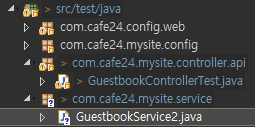
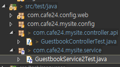

[TOC]

---

# TDD

## [1] 방명록 실제 데이터 받기 테스트

**pom.xml** - mockito, hamcrest, json-path. gson 추가

```xml
<!-- mockito-all -->
<dependency>
    <groupId>org.mockito</groupId>
    <artifactId>mockito-all</artifactId>
    <version>1.10.19</version>
    <scope>test</scope>
</dependency>

<!-- hamcrest-all -->
<dependency>
    <groupId>org.hamcrest</groupId>
    <artifactId>hamcrest-all</artifactId>
    <version>1.3</version>
    <scope>test</scope>
</dependency>

<!-- json-path -->
<dependency>
    <groupId>com.jayway.jsonpath</groupId>
    <artifactId>json-path</artifactId>
    <version>2.4.0</version>
    <scope>test</scope>
</dependency>

<!-- gson -->
<dependency>
    <groupId>com.google.code.gson</groupId>
    <artifactId>gson</artifactId>
    <version>2.8.5</version>
    <scope>test</scope>
</dependency>
```


**GuestbookControllerTest.java**

**static import**

```java
import static org.hamcrest.Matchers.is;
import static org.springframework.test.web.servlet.result.MockMvcResultMatchers.jsonPath;
```

<br>

**test code**

```java
@Test
public void testFetchGuestbookList() throws Exception {
    ResultActions resultActions = 
        mockMvc
        .perform(get("/api/guestbook/list/{no}", 1L)
                 .contentType(MediaType.APPLICATION_JSON)); // 없는 url

    resultActions
        .andExpect(status().isOk())
        .andDo(print())
        .andExpect(jsonPath("$.result",is("success") ));
}
```

<br>

**예상 데이터 형식**

```json
{
    "result" : "success",
    "message" : "null",
    "data" : [
				{
                    "no":"1", 
                    "name":"user1", 
                    "password":"1234", 
                    "contents":"test1", 
                    "regDate":"2019-07-10 09:20"
				}, {
                    "no":"2", 
                    "name":"user2", 
                    "password":"4321", 
                    "contents":"test2", 
                    "regDate":"2019-07-11 09:20"
				}
             ]
}
```

<br>

**출력 data**

```
MockHttpServletRequest:
      HTTP Method = GET
      Request URI = /api/guestbook/list/1
       Parameters = {}
          Headers = {Content-Type=[application/json]}

Handler:
             Type = com.cafe24.mysite.controller.api.GuestbookController
           Method = public com.cafe24.mysite.dto.JSONResult com.cafe24.mysite.controller.api.GuestbookController.list(int)

Async:
    Async started = false
     Async result = null

Resolved Exception:
             Type = null

ModelAndView:
        View name = null
             View = null
            Model = null

FlashMap:
       Attributes = null

MockHttpServletResponse:
           Status = 200
    Error message = null
          Headers = {Content-Type=[application/json;charset=UTF-8]}
     Content type = application/json;charset=UTF-8
             Body = {
  "result" : "success",
  "message" : null,
  "data" : null
}
    Forwarded URL = null
   Redirected URL = null
          Cookies = []
```

<br>

**출력 데이터 검증 코드**

**static import** 

```java
import static org.hamcrest.Matchers.hasSize;
```

```java
@Test
public void testFetchGuestbookList() throws Exception {
    ResultActions resultActions = 
        mockMvc
        .perform(get("/api/guestbook/list/{no}", 1L)
                 .contentType(MediaType.APPLICATION_JSON)); // 없는 url

    resultActions
        .andExpect(status().isOk())
        .andDo(print())
        .andExpect(jsonPath("$.result", is("success") ))
        .andExpect(jsonPath("$.data", hasSize(2)))			
        .andExpect(jsonPath("$.data[0].no", is(1) ))
        .andExpect(jsonPath("$.data[0].name", is("user1") ))
        .andExpect(jsonPath("$.data[0].contents", is("test1") ));
}
```

<br>

테스트 성공을 위해 **GuestbookController.java** 구현

```java
@RestController("guestbookAPIController")
@RequestMapping("/api/guestbook")
public class GuestbookController {

	@RequestMapping(value = "/list/{no}", method = RequestMethod.GET)
	public JSONResult list(@PathVariable(value = "no") int no) {
		GuestbookVo vo1 = new GuestbookVo(1L, "user1", "1234", "test1", "2019-07-10 09:20");
		GuestbookVo vo2= new GuestbookVo(2L, "user2", "4321", "test2", "2019-07-11 09:20");
		
		List<GuestbookVo> list = new ArrayList<GuestbookVo>();
		list.add(vo1);
		list.add(vo2);
		
		return JSONResult.success(list);
	} 
	
}
```

**GuestbookControllerTest.java**

```java
	@Test
	public void testFetchGuestbookList() throws Exception {
		ResultActions resultActions = 
				mockMvc
				.perform(get("/api/guestbook/list/{no}", 1L)
				.contentType(MediaType.APPLICATION_JSON)); // 없는 url
				
		resultActions
			.andExpect(status().isOk())
			.andDo(print())
			.andExpect(jsonPath("$.result", is("success") ))
			.andExpect(jsonPath("$.data", hasSize(2)))			
			.andExpect(jsonPath("$.data[0].no", is(1) ))
			.andExpect(jsonPath("$.data[0].name", is("user1") ))
			.andExpect(jsonPath("$.data[0].contents", is("test1") ))
			.andExpect(jsonPath("$.data[1].no", is(2) ))
			.andExpect(jsonPath("$.data[1].name", is("user2") ))
			.andExpect(jsonPath("$.data[1].contents", is("test2") ));
	}
```

> Test 성공!
>
> 하지만 이런 테스트 방식은 내가 직접 데이터 넣었으니
>
> 테스트 할때마다 코드를 수정해야함.
>
> 방식을 바꾸자!


## [2] 제대로 TDD

**GuestbookService2.java 만들기**



```java
package com.cafe24.mysite.service;
@Service
public class GuestbookService2 {

	public List<GuestbookVo> getContentsList(int i) {
		GuestbookVo vo1 = new GuestbookVo(1L, "user1", "1234", "test1", "2019-07-10 09:20");
		GuestbookVo vo2= new GuestbookVo(2L, "user2", "4321", "test2", "2019-07-11 09:20");
		
		List<GuestbookVo> list = new ArrayList<GuestbookVo>();
		list.add(vo1);
		list.add(vo2);
		
		return list;
	}
}
```


**GuestbookController.java** 수정된 코드

```java
@RestController("guestbookAPIController")
@RequestMapping("/api/guestbook")
public class GuestbookController {

	@Autowired
	private GuestbookService2 guestbookService2;
	
	@RequestMapping(value = "/list/{no}", method = RequestMethod.GET)
	public JSONResult list(@PathVariable(value = "no") int no) {
		
		List<GuestbookVo> list = guestbookService2.getContentsList(1);
		
		return JSONResult.success(list);
	} 
	
}
```

> 테스트 성공@

---


---

## [3] Insert TDD

**import**

```java
import org.mockito.Mockito;
import static org.springframework.test.web.servlet.request.MockMvcRequestBuilders.post;
```

**데이터 SET**

```json
$ = {
    "result" : "success",
    "message" : null,
    "data" : {
        "no" : 3,
        "name" : "user1",
        "password" : "1234",
        "contents" : "test1",
        "regDate" : "2019-07-10 11:11"
    }
}
```


**GuestbookControllerTest.java**

```java
@Test
public void testInsertGuestbook() throws Exception {
    //		나중에 이런식으로 쓸 수 있음
    //		GuestbookVo voMock = Mockito.mock(GuestbookVo.class);
    //		Mockito.when(voMock.getNo2()).thenReturn(10L);
    //		Long no = voMock.getNo2();

    //      MailSender mailsender = Mockito.mock(MailSender.class);
    //		Mockito.when(mailSenderMock.sendMail("", "")).thenReturn(true);
    //		isSuccess = mailSenderMock.sendMail("");

    GuestbookVo vo = new GuestbookVo();
    vo.setName("user1");
    vo.setPassword("1234");
    vo.setContents("test1");


    ResultActions resultActions = 
        mockMvc
        .perform(post("/api/guestbook/add")
                 .contentType(MediaType.APPLICATION_JSON).content(new Gson().toJson(vo))); 

    resultActions
        .andExpect(status().isOk())
        .andDo(print())
        .andExpect(jsonPath("$.result", is("success") ))
        .andExpect(jsonPath("$.data.name", is(vo.getName())))
        .andExpect(jsonPath("$.data.contents", is(vo.getContents())));
}
```


**GuestbookController.java**

```java
@RequestMapping(value = "/add", method = RequestMethod.POST)
public JSONResult add(@RequestBody GuestbookVo guestbookVo) {
    GuestbookVo newVo = guestbookService2.addContents(guestbookVo);
    return JSONResult.success(newVo);
} 
```


**GuestbookService2.java**

```java
	public GuestbookVo addContents(GuestbookVo guestbookVo) {
		guestbookVo.setNo(3L);
		guestbookVo.setRegDate("2019-07-10 11:11");
		
		return guestbookVo;
	}
```


------

## [4] delete TDD

**GuestbookControllerTest.java**

```java
@Test
public void testDeleteGuestbook() throws Exception {
    Map<String, Object> map = new HashMap<String, Object>();

    map.put("no", 1L);
    map.put("password", "1234");

    ResultActions resultActions = 
        mockMvc
        .perform(delete("/api/guestbook/delete")
                 .contentType(MediaType.APPLICATION_JSON).content(new Gson().toJson(map))); 

    resultActions
        .andExpect(status().isOk())
        .andDo(print())
        .andExpect(jsonPath("$.result", is("success") ));
}
```


**GuestbookController.java**

```java
@RequestMapping(value = "/delete", method = RequestMethod.DELETE)
public JSONResult delete(@RequestBody Map<String, Object> map) {
    Long no = guestbookService2.deleteContents(((Integer)map.get("no")).longValue(), (String)map.get("password"));
    return JSONResult.success(no);
} 
```


**GuestbookService2.java**

```java
public Long deleteContents(Long no, String password) {
    return no;
}
```

> Controller 테스트 성공!

---


## [5] before, after

**ExampleTest.java**

```java
@Before
public void setUp() {
System.out.println("Before");
}

@After
public void tearDown() {
System.out.println("After");
}

@Test
public void myATest() {
System.out.println("@Test:A");
}

@Test
public void myBTest() {
System.out.println("@Test:B");
}

@Test
public void myCTest() {
System.out.println("@Test:C");
}
```

Before 와 After은 메소드 하나 실행할때마다 실행됨

```
Before
@Test:A
After
Before
@Test:B
After
Before
@Test:C
After
```

---

@BeforeClass와 @AfterClass는 클래스하나 실행할때 한번 실행

```java
@BeforeClass
public static void setUpBefor() {
    System.out.println("@BeforeClass");
}

@AfterClass
public static void tearDownAfter() {
    System.out.println("@AfterClass");
}

@Test
public void myATest() {
    System.out.println("@Test:A");
}

@Test
public void myBTest() {
    System.out.println("@Test:B");
}

@Test
public void myCTest() {
    System.out.println("@Test:C");
}
```

```
Before
@Test:A
@Test:B
@Test:C
After
```

이런식으로 쓰면 됨

```java
@AfterClass
public static void cleanUp() {
    guestbookDao.deleteAll();
}
```

공유변수 사용하기

```java
public class ExampleTest {

    // 테스트 케이스(메소드)끼리 공유해야 할 변수가 있으면 스태틱 선언
    private static StringBuilder output = new StringBuilder();

    @BeforeClass
    public static void setUpBefor() {
        System.out.println("@BeforeClass : " + output.toString());
    }

    @AfterClass
    public static void tearDownAfter() {
        System.out.println("@AfterClass : " + output.toString());
    }

    @Before
    public void setUp() {
        System.out.println("Before");
    }

    @After
    public void tearDown() {
        System.out.println("After");
    }

    @Test
    public void myATest() {
        System.out.println("@Test:A");
        output.append("A");
    }

    @Test
    public void myBTest() {
        System.out.println("@Test:B");
        output.append("B");
    }

    @Test
    public void myCTest() {
        System.out.println("@Test:C");
        output.append("C");

    }
```

```
@BeforeClass : 
Before
@Test:A
After
Before
@Test:B
After
Before
@Test:C
After
@AfterClass : ABC
```


### assertXYZ 테스트

**import**

```java
import static org.junit.Assert.*;
import static org.hamcrest.Matchers.*;
```

```java
// test 무시
@Ignore
@Test
public void ignoreTest() {
    assertTrue(false);
}

@Test
public void testAssert() {
    assertTrue(1 == 10-9);
    assertFalse(2 == 10-9);

    assertNull(null);
    assertNotNull(new Object());

    assertEquals("aa", "aa");
    assertEquals(1, 1);
    assertEquals(new String("hello"), "hello");
    assertNotEquals(true, false);

    assertSame("Hello", "Hello");
    assertNotSame(new String("Hello"), "Hello");
    assertNotSame(new Integer(1), 1);

    // assertThat
    // - is, is not 
    assertThat(1+2, is(3));
    assertThat("this is never", is(not("that")));

    // - allOf
    assertThat("Hello World", allOf(startsWith("Hell"), containsString("lo")));

    // - anyOf
    assertThat("Hello World", anyOf(startsWith("Heaven"), containsString("lo")));

    // - both
    assertThat("ABC", both(containsString("A")).and(containsString("B")));

    // - either
    assertThat("ABC", either(containsString("A")).or(containsString("X")));

    // - everyItem
    assertThat(Arrays.asList("Apple", "Apartment", "Application"), everyItem(startsWith("Ap")));

    // - hasItem
    assertThat(Arrays.asList("Apple", "Apartment", "BABO"), hasItem(startsWith("Ap")));

    //		fail("All Over!!!!!!!!!!");
}

@Test
public void testAssert1() {
    Object[] a = {"Java", "JUnit", "Spring"};
    Object[] b = {"Java", "JUnit", "Spring"};

    assertArrayEquals(a, b);
}
```


------

## [5] Service Test



**GuestbookService2Test.java**

```java
@RunWith(SpringJUnit4ClassRunner.class)
@ContextConfiguration(classes={AppConfig.class, TestWebConfig.class})
@WebAppConfiguration
public class GuestbookService2Test {
   
   @Autowired
   private GuestbookService guestbookService;

   
   @Test
   public void testGuestbookServiceDI() {
      assertNotNull(guestbookService);
   }
   
   @Test
   public void testGetContentList() {
	   List<GuestbookVo> list = guestbookService.getList();
//	   assertArrayEquals(list, actuals);
   }
   
   @Test
   public void testWriteContent() {
	   GuestbookVo vo = new GuestbookVo();
	   vo.setName("user1");
	   vo.setContents("test1");
	   vo.setPassword("1234");
	   
	   guestbookService.writeContent(vo);
   }
   
//   @AfterClass
//   public static void cleanUp() {
//	   guestbookDao.deleteAll();
//   }
}
```

---


