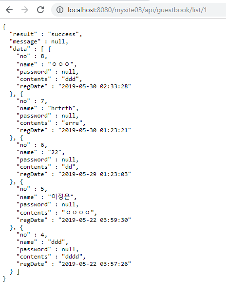
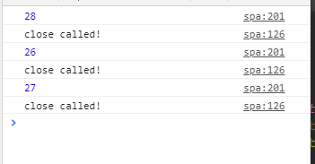

[TOC]

---

# 방명록 ajax 

### [mysite multiproject/ mysite03 프로젝트 코드](https://github.com/jungeunlee95/mysite-multi-project/tree/master/mysite03)


### 먼저 api url 만들기

**GuestbookDao.java**

```java
public List<GuestbookVo> getList(Long startIndex) {
    List<GuestbookVo> result = sqlSession.selectList("guestbook.getList2", (startIndex-1)*COUNT_PER_PAGE);
    return result; 
}
```


**mapper/guestbook.xml**

```xml
<select id="getList2" resultType="guestbookvo" parameterType='Long'>
    <![CDATA[
  select no, name, contents, date_format(reg_date, '%Y-%m-%d %h:%i:%s') as regDate
  from guestbook
  order by reg_date desc
  limit #{startNo}, 5
 ]]>
</select> 
```


**GuestbookService.java**

```java
public List<GuestbookVo> getList(Long page){
    return guestbookDao.getList(page);
}
```


**api/GuestbookController.java**

```java
@RequestMapping(value="/list/{no}", method=RequestMethod.GET)
public JSONResult list(@PathVariable(value="no") Long page) {
    List<GuestbookVo> list = guestbookService.getList(page);
    return JSONResult.success(list);
}
```

> 

---


---

### view에서 ajax받아보기

**index-spa.jsp**

```html
<script>
    var isEnd = false;
    var startPage = 1;
    var userName = '${authUser.name}';
    console.log(userName);

    var render = function(vo){
        // 실제로는 template library를 사용한다. (html 렌더링 라이브러리)
        // -> ejs, underscore, mustache
        var html =  "<li data-no=''>"+
            "<strong>"+vo.name+"</strong>"+
            // 이 문자열의 모든(g)거에 다 적용해라 . \n -> <br>
            "<p>"+ vo.contents.replace(/</gi, "&lt;").replace(/>/gi, "&gt;").replace(/\n/gi, "<br>") + "</p><br>"+
            "<strong></strong>"+
            "<a href='' data-no=''>삭제</a>"+ 
            "</li>"; 
        $("#list-guestbook").append(html) 
    } 

    var fetchList = function(){
        if(isEnd == true){
            return;
        }

        $.ajax({
            url: "${pageContext.request.contextPath}/api/guestbook/list/" + startPage,
            type: "get",
            /* contentType: "application/json"  -> post 방식 JSON */
            dataType: "json",
            data: "",
            success: function(response){
                if(response.result != "success"){
                    console.error(response.message);
                    return;
                }

                // detect end
                if(response.data.length == 0){
                    isEnd = true; 
                    $('#btn-next').prop("disabled", true);
                    return; 
                }

                //rendering
                $.each(response.data, function(index, vo){
                    render(vo);
                });
                startPage++;
                //$.each(response.data, render); // 이렇게 해도 ok

            },				// jqeury XML Http Request
            error : function(jqXHR, status, e){
                console.error(status + " : " + e);
            }
        });
    }

    $(function() {
        $("#btn-next").click(function() {
            fetchList();
        });

        // 최초리스트 가져오기
        fetchList();
    });
</script>
<body>
    <ul id="list-guestbook">
        <!-- 여기에 ajax list 놓기 -->
    </ul>
    ...
    <button id="btn-next">next</button>
    ...
</body>
```

**버튼 말고 스크롤 이벤트로** -> 마지막만 수정

```html
<script>
...
$(function() {
		$("#btn-next").click(function() {
			fetchList();
		});
		
		$(window).scroll(function(){
			var $window = $(this); // window가 매핑된 json 객체 
			var scrollTop = $window.scrollTop();;
			var windowHeight = $window.height();
			var documentHeight = $(document).height();
			
			//console.log(scrollTop, windowHeight, documentHeight);
			if(scrollTop + windowHeight + 10 > documentHeight){
				fetchList();
			} 
		});
		
		// 최초리스트 가져오기
		fetchList();
	});
</script>
<body>
    <ul id="list-guestbook">
        <!-- 여기에 ajax list 놓기 -->
    </ul>
    ...
    <button id="btn-next">next</button>
    ...
</body>
```


### 끝 검출

**mapper/guestbook.xml**

```xml
<select id="getList2" resultType="guestbookvo" parameterType='Long'>
    <![CDATA[
  select no, name, contents, date_format(reg_date, '%Y-%m-%d %h:%i:%s') as regDate
  from guestbook
  ]]>
    <if test="_parameter > 0">
        <![CDATA[
   where no < #{_parameter}
  ]]>
    </if> 
    <![CDATA[
  order by no desc
  limit 0, 5
 ]]>
</select> 
```


**GuestbookDao.java**

```java
public List<GuestbookVo> getList(Long lastNo) {
    List<GuestbookVo> result = sqlSession.selectList("guestbook.getList2", lastNo);
    return result; 
}
```


**GuestbookService.java**

```java
public List<GuestbookVo> getList(Long lastNo){
    return guestbookDao.getList(lastNo);
}
```


**GuestbookController.java**

```java
@RequestMapping(value="/list/{lastNo}", method=RequestMethod.GET)
public JSONResult list(@PathVariable(value="lastNo") Long lastNo) {
    List<GuestbookVo> list = guestbookService.getList(lastNo);
    return JSONResult.success(list);
}
```


**index-spa.jsp**

javascript만 수정

`var lastNo = $('#list-guestbook li').last().data('no') || 0;`

```js
var isEnd = false;
var userName = '${authUser.name}';
console.log(userName);

var render = function(vo){
    // 실제로는 template library를 사용한다. (html 렌더링 라이브러리)
    // -> ejs, underscore, mustache
    var html =  "<li data-no='"+ vo.no +"'>"+
        "<strong>"+vo.name+"</strong>"+
        // 이 문자열의 모든(g)거에 다 적용해라 . \n -> <br>
        "<p>"+ vo.contents.replace(/</gi, "&lt;").replace(/>/gi, "&gt;").replace(/\n/gi, "<br>") + "</p><br>"+
        "<strong></strong>"+
        "<a href='' data-no=''>삭제</a>"+ 
        "</li>"; 
    $("#list-guestbook").append(html) 
} 

var fetchList = function(){
    if(isEnd == true){
        return;
    }

    var lastNo = $('#list-guestbook li').last().data('no') || 0;

    $.ajax({
        url: "${pageContext.request.contextPath}/api/guestbook/list/" + lastNo,
        type: "get",
        /* contentType: "application/json"  -> post 방식 JSON */
        dataType: "json",
        data: "",
        success: function(response){
            if(response.result != "success"){
                console.error(response.message);
                return;
            }

            // detect end
            if(response.data.length == 0){
                isEnd = true; 
                $('#btn-next').prop("disabled", true);
                return; 
            }

            //rendering
            $.each(response.data, function(index, vo){
                render(vo);
            });
            //$.each(response.data, render); 

        },				// jqeury XML Http Request
        error : function(jqXHR, status, e){
            console.error(status + " : " + e);
        }

    });
}

$(function() {
    $("#btn-next").click(function() {
        fetchList();
    });

    $(window).scroll(function(){
        var $window = $(this); // window가 매핑된 json 객체 
        var scrollTop = $window.scrollTop();;
        var windowHeight = $window.height();
        var documentHeight = $(document).height();

        //console.log(scrollTop, windowHeight, documentHeight);
        if(scrollTop + windowHeight + 10 > documentHeight){
            fetchList();
        } 
    });

    // 최초리스트 가져오기
    fetchList();
});
```

---


---

### add by ajax

**GuestbookController.java**

```java
@RequestMapping(value = "/add", method = RequestMethod.POST)
public JSONResult add(@RequestBody GuestbookVo guestbookVo) {
    guestbookService.writeContent(guestbookVo);
    return JSONResult.success(guestbookVo);
} 
```


**guestbook.xml**

```xml
<insert id="insert" parameterType="guestbookvo">
    <![CDATA[
  insert into guestbook  
  values(null, #{name }, #{password }, #{contents }, now())
 ]]>
    <selectKey keyProperty="no" resultType="long" order="AFTER">
        select last_insert_id()
    </selectKey>
</insert>
```


**js**

```html
<script>
var isEnd = false;
	var userName = '${authUser.name}';
	/* console.log(userName); */
	
	var render = function(vo, mode){
		// 실제로는 template library를 사용한다. (html 렌더링 라이브러리)
		// -> ejs, underscore, mustache
		var html =  "<li data-no='"+ vo.no +"'>"+
						"<strong>"+vo.name+"</strong>"+
												// 이 문자열의 모든(g)거에 다 적용해라 . \n -> <br>
						"<p>"+ vo.contents.replace(/</gi, "&lt;").replace(/>/gi, "&gt;").replace(/\n/gi, "<br>") + "</p><br>"+
						"<strong></strong>"+
						"<a href='' data-no=''>삭제</a>"+ 
					"</li>"; 
		
		if(mode){			
			$("#list-guestbook").prepend(html); 			
		}else{
			$("#list-guestbook").append(html);		
		}
	} 
	
...

	$(function() {
		/* getlist 코드 생략 */
						
			// validation (client side, UX - 클라이언트쪽에서 해도 서버에서도 반드시 해줘야함)
			// 생략  plugin 사용해서 할 수 있음 (jQuery plugin)
			vo.name = $("#input-name").val();
			vo.password = $("#input-password").val();
			vo.contents = $("#tx-content").val();
			
			// console.log( $.param(vo) ); 		    
			// => name=ff&password=ff&contents=ff   
			// console.log( JSON.stringify(vo) );        
			// => {"name":"ff","password":"ff","contents":"ff"}
			
			// 글쓰기 ajax 통신
			$.ajax({
				url: "${pageContext.request.contextPath}/api/guestbook/add",
				type: "post",
				contentType: "application/json",  // -> post 방식 JSON
				dataType: "json",
				data: JSON.stringify(vo),
				success: function(response){
					console.log(response);
					if(response.result != "success"){
						console.error(response.message);
						return;
					}
					
					//rendering
					render(response.data, true);
					
					// reset form
					$("#add-form")[0].reset();
					
				},				// jqeury XML Http Request
				error : function(jqXHR, status, e){
					console.error(status + " : " + e);
				}
				
			});
			
		});
		
		// 최초리스트 가져오기
		fetchList();
	});
</script>
<body>
    ...
    <h1>방명록</h1>
    <form id="add-form" action="/dd" method="post">
        <input type="text" id="input-name" placeholder="이름">
        <input type="password" id="input-password" placeholder="비밀번호">
        <textarea id="tx-content" placeholder="내용을 입력해 주세요."></textarea>
        <input type="submit" value="보내기" />
    </form>
    ...
</body>
```

---


---

### 삭제 모달창 ajax 통신

```html
<script>
    ...

    $(function() {

        var dialogDelete = $( "#dialog-delete-form" ).dialog({
            autoOpen: false,
            height: 170,
            width: 300,
            modal: true,
            buttons: {
                "삭제": function () {
                    console.log("go delete");
                },
                Cancel: function() {
                    dialogDelete.dialog( "close" );
                }
            },
            close: function() {
                console.log("close called!");
            }
        });

        $("#btn-next").click(function() {
            fetchList();
        });

        ...

        // Live Event => delegation(위임) 방식
        //$("#guestbook ul li a").click(function(){
        //	
        //}); // -> 이게 안먹힘

        $(document).on('click', '#guestbook ul li a', function(event) {
            event.preventDefault();
            dialogDelete.dialog( "open" );
        });
</script>
<body>
    <div id="dialog-delete-form" title="메세지 삭제" style="display:none">
        <p class="validateTips normal">작성시 입력했던 비밀번호를 입력하세요.</p>
        <p class="validateTips error" style="display:none">비밀번호가 틀립니다.</p>
        <form>
            <input type="password" id="password-delete" value="" class="text ui-widget-content ui-corner-all">
            <input type="hidden" id="hidden-no" value="">
            <input type="submit" tabindex="-1" style="position:absolute; top:-1000px">
        </form>
    </div>
    
    <div id="dialog-message" title="" style="display:none">
        <p></p>
    </div

</body>
```

**render함수 삭제 a태그에 번호넣기**

```js
var render = function(vo, mode){
    // 실제로는 template library를 사용한다. (html 렌더링 라이브러리)
    // -> ejs, underscore, mustache
    var html =  "<li data-no='"+ vo.no +"'>"+
        "<strong>"+vo.name+"</strong>"+
        // 이 문자열의 모든(g)거에 다 적용해라 . \n -> <br>
        "<p>"+ vo.contents.replace(/</gi, "&lt;").replace(/>/gi, "&gt;").replace(/\n/gi, "<br>") + "</p><br>"+
        "<strong></strong>"+
        "<a href='#' data-no='"+ vo.no +"'>삭제</a>"+ 
        "</li>"; 

    if(mode){			
        $("#list-guestbook").prepend(html); 			
    }else{
        $("#list-guestbook").append(html);		
    }
} 	  

$(document).on('click', '#guestbook ul li a', function(event) {
    $anchor = $(this);
    var no = $anchor.data('no');
    console.log(no);

    event.preventDefault();
    dialogDelete.dialog( "open" );
});
```


> 

값넣기 input에 hidden으로 게시글 번호

```js
$(document).on('click', '#guestbook ul li a', function(event) {
    $anchor = $(this);
    var no = $anchor.data('no');
    $("#hidden-no").val(no); 

    event.preventDefault();
    dialogDelete.dialog( "open" );
}); 
```


---

DELETE /api/guetbook/1

> password = '1234'

이렇게 보내기 

---

**삭제 코드 만들기**

**GuestbookController.java**

```java
@RequestMapping(value = "/{no}", method = RequestMethod.DELETE)
public JSONResult delete(@PathVariable(value="no") Long no,
                         @RequestParam(value="password") String password) {
    boolean result = guestbookService.deleteGuestbook(vo);
    System.out.println(result + "@@@@@@@@@@@@@@@@@@@@@@@@@@@");
    return JSONResult.success(vo.getNo());
} 
```


**삭제 ajax 구현**

```js
$(function() {
    var dialogDelete = $( "#dialog-delete-form" ).dialog({
        autoOpen: false,
        height: 170,
        width: 300,.
        modal: true,
        buttons: {
            "삭제": function () {
                var vo = {
                    no : $("#hidden-no").val(),
                    password : $("#password-delete").val()   
                }
                $.ajax({
                    url: "${pageContext.request.contextPath}/api/guestbook/delete",
                    type: "delete",
                    contentType: "application/json",  // -> post 방식 JSON
                    dataType: "json",
                    data: JSON.stringify(vo),
                    success: function(response){
                        console.log(response);

                        if(response.result != "success"){
                            console.error(response.message);
                            return;
                        }

                        // li element 삭제(방명록) 
                        $("#list-guestbook li[data-no='"+ response.data +"']").remove();
                        dialogDelete.dialog('close'); 
                    },	
                    error : function(jqXHR, status, e){
                        console.error(status + " : " + e);
                    }

                });
            }, 
            "취소" : function() {
                dialogDelete.dialog("close");
            }
        },
        close: function() {
            $("#password-delete").val("");
            $("#hidden-no").val("");
        } 
    });

    $("#btn-next").click(function() {
        fetchList();
    });

    ...
    
});
```

> 해야할거
>
> 삭제 안됐을때 처리 : 비밀번호 다를때


---

**index-spa.jsp**

```js
var dialogDelete = $( "#dialog-delete-form" ).dialog({
    autoOpen: false,
    height: 170,
    width: 300,
    modal: true,
    buttons: {
        "삭제": function () {
            $.ajax({
                url: "${pageContext.request.contextPath}/api/guestbook/"+$("#hidden-no").val()+"/"+$("#password-delete").val(),
                type: "delete",
                //contentType: "application/json",  // -> post 방식 JSON
                //dataType: "json",
                //data:{ password : $("#password-delete").val() }, 
                success: function(response){ 
                    console.log(response);

                    if(response.result != "success"){
                        console.error(response.message); 
                        return; 
                    } 
                    if(response.data == false){
                        alert("비밀번호가 올바르지 않습니다."); 
                        $("#password-delete").val("");
                        return;
                    }  

                    // li element 삭제(방명록)
                    alert("삭제되었습니다.");
                    $("#list-guestbook li[data-no='"+ response.message +"']").remove();
                    dialogDelete.dialog('close'); 
                },	
                error : function(jqXHR, status, e){
                    console.error(status + " : " + e);
                }

            });
        }, 
        "취소" : function() {
            dialogDelete.dialog("close");
        }
    },
    close: function() {
        $("#password-delete").val("");
        $("#hidden-no").val("");
    } 
});
```

**GuestbookController.java**

```java
@RequestMapping(value = "/{no}/{password}", method = RequestMethod.DELETE)
public JSONResult delete(@PathVariable(value="no") Long no,
                         @PathVariable(value="password") String password) {
    GuestbookVo vo = new GuestbookVo();
    vo.setNo(no);  
    vo.setPassword(password); 
    boolean result = guestbookService.deleteGuestbook(vo);
    return JSONResult.success(result, vo.getNo()+"");
} 
```


