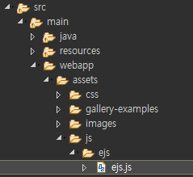

[TOC]

---

# jQuery Plugin	

jquery widgets = `https://jqueryui.com/dialog/#default`

`<button id="btn-next">nextPage</button>`

[1]

```js
$(function() {(function($){
    $.fn.hello = function(){
        console.log($(this).attr("id") + " : hello!");
    }
})(jQuery);

$(function() {
    $("#btn-next").hello();
});
```
> btn-next : hello!


[2]


```js
(function($){
    $.fn.flash = function(){
        $(this).click(function(){
            var isBlink = false;
            var $that = $(this);
            setInterval(function() {
                $that.css("backgroundColor", isBlink ? "#f00" : "#aaa");
                isBlink = !isBlink;
            }, 1000);
        });
    }
})(jQuery);

$(function() {
    $("#btn-next").flash();
});
```

> 버튼 누르면 반짝반짝
>
>  

---


---

### form valid검사

```js
// form에서 사용
var messageBox = function(title, message){
    $("#dialog-message").attr("title", title);
    $("#dialog-message p").text(message);
    $("#dialog-message").dialog({
        modal:true
    }); 
}

$("#add-form").submit(function(e){
    event.preventDefault();

    var vo = {};
    
    vo.name = $("#input-name").val();
    if(vo.name == ''){
        messageBox('글남기기', '이름은 필수 입력 항목입니다.');
        return;
    }
    
    ...

}); 
```


---

### 모달 창 닫기 + 해당 element에 focus 주기

```js
// form에서 사용
var messageBox = function(title, message){
    $("#dialog-message").attr("title", title);
    $("#dialog-message p").text(message);
    $("#dialog-message").dialog({
        modal:true,
        buttons:{
            "확인" : function(){
                $(this).dialog("close"); 
                $('#input-name').focus(); 
            }
        }
    }); 
}
```


---

### callback으로 받아서 각자 주기

```js
var emptyFunction = function(){};

// form에서 사용
var messageBox = function(title, message, callback){
    $("#dialog-message").attr("title", title);
    $("#dialog-message p").text(message);
    $("#dialog-message").dialog({
        modal:true,
        buttons:{
            "확인" : function(){
                $(this).dialog("close"); 
            }
        }, 
        close : function(){
            (callback || emptyFunction)();
        }
    });  
}

$("#add-form").submit(function(e){
    event.preventDefault();

    var vo = {};

    vo.name = $("#input-name").val();
    if(vo.name == ''){
        messageBox('글남기기', '이름은 필수 입력 항목입니다.', function(){
            $('#input-name').focus(); 
        });
        return;
    }

    vo.password = $("#input-password").val();
    if(vo.password == ''){
        messageBox('글남기기', '비밀번호는 필수 입력 항목입니다.', function(){
            $('#input-password').focus(); 
        });
        return;
    }

    vo.contents = $("#tx-content").val();
    if(vo.password == ''){
        messageBox('글남기기', '내용은 필수 입력 항목입니다.');
        return;
    }

    ...

}); 
```


---

### ejs 템플릿 사용

**index-spa.jsp**

**아래 코드 ejs로 수정하기**

```js
// 실제로는 template library를 사용한다. (html 렌더링 라이브러리)
// -> ejs, underscore, mustache
var html =  "<li data-no='"+ vo.no +"'>"+
    "<strong>"+vo.name+"</strong>"+
    // 이 문자열의 모든(g)거에 다 적용해라 . \n -> <br>
    "<p>"+ vo.contents.replace(/</gi, "&lt;").replace(/>/gi, "&gt;").replace(/\n/gi, "<br>") + "</p><br>"+
    "<strong></strong>"+
    "<a href='#' data-no='"+ vo.no +"'>삭제</a>"+ 
    "</li>"; 
```


**1) ejs 라이브러리 넣기**




#### 2) ejs-templates 만들기


**guestbook-list.ejs**

```ejs
<%	
for(var i=0; i<data.length; i++){
	var vo = data[i];
%>

<li data-no='<%=vo.no%>'>
	<strong><%=vo.name%></strong>
	<p><%=vo.contents.replace(/</gi, "&lt;").replace(/>/gi, "&gt;").replace(/\n/gi, "<br>")%></p><br>
	<strong></strong>
	<a href='#' data-no='<%=vo.no%>'>삭제</a>
</li>

<%
}
%>
```


**guestbook-list-item.ejs**

```ejs
<li data-no='<%=no%>'>
	<strong><%=name%></strong>
	<p><%=contents.replace(/</gi, "&lt;").replace(/>/gi, "&gt;").replace(/\n/gi, "<br>")%></p><br>
	<strong></strong>
	<a href='#' data-no='<%=no%>'>삭제</a>
</li>
```


**3) import하기**

`<script type="text/javascript" src="${pageContext.request.contextPath }/assets/js/ejs/ejs.js"></script>`  추가


**4) 코드 수정**

**[1]**

```js
////////////////////// import ejs template //////////////////////
var listItemTemplate = new EJS({
    url : '${pageContext.request.contextPath }/assets/js/ejs-templates/guestbook-list-item.ejs'
});

var listTemplate = new EJS({
    url : '${pageContext.request.contextPath }/assets/js/ejs-templates/guestbook-list.ejs' 
});
//////////////////////////////////////////////////////////////////

var isEnd = false; 
var userName = '${authUser.name}';

var render = function(vo, mode){
    // 실제로는 template library를 사용한다. (html 렌더링 라이브러리)
    // -> ejs, underscore, mustache
    /* 		var html =  "<li data-no='"+ vo.no +"'>"+
						"<strong>"+vo.name+"</strong>"+
												// 이 문자열의 모든(g)거에 다 적용해라 . \n -> <br>
						"<p>"+ vo.contents.replace(/</gi, "&lt;").replace(/>/gi, "&gt;").replace(/\n/gi, "<br>") + "</p><br>"+
						"<strong></strong>"+
						"<a href='#' data-no='"+ vo.no +"'>삭제</a>"+ 
					"</li>"; */

    var html =  listItemTemplate.render(vo);

    if(mode){			
        $("#list-guestbook").prepend(html); 			
    }else{
        $("#list-guestbook").append(html);		
    }
} 
```

**[2]**

```js
//rendering
//$.each(response.data, render); 
//$.each(response.data, function(index, vo){
//	render(vo);
//});
var html = listTemplate.render(response);
$("#list-guestbook").append(html);
```

**[3]**

```js
$("#add-form").submit(function(e){
    ... // ajax 통신 코드 rendering 부분 수정
    //rendering
    var html =  listItemTemplate.render(response.data);
    render(response.data, true);

    ...
});
```


