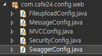
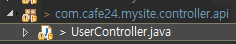

[TOC]

---

swagger spring


api가 필요한 화면만 만들자(회원가입, 로그인, 주문)


mysite3

**com.cafe24.mysite.controller.api/UserController.java**

`@Controller("userAPIController")`-> `@RestController("userAPIController")`

`@RequestMapping("/user/api")`->`@RequestMapping("/api/user")`


라이브러리 추가

**pom.xml**

```xml
<!-- Swagger --> 			
<dependency>
	<groupId>io.springfox</groupId>
	<artifactId>springfox-swagger2</artifactId>
	<version>2.6.1</version>
</dependency>
		
<dependency>
	<groupId>io.springfox</groupId>
	<artifactId>springfox-swagger-ui</artifactId>
	<version>2.6.1</version>
</dependency>
```


**SwaggerConfig.java** -> WebConfig.java에  SwaggerConfig.class 등록



```java
@Configuration
@EnableSwagger2
public class SwaggerConfig {
    @Bean
    public Docket api() {
        return new Docket(DocumentationType.SWAGGER_2)
                .select()
                .apis(RequestHandlerSelectors.basePackage("com.cafe24.mysite.controller.api"))
                .paths(PathSelectors.any())
                .build();
    }
}
```

>  여기 UserController.java 스캐닝 할거임


접근 1

`http://localhost:8080/mysite3/v2/api-docs`

```
{"swagger":"2.0","info":{"description":"Api Documentation","version":"1.0","title":"Api Documentation","termsOfService":"urn:tos","contact":{},"license":{"name":"Apache 2.0","url":"http://www.apache.org/licenses/LICENSE-2.0"}},"host":"localhost:8080","basePath":"/mysite3","tags":[{"name":"user-controller","description":"User Controller"}],"paths":{"/api/user/checkemail":{"get":{"tags":["user-controller"],"summary":"checkEmail","operationId":"checkEmailUsingGET","consumes":["application/json"],"produces":["*/*"],"parameters":[{"name":"email","in":"query","description":"email","required":true,"type":"string"}],"responses":{"200":{"description":"OK","schema":{"$ref":"#/definitions/JSONResult"}},"401":{"description":"Unauthorized"},"403":{"description":"Forbidden"},"404":{"description":"Not Found"}}},"head":{"tags":["user-controller"],"summary":"checkEmail","operationId":"checkEmailUsingHEAD","consumes":["application/json"],"produces":["*/*"],"parameters":[{"name":"email","in":"query","description":"email","required":true,"type":"string"}],"responses":{"200":{"description":"OK","schema":{"$ref":"#/definitions/JSONResult"}},"401":{"description":"Unauthorized"},"204":{"description":"No Content"},"403":{"description":"Forbidden"}}},"post":{"tags":["user-controller"],"summary":"checkEmail","operationId":"checkEmailUsingPOST","consumes":["application/json"],"produces":["*/*"],"parameters":[{"name":"email","in":"query","description":"email","required":true,"type":"string"}],"responses":{"200":{"description":"OK","schema":{"$ref":"#/definitions/JSONResult"}},"201":{"description":"Created"},"401":{"description":"Unauthorized"},"403":{"description":"Forbidden"},"404":{"description":"Not Found"}}},"put":{"tags":["user-controller"],"summary":"checkEmail","operationId":"checkEmailUsingPUT","consumes":["application/json"],"produces":["*/*"],"parameters":[{"name":"email","in":"query","description":"email","required":true,"type":"string"}],"responses":{"200":{"description":"OK","schema":{"$ref":"#/definitions/JSONResult"}},"201":{"description":"Created"},"401":{"description":"Unauthorized"},"403":{"description":"Forbidden"},"404":{"description":"Not Found"}}},"delete":{"tags":["user-controller"],"summary":"checkEmail","operationId":"checkEmailUsingDELETE","consumes":["application/json"],"produces":["*/*"],"parameters":[{"name":"email","in":"query","description":"email","required":true,"type":"string"}],"responses":{"200":{"description":"OK","schema":{"$ref":"#/definitions/JSONResult"}},"401":{"description":"Unauthorized"},"204":{"description":"No Content"},"403":{"description":"Forbidden"}}},"options":{"tags":["user-controller"],"summary":"checkEmail","operationId":"checkEmailUsingOPTIONS","consumes":["application/json"],"produces":["*/*"],"parameters":[{"name":"email","in":"query","description":"email","required":true,"type":"string"}],"responses":{"200":{"description":"OK","schema":{"$ref":"#/definitions/JSONResult"}},"401":{"description":"Unauthorized"},"204":{"description":"No Content"},"403":{"description":"Forbidden"}}},"patch":{"tags":["user-controller"],"summary":"checkEmail","operationId":"checkEmailUsingPATCH","consumes":["application/json"],"produces":["*/*"],"parameters":[{"name":"email","in":"query","description":"email","required":true,"type":"string"}],"responses":{"200":{"description":"OK","schema":{"$ref":"#/definitions/JSONResult"}},"401":{"description":"Unauthorized"},"204":{"description":"No Content"},"403":{"description":"Forbidden"}}}}},"definitions":{"JSONResult":{"type":"object","properties":{"data":{"type":"object"},"message":{"type":"string"},"result":{"type":"string"}}}}}
```

접근 2

`http://localhost:8080/mysite3/swagger-ui.html`

> 아직 url이 다 안뜸! 뜨게하기


**com.cafe24.mysite.controller.api/UserController.java**

```java
//@Controller("userAPIController")
@RestController("userAPIController")
//@RequestMapping("/user/api")
@RequestMapping("/api/user")
public class UserController {
	 
	@Autowired
	private UserService userService;
	
	//@ResponseBody
	@ApiOperation(value="이메일 존재 여부")
	@ApiImplicitParams({
		@ApiImplicitParam(name="email", value="이메일주소", required=true, dataType="string", defaultValue = "aaa")
	})
	@RequestMapping(value="/checkemail", method=RequestMethod.POST) 
	public JSONResult checkEmail(
			@RequestParam(value="email", required=true, defaultValue="") String email) {
		Boolean exist = userService.existEmail(email);
		return JSONResult.success(exist);
	} 

}
```


(R) GET /api/user/10 

(D) DELETE /api/user/10 

(C) POST /api/user

(U) PUT /api/user/10 

---------------------------- body

{

​	name:"aaa",

​	email:"bbb@gmail.com"

}


