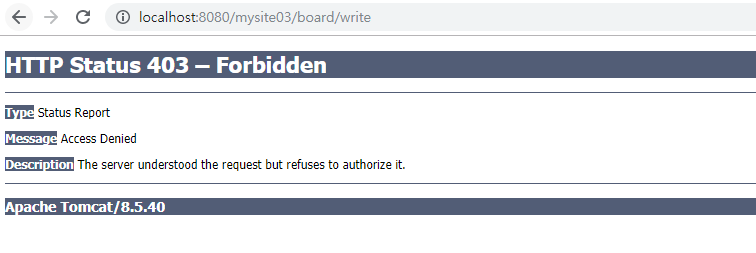
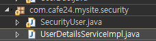

[TOC]

---

# Spring Security

자료 : <https://sjh836.tistory.com/165>

---

Authentication(인증)

Authorization(권한) - Role

-> 사용자 정보(pricipule):이름,이메일 ... + 비밀번호(credential) + Authority(권한)


원래 Intercepter로 비슷하게 흉내 냈었음

근데 보안은 원래 어플리케이션 밖에 있어야함!

인터셉터도 어플리케이션 안에 있으니 밖으로 밀어내야함


filter(완전 스프링과 별개 - servlet 스팩)는 톰캣안에 있고 스프링 밖에 있음

acegi (filter chain? )

스프링 필터 16개가 있음

**Security Filter Chain**

V : 필수! 반드시 만들어야함!

```
1. ChannelProcessingFilter

2. SecurityContextPersistenceFilter( auto-config default, V )
 - SecurityContextRepository에서 SecurityContext를 로드하고 저장하는 일을 담당함
 
3. ConcurrentSessionFilter

4. LogoutFilter( auto-config default, V )
- 로그아웃 URL로 지정된 가상URL에 대한 요청을 감시하고 매칭되는 요청이 있으면 사용자를 로그아웃시킴

5. UsernamePasswordAuthenticationFilter( auto-config default, V )
- 사용자명과 비밀번호로 이뤄진 폼기반 인증에 사용하는 가상 URL요청을 감시하고 요청이 있으면 사용자의 인증을 진행함

6. DefaultLoginPageGeneratingFilter( auto-config default )
- 폼기반 또는 OpenID 기반 인증에 사용하는 가상URL에 대한 요청을 감시하고 로그인 폼 기능을 수행하는데 필요한 HTML을 생성함

7. CasAuthenticationFilter

8. BasicAuthenticationFilter( auto-config default, V )
- HTTP 기본 인증 헤더를 감시하고 이를 처리함

9. RequestCacheAwareFilter( auto-config default )
- 로그인 성공 이후 인증 요청에 의해 가로채어진 사용자의 원래 요청을 재구성하는데 사용됨 SecurityContextHolderAwareRequestFilter HttpServletRequest를 HttpServletRequestWrapper를 상속하는 하위 클래스(SecurityContextHolderAwareRequestWrapper)로 감싸서 필터 체인상 하단에 위치한 요청 프로세서에 추가 컨텍스트를 제공함

10. SecurityContextHolderAwareRequestFilter( auto-config default )

11. JaasApiIntegrationFilter

12. RememberMeAuthenticationFilter (custom으로 설정하는 것이 좋음, V)

13. AnonymousAuthenticationFilter( auto-config default )
- 이 필터가 호출되는 시점까지 사용자가 아직 인증을 받지 못했다면 요청 관련 인증 토큰에서 사용자가 익명 사용자로 나타나게 됨

14. SessionManagementFilter( auto-config default )
- 인증된 주체를 바탕으로 세션 트래킹을 처리해 단일 주체와 관련한 모든 세션들이 트래킹되도록 도움

15. ExceptionTranslationFilter( auto-config default, V )
- 이 필터는 보호된 요청을 처리하는 동안 발생할 수 있는 기대한 예외의 기본 라우팅과 위임을 처리함

16. FilterSecurityInterceptor( auto-config default, V )
- 중간에서 살펴보아야 하는 URL
- 이 필터는 권한부여와 관련한 결정을 AccessDecisionManager에게 위임해 권한부여 결정 및 접근 제어 결정을 쉽게 만들어 줌
```

> Spring Security Filter Chain 가 Bean에 들어가 있어야함

---


rootapplicationContext에 설정해야함(wep이 로딩 된 후)

class DelegatingFilterProxy - 권한 + 인증을 여기서 해야함


---

인터셉터, 어노테이션을 도려내고 스프링시큐리티 입히기

AuthenticationFilter


api쪽에서는 신경 안쓰게 프론트에서 적용

Spring Security = Cookie & Session based

---


---


# 시작

mysite03

**pom.xml 추가**

```xml
<properties>
    ...
    <org.springsecurity-version>4.2.0.RELEASE</org.springsecurity-version>
    ...
</properties>

<!-- Spring Security -->
<dependency>
    <groupId>org.springframework.security</groupId>
    <artifactId>spring-security-core</artifactId>
    <version>${org.springsecurity-version}</version>
</dependency>

<dependency>
    <groupId>org.springframework.security</groupId>
    <artifactId>spring-security-config</artifactId>
    <version>${org.springsecurity-version}</version>
</dependency>

<dependency>
    <groupId>org.springframework.security</groupId>
    <artifactId>spring-security-taglibs</artifactId>
    <version>${org.springsecurity-version}</version>
</dependency>

<dependency>
    <groupId>org.springframework.security</groupId>
    <artifactId>spring-security-acl</artifactId>
    <version>${org.springsecurity-version}</version>
</dependency>
```

```
2. 스프링 부트

<!-- https://mvnrepository.com/artifact/org.springframework.boot/spring-boot-starter-security -->
<dependency>
<groupId>org.springframework.boot</groupId>
<artifactId>spring-boot-starter-security</artifactId>
<version>2.1.6.RELEASE</version>
</dependency>
```


**web.xml Filter 추가**

```xml
<!-- Spring Security Filter -->
<filter>
    <filter-name>springSecurityFilterChain</filter-name>
    <filter-class>org.springframework.web.filter.DelegatingFilterProxy</filter-class>
</filter>
<filter-mapping>
    <filter-name>springSecurityFilterChain</filter-name>
    <url-pattern>/*</url-pattern>
</filter-mapping>
```


**SecurityConfig.java 어노테이션 지우기**

```java
// Spring Security로 대체 
//@Configuration
//@EnableWebMvc
```


**com.cafe24.config.app/ SecurityConfig.java 만들기**

> 기존 SecurityConfig는 com.cafe24.config.web 패키지 였음


```java
@Configuration
@EnableWebSecurity
public class SecurityConfig extends WebSecurityConfigurerAdapter{

    // [ 스프링 시큐리티 필터 연결 ] 
    // WebSecurity 객체는 
    // springSecurityFilterChain이라는 이름의 
    // DelegatingFilterProxy Bean 객체를 생성
    // DelegatingFilterProxy Bean은 많은 Spring Security Filter Chain에 역할을 위임한다.

    @Override
    public void configure(WebSecurity web) throws Exception {
        //super.configure(web);

        // 스프링 시큐리티의 필터 연결을 설정하기 위한 오버라이딩이다.
        // 예외가 웹접근 URL를 설정한다.
        // ACL(Access Control List - 접근 제어 목록)의 예외 URL을 설정
    }

    @Override
    protected void configure(HttpSecurity http) throws Exception {
        // 인터셉터로 요청을 안전하게 보호하는 방법을 설정하기 위한 오버라이딩이다.
        super.configure(http); // 모든 url 막고있음
    }

    @Override
    protected void configure(AuthenticationManagerBuilder auth) throws Exception {
        // 사용자 세부 서비스를 설정하기 위한 오버라이딩이다.
        super.configure(auth);
    }
}
```


**AppConfig에 import 추가**

`@Import({DBConfig.class, MyBatisConfig.class, SecurityConfig.class})`


> 
>
> 무조건 로그인 페이지로 가게 함

---


---

**SecurityConfig.java**

ACL(Access Control List - 접근 제어 목록)에 등록하지 않을  URL을 예외 설정

```java
@Override
public void configure(WebSecurity web) throws Exception {
    // antMatchers
    //		web.ignoring().antMatchers("/assets/**");
    //		web.ignoring().antMatchers("/favicon.ico");

    // regexMatchers
    web.ignoring().regexMatchers("\\A/assets/.*\\Z");
    web.ignoring().regexMatchers("\\A/favicon.ico\\Z"); 
}
```


---


---

**SecurityConfig.java**

>  **Interceptor URL의 요청을 안전하게 보호(보안)하는 방법을 설정**

> 우리가 인증이 필요로 하는 url
>
> **인증( Authenticated )** : (ROLE_USER, ROLE_ADMIN) -> 둘 중 하나 필요
>
> - /user/logout
> - /user/update
> - /board/write
> - /board/delete
> - /board/modify

> **권한( Authorized )** : ROLE_ADMIN
>
> - /admin/**  

> **인증/권한이 필요 없음**
>
> - allow all

```java
// Interceptor URL의 요청을 안전하게 보호(보안)하는 방법을 설정
@Override 
protected void configure(HttpSecurity http) throws Exception {
    // 인터셉터로 요청을 안전하게 보호하는 방법을 설정하기 위한 오버라이딩이다.
    http.authorizeRequests()  // 모두 다 인증이 되어있어야한다.

        // 인증이 되어있을 때 (Authenticated?)
        .antMatchers("/user/update", "/user/logout").authenticated()
        .antMatchers("/board/write", "/board/delte", "/board/modify").authenticated()

        // ADMIN Authorization(ADMIN 권한, ROME_ADMIN) - 3가지 방법
        //		.antMatchers("/admin/**").hasRole("RONE_ADMIN")
        //		.antMatchers("/admin/**").access("hasRole('RONE_ADMIN'")
        .antMatchers("/admin/**").hasAuthority("RONE_ADMIN")

        // 모두 허용 ( 위에서 걸리면(url 매칭)-저기있는 URL이 아니라면, 밑으로 안내려옴 ) - 2가지 방법
        //		.antMatchers("/**").permitAll();
        .anyRequest().permitAll();
}

```

위에서 설정한 url만 forbidden

> 

---

---

**로그인, 로그아웃 설정**

**SecurityConfig.java**

```java
@Override 
protected void configure(HttpSecurity http) throws Exception {
    // 1. ACL 설정
    http.authorizeRequests() 
        .antMatchers("/user/update", "/user/logout").authenticated()
        .antMatchers("/board/write", "/board/delte", "/board/modify").authenticated()
        .antMatchers("/admin/**").hasAuthority("RONE_ADMIN")
        .anyRequest().permitAll();


    // 2. 로그인 설정
    http
        .formLogin()
        .loginPage("user/login")
        .loginProcessingUrl("/user/auth")  // view form의 action과 맞아야함
        .failureUrl("/user/login?result=fail")
        .defaultSuccessUrl("/", true)
        .usernameParameter("email")
        .passwordParameter("password");


    // 3. 로그아웃 설정
    http
        .logout()
        .logoutRequestMatcher(new AntPathRequestMatcher("/user/logout"))
        .logoutSuccessUrl("/")
        .invalidateHttpSession(true);
}
```

---


---

**UserDetailService를 설정**

```java
@Configuration
@EnableWebSecurity
public class SecurityConfig extends WebSecurityConfigurerAdapter{

    @Autowired
    private UserDetailsService userDetailsService;

    ...

    // UserDetailService를 설정
    @Override
    protected void configure(AuthenticationManagerBuilder auth) throws Exception {
        // 사용자 세부 서비스를 설정하기 위한 오버라이딩이다.
        auth.userDetailsService(userDetailsService);
    }    

}
```

---


---

UserDao

```java
public UserVo get(String email) {	
    UserVo vo = new UserVo();
    vo.setName("이정은");
    vo.setNo(1L);
    vo.setEmail("aaa");
    vo.setPassword("1234");
    vo.setRole("ROLE_USER");
    return vo;
    //		return sqlSession.selectOne("user.getByEmail", email);
}
```


**UserDetailsServiceImpl.java**  

```java
@Component
public class UserDetailsServiceImpl implements UserDetailsService {

	@Autowired
	private UserDao userDao;
	
	@Override
	public UserDetails loadUserByUsername(String username) throws UsernameNotFoundException {
		UserVo userVo = userDao.get(username);
		
		SecurityUser securityUser = new SecurityUser();
		
		if ( userVo != null ) {
			securityUser.setName(userVo.getName());         
			securityUser.setUsername(userVo.getEmail());     // principal
			securityUser.setPassword(userVo.getPassword());  // credetial
			
			List<GrantedAuthority> authorities = new ArrayList<GrantedAuthority>();
			authorities.add(new SimpleGrantedAuthority(userVo.getRole()));
			
			securityUser.setAuthorities(authorities);
		}
		
		return securityUser;
	}
}
```

> AppConfig에 ComponentScan 추가 "com.cafe24.mysite.security"


**com.cafe24.mysite.security/SecurityUser.java**  

```java
package com.cafe24.mysite.security;

import java.util.Collection;

import org.springframework.security.core.GrantedAuthority;
import org.springframework.security.core.userdetails.UserDetails;

public class SecurityUser implements UserDetails {

    private Collection<? extends GrantedAuthority> authorities;
    private String username;  // principal - biz name : email
    private String password;  // credential

    // etc
    private String name;  // biz data

    @Override
    public Collection<? extends GrantedAuthority> getAuthorities() {
        // ROLE
        return authorities;
    }

    @Override
    public String getPassword() {
        return password;
    }

    @Override
    public String getUsername() {
        return username;
    }


    // -------------- 계정에 대한 디테일한 설정 -----------------
    @Override
    public boolean isAccountNonExpired() {
        return true;
    }

    @Override
    public boolean isAccountNonLocked() {
        return true;
    }

    @Override
    public boolean isCredentialsNonExpired() {return true;
                                             }

    @Override
    public boolean isEnabled() {
        return true;
    }
    // -----------------------------------------------

    public String getName() {
        return name;
    }

    public void setName(String name) {
        this.name = name;
    }

    public void setAuthorities(Collection<? extends GrantedAuthority> authorities) {
        this.authorities = authorities;
    }

    public void setUsername(String username) {
        this.username = username;
    }

    public void setPassword(String password) {
        this.password = password;
    }

}

```


csrf 설정 잠깐 막기

**SecurityConfig.java**

```java
// Temporary for Testing
http.csrf().disable();
```


