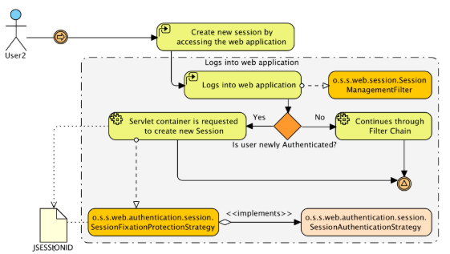
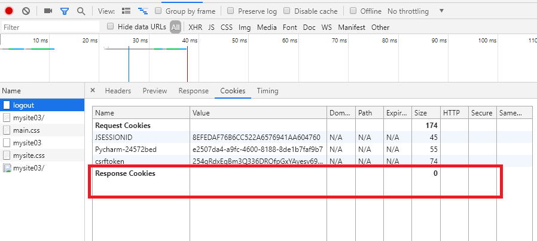
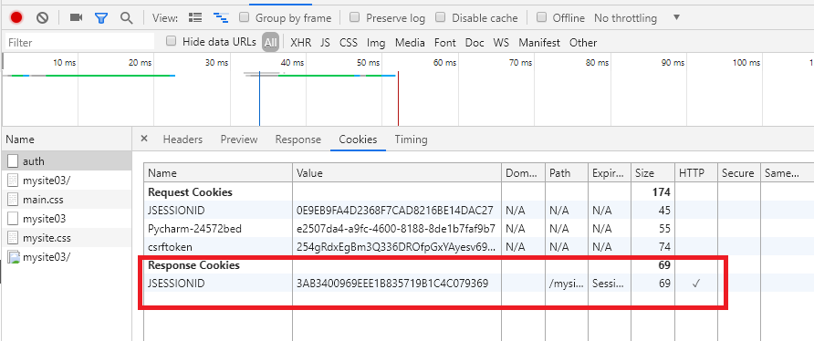
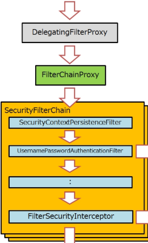
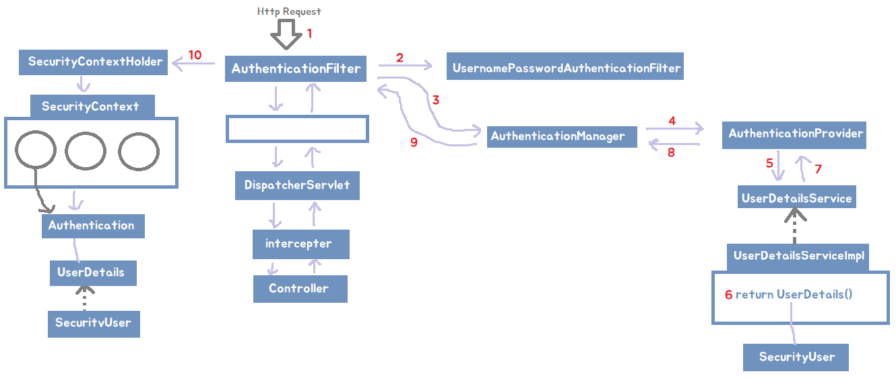
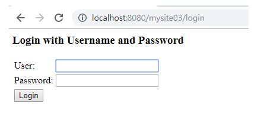
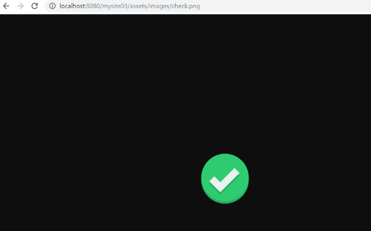

---


---

## 🎈 스프링 시큐리티 (Spring Security)

- 스프링 시큐리티는 스프링 기반의 어플리케이션의 보안을 담당하는 프레임워크이다.

- 스프링 시큐리티가 구성하는 영역은 두가지이다.

  > 인증(Authenticatio) : 애플리케이션의 작업을 수행할 수 있는 주체
  >
  > 권한(Authorization) : 인증된 주체가 특정 동작을 수행할 수 있는 권한을 가졌는지를 결정

- 스프링 시큐리티는 보안과 관련해 많은 옵션들을 지원해준다. (나는 스프링 시큐리티를 사용하기 전 기존 인증과 권한에 대한 설정을 커스텀 어노테이션을 통해서 구현했었다.)

- 스프링 시큐리티는 Spring와 완전 분리되어 filter 기반으로 동작한다.

- 

  세션 - 쿠키 방식으로 인증한다. (요청을 받아 DB에 검증된 회원일 경우,  JSESSIONID 부여 후 -> 이 후 요청에서 JSESSIONID을 검증 후 유효하면 인증을 준다. )

  > **[ 로그아웃 상태 ]**
  >
  > 
  >
  > **[ 로그인 상태 ]**
  >
  > 


<Br>

## 🎈 스프링 시큐리티 필터 (Spring Security filter)



Spring Security FIlter는 필터를 수행하고 다음 필터의 일을 수행하는 체인 형식으로 이루어져 있다.

<b style="color:blue;">Security Filter Chain 종류</b>

> auto-config : 자동 config
>
> V : 필수, 반드시 만들어야한다.

```
1. ChannelProcessingFilter

2. SecurityContextPersistenceFilter( auto-config default, V )
 - SecurityContextRepository에서 SecurityContext를 로드하고 저장하는 일을 담당함
 
3. ConcurrentSessionFilter

4. HEADERS_FILTER

5. CSRF_FILTER

6. LogoutFilter( auto-config default, V )
- 로그아웃 URL로 지정된 가상URL에 대한 요청을 감시하고 매칭되는 요청이 있으면 사용자를 로그아웃시킴

7. UsernamePasswordAuthenticationFilter( auto-config default, V )
- 사용자명과 비밀번호로 이뤄진 폼기반 인증에 사용하는 가상 URL요청을 감시하고 요청이 있으면 사용자의 인증을 진행함

8. DefaultLoginPageGeneratingFilter( auto-config default )
- 폼기반 또는 OpenID 기반 인증에 사용하는 가상URL에 대한 요청을 감시하고 로그인 폼 기능을 수행하는데 필요한 HTML을 생성함

9. CasAuthenticationFilter

10. BasicAuthenticationFilter( auto-config default, V )
- HTTP 기본 인증 헤더를 감시하고 이를 처리함

11. RequestCacheAwareFilter( auto-config default )
- 로그인 성공 이후 인증 요청에 의해 가로채어진 사용자의 원래 요청을 재구성하는데 사용됨 SecurityContextHolderAwareRequestFilter HttpServletRequest를 HttpServletRequestWrapper를 상속하는 하위 클래스(SecurityContextHolderAwareRequestWrapper)로 감싸서 필터 체인상 하단에 위치한 요청 프로세서에 추가 컨텍스트를 제공함

12. SecurityContextHolderAwareRequestFilter( auto-config default )

13. JaasApiIntegrationFilter

14. RememberMeAuthenticationFilter (custom으로 설정하는 것이 좋음, V)

15. AnonymousAuthenticationFilter( auto-config default )
- 이 필터가 호출되는 시점까지 사용자가 아직 인증을 받지 못했다면 요청 관련 인증 토큰에서 사용자가 익명 사용자로 나타나게 됨

16. SessionManagementFilter( auto-config default )
- 인증된 주체를 바탕으로 세션 트래킹을 처리해 단일 주체와 관련한 모든 세션들이 트래킹되도록 도움

17. ExceptionTranslationFilter( auto-config default, V )
- 이 필터는 보호된 요청을 처리하는 동안 발생할 수 있는 기대한 예외의 기본 라우팅과 위임을 처리함

18. FilterSecurityInterceptor( auto-config default, V )
- 중간에서 살펴보아야 하는 URL
- 이 필터는 권한부여와 관련한 결정을 AccessDecisionManager에게 위임해 권한부여 결정 및 접근 제어 결정을 쉽게 만들어 줌 (앞에 지나온 모든 필터들의 정보를 토대로 최종 결정을 내린다.)
```

> [Spring Security Reference에서 필터 더 살펴보기](https://docs.spring.io/spring-security/site/docs/3.2.4.RELEASE/reference/htmlsingle/#ns-web-advanced)

<Br>

### AuthenticationManager

요청에 담긴 Authentication을  

-> AuthenticationManager에 넘겨주면 

-> AuthenticationManager를 구현한 ProviderManager가 처리한다.

-> AuthenticationManager가 AuthenticationProvider(多)를 통해 

-> UserDetailsService를 거쳐 인증을 받아 

-> UserDetails에 SercurityUser를 등록한다,

<br>

<br>

## 🎈 Spring Security 사용자 인증 코드 작성해보기

### **<< login / logout 인증 >>**



**패키지 구성**


### [1] pom.xml 추가

```xml
<!-- Spring Security -->
<dependency>
    <groupId>org.springframework.security</groupId>
    <artifactId>spring-security-core</artifactId>
    <version>4.2.0.RELEASE</version>
</dependency>

<dependency>
    <groupId>org.springframework.security</groupId>
    <artifactId>spring-security-config</artifactId>
    <version>4.2.0.RELEASE</version>
</dependency>

<dependency>
    <groupId>org.springframework.security</groupId>
    <artifactId>spring-security-taglibs</artifactId>
    <version>4.2.0.RELEASE</version>
</dependency>

<dependency>
    <groupId>org.springframework.security</groupId>
    <artifactId>spring-security-acl</artifactId>
    <version>4.2.0.RELEASE</version>
</dependency>
```

<br>

### [2] DelegatingFilterProxy 설정

DelegatingFilterProxy는 Spring Security가 모든 요청을 가로채 보안이 적용되게 하는 서블릿 필터이다.

보안 처리와 관련된 일을 하는 것은 아니지만, 보안 적용을 위해 spring security에게 권한 부여 등을 체크하기 위해 넘겨주는 역할을 한다.

springSecurityFilterChain는 chain형식으로 이루어져 각각의 filter들이 순차적으로 일을 수행한다.  (SpringSecurityFilterChain이 Bean에 들어가 있어야한다.)

**web.xml에 DelegatingFilterProxy를 설정한다.**

```xml
<!-- Spring Security Filter -->
<filter>
    <filter-name>springSecurityFilterChain</filter-name>
    <filter-class>org.springframework.web.filter.DelegatingFilterProxy</filter-class>
</filter>
<filter-mapping>
    <filter-name>springSecurityFilterChain</filter-name>
    <url-pattern>/*</url-pattern>
</filter-mapping>
```

<br>

### [3] WebSecurityConfigurerAdapter를 상속받은 SecurityConfig 만들기

    [ 스프링 시큐리티 필터 연결 ] 
    WebSecurity 객체는 
    springSecurityFilterChain이라는 이름의 DelegatingFilterProxy Bean 객체를 생성한다.
    DelegatingFilterProxy Bean은 많은 Spring Security Filter Chain에 역할을 위임한다.
```java
@Configuration
@EnableWebSecurity
public class SecurityConfig extends WebSecurityConfigurerAdapter{

    @Override
    public void configure(WebSecurity web) throws Exception {
        //super.configure(web); // 아무런 작업을 하지 않음

        // 스프링 시큐리티의 필터 연결을 설정하기 위한 오버라이딩이다.
        // 예외가 웹접근 URL를 설정한다.
        // ACL(Access Control List - 접근 제어 목록)의 예외 URL을 설정
    }

    @Override
    protected void configure(HttpSecurity http) throws Exception {
        // 인터셉터로 요청을 안전하게 보호하는 방법을 설정하기 위한 오버라이딩이다.
        super.configure(http); // 모든 url 막고있음
    }

    @Override
    protected void configure(AuthenticationManagerBuilder auth) throws Exception {
        // 사용자 세부 서비스를 설정하기 위한 오버라이딩이다.
        super.configure(auth);
    }
}
```

<br>

### [4] AppConfig.에 Import를 추가

`@Import({DBConfig.class, MyBatisConfig.class, SecurityConfig.class})`

현재 SecurityConfig에서 모든 URL을 막고 있으므로, 어플리케이션 접근 시 무조건 로그인 페이지로 가게된다.



<br>

### [5] ACL에 등록하지 않을 URL 예외 설정

ACL = Access Control List, 접근 제어 목록

SecurityConfig의 cofigure(WebSecurity web){} 메소드에 설정해 주면 된다.

**1번째 방법 : antMatchers**

```java
@Override
public void configure(WebSecurity web) throws Exception {
    // antMatchers
    web.ignoring().antMatchers("/assets/**");
    web.ignoring().antMatchers("/favicon.ico");
}
```

**2번째 방법 : regexMatchers**

```java
@Override
public void configure(WebSecurity web) throws Exception {
    // regexMatchers
    web.ignoring().regexMatchers("\\A/assets/.*\\Z");
    web.ignoring().regexMatchers("\\A/favicon.ico\\Z"); 
}
```

> 이제 /assets로 들어오는 경로와 favicon.ico 는 허용이 되어 접근이 가능하다.
>
> 

<br>

### [6] Interceptor URL의 요청을 안전하게 보호(보안)하는 방법을 설정

<b style="color:blue;">현재 내 프로젝트에서 인증을 필요로 하는 URL</b>

**인증( Authenticated )** : (ROLE_USER, ROLE_ADMIN) -> 둘 중 하나 필요

- /user/logout
- /user/update
- /board/write
- /board/delete
- /board/modify


<b style="color:blue;">현재 내 프로젝트에서 권한을 필요로 하는 URL</b>

**권한( Authorized )** : ROLE_ADMIN

- /admin/**  


<b style="color:blue;">인증/권한이 필요 없음</b>

- allow all

SecurityConfig의 cofigure(HttpSecurity http){} 메소드에 설정해 주면 된다.

```java
@Override 
protected void configure(HttpSecurity http) throws Exception {
    // 인터셉터로 요청을 안전하게 보호하는 방법을 설정하기 위한 오버라이딩이다.
    http.authorizeRequests()  // 모두 다 인증이 되어있어야한다.

        // 인증이 되어있을 때 (Authenticated?)
        .antMatchers("/user/update", "/user/logout").authenticated()
        .antMatchers("/board/write", "/board/delte", "/board/modify").authenticated()

        // ADMIN Authorization(ADMIN 권한, ROME_ADMIN) - 3가지 방법
        //		.antMatchers("/admin/**").hasRole("RONE_ADMIN")
        //		.antMatchers("/admin/**").access("hasRole('RONE_ADMIN'")
        .antMatchers("/admin/**").hasAuthority("RONE_ADMIN")

        // 모두 허용 ( 위에서 걸리면(url 매칭)-저기있는 URL이 아니라면, 밑으로 안내려옴 ) - 2가지 방법
        //		.antMatchers("/**").permitAll();
        .anyRequest().permitAll();
}
```

주석을 뺀 필요부분만 있는 코드

```java
@Override 
protected void configure(HttpSecurity http) throws Exception {
    http.authorizeRequests().antMatchers("/user/update", "/user/logout").authenticated().antMatchers("/board/write", "/board/delte", "/board/modify").authenticated().antMatchers("/admin/**").hasAuthority("RONE_ADMIN").anyRequest().permitAll();
}
```

> 이렇게 설정하면 위에서 설정한 url을 제외하고는 어플리케이션에 접근할 수 있게 된다. 
>
> 위의 url만 forbidden
>
> 

<br>

### [7] 로그인, 로그아웃 설정

#### - AuthenticationProvider 설정

**SecurityConfig.java**

```java
@Override 
protected void configure(HttpSecurity http) throws Exception {
    // 1. ACL 설정
    http.authorizeRequests() 
        .antMatchers("/user/update", "/user/logout").authenticated()
        .antMatchers("/board/write", "/board/delte", "/board/modify").authenticated()
        .antMatchers("/admin/**").hasAuthority("RONE_ADMIN")
        .anyRequest().permitAll();
    
    // Temporary for Testing 임시로 csrf 설정 막기
    http.csrf().disable();
    
    // 2. 로그인 설정
    http
        .formLogin()
        .loginPage("user/login") 	// 로그인 페이지 url
        .loginProcessingUrl("/user/auth")  // view form의 action과 맞아야함
        .failureUrl("/user/login?result=fail") // 로그인 실패시 redirect
        .defaultSuccessUrl("/", true) // 로그인 성공시
        .usernameParameter("email")  // 로그인 요청시 id용 파라미터 (메소드 이름이 usernameParameter로 무조건 써야하지만, 파라미터는 email이든 id이든 name이든 상관없다.)
        .passwordParameter("password");	// 로그인 요청시 password용 파라미터

    // 3. 로그아웃 설정
    http
        .logout() 
        .logoutRequestMatcher(new AntPathRequestMatcher("/user/logout"))
        .logoutSuccessUrl("/") // 로그아웃 성공시
        .invalidateHttpSession(true);
}
```

<br>

#### - UserDetailsService 설정

SecurityConfig의 configure(AuthenticationManagerBuilder auth){} 메소드에 설정해 주면 된다.

```java
@Configuration
@EnableWebSecurity
public class SecurityConfig extends WebSecurityConfigurerAdapter{
	
    // 1. UserDetailsService를 자동주입 받은 뒤
    @Autowired
    private UserDetailsService userDetailsService;

    ...

    // 2. UserDetailService를 설정
    @Override
    protected void configure(AuthenticationManagerBuilder auth) throws Exception {
        // 사용자 세부 서비스를 설정하기 위한 오버라이딩이다.
        auth.userDetailsService(userDetailsService);
    }    
}
```

<br>

#### - 회원 인증 정보를 담고있는 SecurityUser(UserDetails) 만들기

```java
public class SecurityUser implements UserDetails {

    private Collection<? extends GrantedAuthority> authorities;
    private String username;  // principal - biz name : email
    private String password;  // credential

    // etc
    private String name;  // biz data

    @Override
    public Collection<? extends GrantedAuthority> getAuthorities() {
        // ROLE
        return authorities;
    }

    @Override
    public String getPassword() {
        return password;
    }

    @Override
    public String getUsername() {
        return username;
    }


    // -------------- 계정에 대한 디테일한 설정 -----------------
    @Override
    public boolean isAccountNonExpired() {
        return true;
    }

    @Override
    public boolean isAccountNonLocked() {
        return true;
    }

    @Override
    public boolean isCredentialsNonExpired() {return true;
                                             }

    @Override
    public boolean isEnabled() {
        return true;
    }
    // -----------------------------------------------

    public String getName() {
        return name;
    }

    public void setName(String name) {
        this.name = name;
    }

    public void setAuthorities(Collection<? extends GrantedAuthority> authorities) {
        this.authorities = authorities;
    }

    public void setUsername(String username) {
        this.username = username;
    }

    public void setPassword(String password) {
        this.password = password;
    }

}

```

<br>

#### - UserDetailsService구현 UserDetailsServiceImpl 작성

> 여기서 Dao에 접근해 Dao에서 해당하는 유저 정보를 찾아 SercurityUser(인증)을 return한다.
>
> <b style="color:red">UserDetailsServiceImpl의 패키지 위치를 AppConfig의 ComponentScan 에 추가해야한다!</b>

```java
@Component
public class UserDetailsServiceImpl implements UserDetailsService {

    @Autowired
    private UserDao userDao;

    @Override
    public UserDetails loadUserByUsername(String username) throws UsernameNotFoundException {
        UserVo userVo = userDao.get(username);

        SecurityUser securityUser = new SecurityUser();

        if ( userVo != null ) {
            securityUser.setName(userVo.getName());         
            securityUser.setUsername(userVo.getEmail());     // principal
            securityUser.setPassword(userVo.getPassword());  // credetial

            List<GrantedAuthority> authorities = new ArrayList<GrantedAuthority>();
            authorities.add(new SimpleGrantedAuthority(userVo.getRole()));

            securityUser.setAuthorities(authorities);
        }

        return securityUser; // 여기서 return된 UserDetails는 SecurityContext의 Authentication에 등록되어 인증 정보를 갖고 있는다.
    }
}
```

**UserDao.java** 에서 임시 데이터를 return 한다.

```java
public UserVo get(String email) {	
    UserVo vo = new UserVo();
    vo.setName("이정은");
    vo.setNo(1L);
    vo.setEmail("aaa");
    vo.setPassword("1234");
    vo.setRole("ROLE_USER");
    return vo;
}
```


<br>

<br>

<br>


