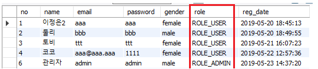
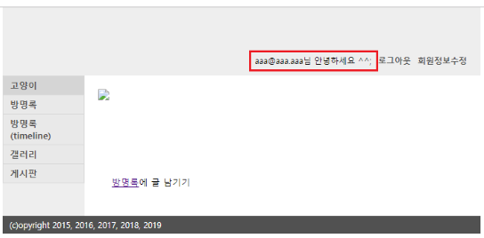
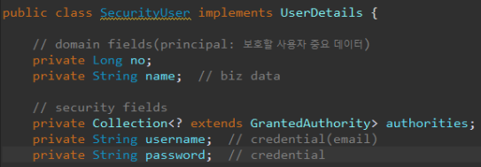
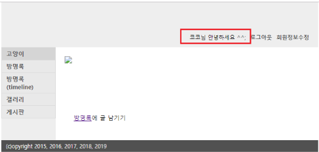

## [ 목차 ]

[TOC]

---

# [project 전체 코드 보기](https://github.com/jungeunlee95/mysite-multi-project/tree/master/mysite03)


## **Authorization(권한) 설정하기 - ROLE** 

### [1] 테이블 수정

ROLE을 아래의 형태로 받을 예정이다.

- 회원 권한 : `ROLE_USER`
- 관리자 권한 : `ROLE_ADMIN` 

위의 형태로 받기 위해서 table의 role컬럼(기존 enum('USER', 'ADMIN') 형태)과 데이터를 수정했다.

```sql
alter table user 
change column role 
role enum('ROLE_USER','ROLE_ADMIN');
```

**수정 후 데이터**




<br>

### [2] SecurityUser에 field 추가하기

SecurityUser는 회원 정보를 저장하는 역할이다. (UserDetails를 구현한 클래스)

<b style="color:blue">SecurityUser.java의 기존 field</b>

```java
private String name;  // biz data
private Collection<? extends GrantedAuthority> authorities;
private String username; 
private String password; 
```

<b style="color:blue">no filed 추가 후 getter, setter 추가 </b>

```java
// domain fields(principal: 보호할 사용자 중요 데이터)
private Long no;
private String name;  // biz data

// security fields
private Collection<? extends GrantedAuthority> authorities;
private String username;  // credential(email)
private String password;  // credential

...

public Long getNo() {
    return no;
}
public void setNo(Long no) {
    this.no = no;
}

...
```

> 인증을 위한 security fields와, 회원의 중요 데이터 domain fields 가 있다.
>
> 다른 회원 정보를 추가하기 위해서 domain fields 쪽에 필드를 추가해주면 된다.

<br>

### [3] UserDetailsServiceImpl 수정하기

<b style="color:blue">이전 코드</b>

```java
@Component
public class UserDetailsServiceImpl implements UserDetailsService {

    @Autowired
    private UserDao userDao;

    @Override
    public UserDetails loadUserByUsername(String username) throws UsernameNotFoundException {
        UserVo userVo = userDao.get(username); 

        SecurityUser securityUser = new SecurityUser();

        if ( userVo != null ) { 
            securityUser.setName(userVo.getName());         
            securityUser.setUsername(userVo.getEmail());     // credential
            securityUser.setPassword(userVo.getPassword());  // credetial

            List<GrantedAuthority> authorities = new ArrayList<GrantedAuthority>();
            authorities.add(new SimpleGrantedAuthority(userVo.getRole()));
        }
        return securityUser;
    }
}
```

> 이전 코드에서는 securityUser의 no field가 없어 no를 넣어주지 못했다. 
>
> no추가와 권한추가 코드(authorities)를 수정했다.

<b style="color:blue">수정 후 코드</b>

```java
@Component
public class UserDetailsServiceImpl implements UserDetailsService {

    @Autowired
    private UserDao userDao;

    @Override
    public UserDetails loadUserByUsername(String username) throws UsernameNotFoundException {
        UserVo userVo = userDao.get(username); 

        SecurityUser securityUser = new SecurityUser();

        if ( userVo != null ) { 
            securityUser.setNo(userVo.getNo());   			// setNo코드 추가
            securityUser.setName(userVo.getName());         
            securityUser.setUsername(userVo.getEmail());     // credential
            securityUser.setPassword(userVo.getPassword());  // credetial
            securityUser.setAuthorities(Arrays.asList(new SimpleGrantedAuthority(userVo.getRole()))); 				// 한줄로 요약
        }
        return securityUser;
    }
}
```

<br>

### [4] UserDao수정하기

<b style="color:blue">이전코드</b>

**UserDao.java** 에서 임시 데이터를 return 했다.

```java
public UserVo get(String email) {
    UserVo vo = new UserVo();
    vo.setName("이정은");
    vo.setNo(1L);
    vo.setEmail("aaa");
    vo.setPassword("1234");
    vo.setRole("ROLE_USER");
    return vo;
}
```

<b style="color:blue">수정 후 코드</b> : mybatis를 통해 db에서 실제 데이터를 가져옴

> username대신 email이 credential이다.

```java
public UserVo get(String email) {	
    return sqlSession.selectOne("user.getByEmail", email);
}
```

<br>

여기 까지 수정했다면 이제 SercurityUser 객체(?)는 ROLE 권한(setAuthorities)을 갖게된다.

일반 회원일 경우 `ROLE_USER`, 관리자일 경우 `ROLE_ADMIN`이다.

해당 권한은 `WebSecurityConfigurerAdapter`를 구현한 `SecurityConfig.java`클래스에서 사용할 수 있다.

[지난 포스팅](https://jungeunlee95.github.io/java/2019/07/17/2-Spring-Security/)에서 

아래의 그림과 같이,


antMatchers를 통해 `/admin/**` 경로는 `ROLE_ADMIN` 권한을 갖게 했었다. 

이제 DB를 통해서 정말로 사용자 데이터의 ROLE을 가져오기 때문에, 

권한을 통해 오직 관리자(ROLE_ADMIN 권한을 가진 회원)만 `/admin/**` 경로에 접근 할 수 있게 되었다.

(이 설정을 하기 전에는 모~든 회원이 Forbidden 403페이지가 떴었다.)

<br>

### [5] jsp에 SpringSecurity TagLib authorize 추가하기

태그 라이브러리 사용을 위해 pom.xml에 라이브러리가 추가 되어있어야한다.

```xml
<dependency>
    <groupId>org.springframework.security</groupId>
    <artifactId>spring-security-taglibs</artifactId>
    <version>${org.springsecurity-version}</version>
</dependency>
```

<b style="color:blue"> 로그인 회원, 비 로그인 회원 분리 </b>

`<sec:authorize access="isAuthenticated()">`를 통해 인증된(로그인한) 회원이라면 회원정보 수정과 로그아웃을 보여준다. 비 로그인 회원일 경우 로그인과 회원가입 버튼을 보여준다.

```html
<sec:authorize access="isAuthenticated()">
    <li><a href="${pageContext.servletContext.contextPath}/user/update">회원정보수정</a></li>
    <li><a href="${pageContext.servletContext.contextPath}/user/logout">로그아웃</a></li>
    <li><sec:authentication property="name" />님 안녕하세요 ^^</li>			
</sec:authorize>
<sec:authorize access="!isAuthenticated()">
    <li><a href="${pageContext.servletContext.contextPath}/user/login">로그인</a><li>
    <li><a href="${pageContext.servletContext.contextPath}/user/join">회원가입</a></li>
</sec:authorize>
```

해당 회원의 정보(name)을 가져오기 위해서는 `<sec:authentication property="name" />`를 사용하면 된다.

> 

하지만, 우리는 credential의 username 인증을 이메일로 했기 때문에 이메일이 뜨게된다.

> UserDetails를 구현한 SecurityUser의 fields 정보
>
> 

여기서 회원의 정보 principal의 name을 가져오기 위해서는 아래의 코드를 적으면 된다.

`<sec:authentication property="principal.name" />`

> 

<br>


