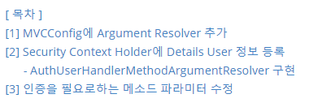
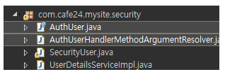

## [ 목차 ] 



---

## [1] MVCConfig에 Argument Resolver 추가

`WebMvcConfigurerAdapter`를 상속받은 `MVCConfig.java`클래스에 Argument Resolver 코드를 추가해준다.

```java
@Configuration
@EnableWebMvc
public class MVCConfig extends WebMvcConfigurerAdapter {
	
	...
	
	// Argument Resolver
	@Bean
	public AuthUserHandlerMethodArgumentResolver authUserHandlerMethodArgumentResolver() {
		return new AuthUserHandlerMethodArgumentResolver();
	}
	
	@Override
	public void addArgumentResolvers(List<HandlerMethodArgumentResolver> argumentResolvers) {
		argumentResolvers.add(authUserHandlerMethodArgumentResolver());
	}
}
```

위에서 return할 `AuthUserHandlerMethodArgumentResolver`클래스를 구현해야한다.

<br>

## [2] Security Context Holder에 Details User 정보 등록 

##       - AuthUserHandlerMethodArgumentResolver 구현



> AuthUser.java : @interface로 어노테이션으로 쓰일 클래스
>
> AuthUserHandlerMethodArgumentResolver : HandlerMethodArgumentResolver 구현 클래스 

> <b style="color:red">`@AuthUser` 어노테이션이 달린 메소드에 `SecurtiyUser`객체를 세션(Security Context Holder)에 등록할 것이다.</b>

**AuthUser.java**

```java
@Retention(RetentionPolicy.RUNTIME)
@Target(ElementType.PARAMETER)
public @interface AuthUser {
} 
```

**AuthUserHandlerMethodArgumentResolver.java**

```java
package com.cafe24.mysite.security;
import org.springframework.core.MethodParameter;
import org.springframework.security.core.Authentication;
import org.springframework.security.core.context.SecurityContextHolder;
import org.springframework.web.bind.support.WebDataBinderFactory;
import org.springframework.web.context.request.NativeWebRequest;
import org.springframework.web.method.support.HandlerMethodArgumentResolver;
import org.springframework.web.method.support.ModelAndViewContainer;

public class AuthUserHandlerMethodArgumentResolver implements HandlerMethodArgumentResolver {

    @Override
    public Object resolveArgument(
        MethodParameter parameter, 
        ModelAndViewContainer mavContainer,
        NativeWebRequest webRequest, 
        WebDataBinderFactory binderFactory) throws Exception {

        Object principal = null;

        Authentication authentication = SecurityContextHolder.getContext().getAuthentication();

        if(authentication != null ) {
            principal = authentication.getPrincipal();
        }

        if(principal == null || principal.getClass() == String .class) {
            return null;
        }

        return principal;
    }

    @Override
    public boolean supportsParameter(MethodParameter parameter) {
        AuthUser authUser = parameter.getParameterAnnotation(AuthUser.class);
        if(authUser==null) {
            return false;
        }

        if(parameter.getParameterType().equals(SecurityUser.class)==false) { 
            return false;
        }
        
        return true;
    }
}
```

<b style="color:blue">코드 해석</b>

> [1] 메소드 파라미터를 검사해 `@AuthUser`가 붙은 경우, 또 그 어노테이션이 붙은 파라미터의 타입이 `SecurityUser`인 경우 를 검사해야한다.
>
> ```java
> @Override
> public boolean supportsParameter(MethodParameter parameter) {
>     AuthUser authUser = parameter.getParameterAnnotation(AuthUser.class);
> 
>     // @AuthUser가 안붙어있으면
>     if(authUser==null) {
>         return false; // 난 그 파라미터 관심없어 return false!
>     }
>     
>     // @AuthUser는 붙어있는데 SecurityUser가 아니면 return false!
>     if(parameter.getParameterType().equals(SecurityUser.class)==false) { //클래스 객체 비교
>         return false;
>     }
>     return true;
> }
> ```
>
> <br>
>
> [2] 위의 `supportsParameter`메소드를 통과하면 `resolveArgument` 메소드에서 처리할 수 있다.
>
> ```java
>     @Override
>     public Object resolveArgument(
>         MethodParameter parameter, 
>         ModelAndViewContainer mavContainer,
>         NativeWebRequest webRequest, 
>         WebDataBinderFactory binderFactory) throws Exception {
> 
>         Object principal = null;
>         
> 		// SecurityContextHolder에서 갖고있는 인증 정보를 확인한다.
>         Authentication authentication = SecurityContextHolder.getContext().getAuthentication();
> 
>         // 인증 정보가 없는 경우 인증 정보 등록
>         if(authentication != null ) {
>             principal = authentication.getPrincipal();
>         }
> 	
>         // 인증 정보가 없다면 return null
>         if(principal == null || principal.getClass() == String .class) {
>             return null;
>         }
> 
>         return principal;
>     }
> ```

<br>

## [3] 인증을 필요로하는 메소드 파라미터 수정

회원정보 수정을 해야하는 경우, 회원이 로그인상태(인증상태)이여야 하고, 해당 회원의 회원 정보만 수정할 수 있어야 한다. 이제 `@AuthUser` 어노테이션을 통해 인증정보를 확인 할 수 있다.

<b style="color:blue">예시코드</b>

```java
@RequestMapping(value = "/update", method = RequestMethod.GET)
public String update(@AuthUser SecurityUser securityUser, Model model) {
    UserVo userVo = userService.getUser(securityUser.getNo());
    	...
}

@RequestMapping(value = "/update", method = RequestMethod.POST)
public String update(@AuthUser SecurityUser securityUser, @ModelAttribute UserVo userVo, Model model) {
	...
    securityUser.setName(userVo.getName());
    ...
}
```


<br>

<br>

<br>


