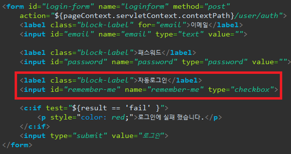
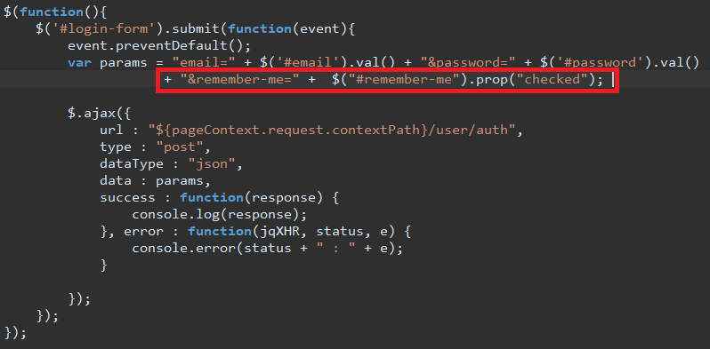
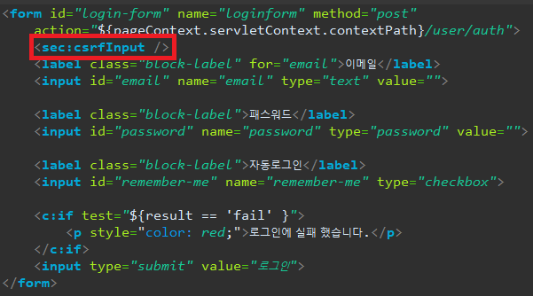
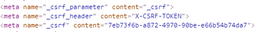
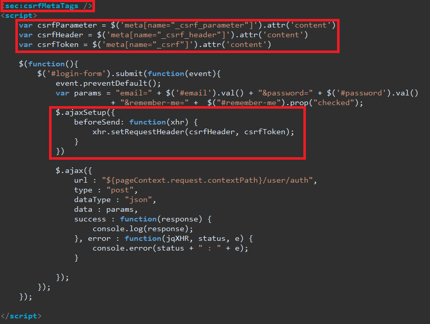

## [ 목차 ] 

[TOC]

---

## [1] 자동로그인 remember-me 설정

### - 설정하기

**xml 버전에서 설정하기**

```xml
<beans:bean id="rememberMeAuthenticationFilter" class="kr.co.sunnyvale.sunny.security.SunnyRememberMeAuthenticationFilter"> 
    <beans:property name="rememberMeServices" ref="rememberMeServices"/>
    <beans:property name="authenticationManager" ref="authenticationManager"/>
</beans:bean>

<beans:bean id="rememberMeServices" class="kr.co.sunnyvale.sunny.security.SunnyTokenBasedRememberMeServices">
    <beans:property name="key" value="sunny" />
    <beans:property name="userDetailsService" ref="customUserDetailsService"/>
    <beans:property name="parameter" value="_sunny_remember_me"/>
    <beans:property name="cookieName" value="SUNNY_REMEMBER_ME"/>
    <beans:property name="useSecureCookie" value="true"/>
</beans:bean>
```

<br>

**config 버전에서 설정하기** : 내가 사용하는 버전

WebSecurityConfigurerAdapter를 구현한 클래스에 `rememberME()`를 추가한다.

**SecurityConfig.java**

```java
@Override 
protected void configure(HttpSecurity http) throws Exception {
    ...
        //
        // 5. RememberMe
        //
        .and()
        .rememberMe()
        .key("mysite03") 
        .rememberMeParameter("remember-me");
}
```

### - form에서 처리하기

**로그인 jsp의 form안에 remember-me 설정**

```html
<label class="block-label">자동로그인</label>
<input name="remember-me" type="checkbox" value="">
```



### - ajax에서 처리하기

```js
var params = "email=" + $('#email').val() + "&password=" + $('#password').val()
+ "&remember-me=" +  $("#remember-me").prop("checked"); 
```

넘겨줄 data의 params에 remember-me를 넘겨주면 된다.



------


<br>


---

## [2] csrf form 처리

이전에 csrf 토큰 처리를 막기위해 임시로 disable을 통해 막아놨었다.

**WebSecurityConfigurerAdapter를 구현한 SecurityConfig.java**

```java
@Override 
protected void configure(HttpSecurity http) throws Exception {
    ...
    
    // Temporary for Testing
    http.csrf().disable();
    
    ...
}
```

이제 이 disable을 지우고 csrf 처리를 해야한다.

vies의 jsp파일에서 post방식으로 처리를 하는 form밑에 코드를 추가해주어야한다.

<br>

**[1] 먼저 해당 jsp파일에 taglib을 추가한다.**

> `<%@ taglib prefix="sec" uri="http://www.springframework.org/security/tags" %>`

<br>

**[2] form안에 csrf 처리 토큰을 넣어준다.**

> `<sec:csrfInput />  `
>
> 

<br>


---

## [3] csrf ajax(javascript) 처리

위의 form의 로그인을  ajax로 구현했다면 자바스크립트를 이용해 csrf토큰을 넘겨주어야한다.

<br>

**[1] csrfMetaTags 태그를 추가한다.**

> `<sec:csrfMetaTags />`
>
> 이 태그를 추가하면 해당페이지에서 개발자 모드를 통해 부여된 csrf 토큰을 확인할 수 있다.
>
> 

<br>

[2] csrf 토큰을 가져와야한다.

> ```js
> var csrfParameter = $('meta[name="_csrf_parameter"]').attr('content')
> var csrfHeader = $('meta[name="_csrf_header"]').attr('content')
> var csrfToken = $('meta[name="_csrf"]').attr('content')  
> ```

<br>

[3] ajaxSetup을 통해 csrf토큰을 처리한다.

> ```js
> $.ajaxSetup({ 
>     beforeSend: function(xhr) { 
>         xhr.setRequestHeader(csrfHeader, csrfToken); 
>     }  
> }) 
> ```




<br>

<br>


