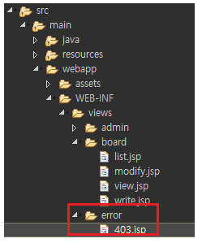
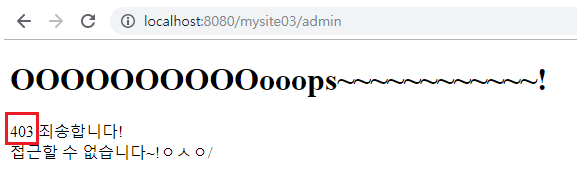

---

## [1] java config 버전 Access Denied Handler 설정

## - error page 처리

**[1] xml 버전에서 설정하기**

```xml
<!-- SS:begin -->	
<http 
      security-context-repository-ref="securityContextRepository" 
      auto-config="false" request-matcher="regex" 
      entry-point-ref="authenticationEntryPoint" disable-url-rewriting="true">
	...
    <access-denied-handler ref="accessDeniedHandler" />		
  	...
</http>

<!-- SS:end -->

<beans:bean id="accessDeniedHandler" class="org.springframework.security.web.access.AccessDeniedHandlerImpl">
    <beans:property name="errorPage" value="/WEB-INF/views/error/403.jsp" />
</beans:bean>
```

<br>

**[2] config 버전에서 설정하기**

WebSecurityConfigurerAdapter을 구현한 클래스에  DeniedPage 설정을 해줘야한다.

**SecurityConfig.java**

```java
@Override 
protected void configure(HttpSecurity http) throws Exception {
    
    ...
        
    http
    .exceptionHandling()
    .accessDeniedPage("/WEB-INF/views/error/403.jsp");
}
```

`.accessDeniedPage("/WEB-INF/views/error/403.jsp");` 설정한 경로에 403.jsp 파일을 만들어준다.



```html
<h1>OOOOOOOOOOooops~~~~~~~~~~~~!</h1>
<p>
    403 죄송합니다! <br> 접근할 수 없습니다~!ㅇㅅㅇ/
</p>
```

위의 설정을 하면, 

일반회원이 관리자 경로 `admin/**`에 접근했을 때(즉, 403 Forbidden 페이지), 아래의 view가 나온다.

([관리자 권한페이지 설정하기](https://jungeunlee95.github.io/java/2019/07/18/3-SpringSecurity-Authorization(%EA%B6%8C%ED%95%9C)-%EC%84%A4%EC%A0%95(ROLE),-TagLib-authorize-%EC%B6%94%EA%B0%80/))




<br>

<br>

<br>


