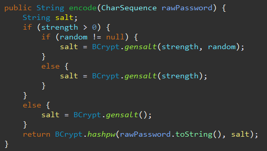
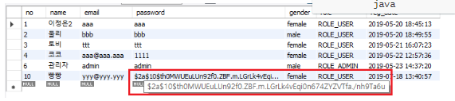

<br>

## [목차]

[TOC]

---

## [0]  비밀번호 암호화

비밀번호의 경우 반드시 단방향 암호화/해싱을 사용해야 한다.

한번 암호화된 비밀번호는 <b style="color:red">절대로 다시 복호화 할 수 없도록</b> 만들어야 한다.

Spring Security 패키지에서는 Password를 암호화할 수 있는 PasswordEncoder Interface가 있다.

기본으로 제공되는 PasswordEncoder중에 복호화가 되지 않는 클래스는

`BCryptPasswordEncoder`, `DelegatingPasswordEncoder`, `SCryptPasswordEncoder`, `Pbkdf2PasswordEncoder` 가 있다. 

이 중 `BCryptPasswordEncoder`를 사용해 암호화를 사용했다!

BCryptPasswordEncoder는 단순히 입력을 1회 해시하는 것이 아니라 ,랜덤의 소트(salt)을 부여하여 여러번 해시를 적용하여 원래의 암호를 추측하기 어럽게 한다.

BCryptPasswordEncoder는 입력값이 같아도 매번 다른 값을 return해주기 때문에 `matches`함수를 잘 확인하고 사용해야한다.

<br>

## [1] config 버전에서 설정하기

- WebSecurityConfigurerAdapter를 구현한 클래스의 configure메소드에 설정한다.

- 암호화 해시는 PasswordEncoder를 DaoAuthenticationProvider로 설정하면 된다.

**SecurityConfig.java**

```java
@Configuration
@EnableWebSecurity
public class SecurityConfig extends WebSecurityConfigurerAdapter{
    
    @Autowired
	private UserDetailsService userDetailsService;

    ...
        
    @Override
    protected void configure(AuthenticationManagerBuilder auth) throws Exception {
        // 사용자 세부 서비스를 설정하기 위한 오버라이딩이다.
        auth
            .userDetailsService(userDetailsService) // 로그인 관리

            // 프로바이더 하나 만들기
            .and()
            .authenticationProvider( authenticationProvider() ); // Password Encoding 관리
    }

    // authenticationProvider()구현
    @Bean
    public AuthenticationProvider authenticationProvider() {
        DaoAuthenticationProvider authProvider = new DaoAuthenticationProvider();
        authProvider.setUserDetailsService(userDetailsService); 
        // 주입된 UserDetailsService에 passwordEncoder를 설정한다.
        authProvider.setPasswordEncoder(passwordEncoder());
        return authProvider;
    }

    // passwordEncoder() 구현
    // 암호를 해시시키는 경우 BCryptPasswordEncoder를 사용한다. 
    @Bean
    public PasswordEncoder passwordEncoder() {
        return new BCryptPasswordEncoder();
    }
}
```

> BCryptPasswordEncoder 클래스를 살펴보면,
>
> - encode시 솔트를 사용하는 것을 볼 수 있다.
>
> 
>
> - matches라는 메서드를 사용하여, 입력된 비밀번호와 DB에 저장된 값을 비교 할 수있다.
>
> 

<br>

## [2] service 에서 passwordEncoder 처리하기

회원가입 시 Dao를 가기위해 거쳐가는 Service의 `joinUser`메소드에서 passwordEncoder를 처리한다.

```java
@Service
public class UserService {

    ...
        
    public Boolean joinUser(UserVo userVo) {
        userVo.setPassword(passwordEncoder.encode(userVo.getPassword()));
        return userDao.insert(userVo);
    }
    
    ...
        
}
```

<br>

## [3] 회원가입 후 데이터 확인하기



> 암호화된 비밀번호가 들어간 것 확인!


<br>

<br>


