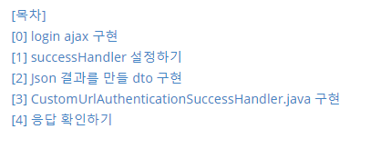
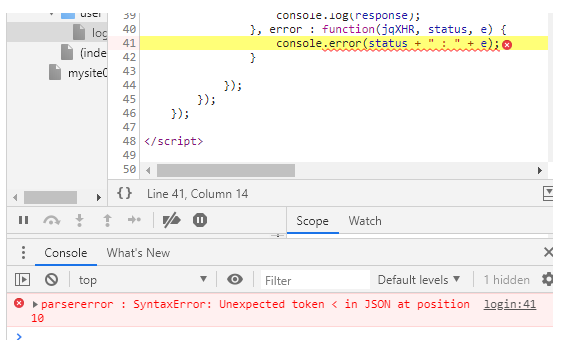
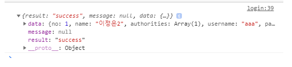

<br>

## [목차]



---

## [0] login ajax 구현

```html
<script type="text/javascript" src="${pageContext.request.contextPath }/assets/js/jquery/jquery-1.9.0.js"></script>
<sec:csrfMetaTags />
<script> 
    var csrfParameter = $('meta[name="_csrf_parameter"]').attr('content')
    var csrfHeader = $('meta[name="_csrf_header"]').attr('content')
    var csrfToken = $('meta[name="_csrf"]').attr('content')  

    $(function(){
        $('#login-form').submit(function(event){
            event.preventDefault();
            var params = "email=" + $('#email').val() + "&password=" + $('#password').val()

            $.ajaxSetup({
                beforeSend: function(xhr) {
                    xhr.setRequestHeader(csrfHeader, csrfToken);
                }  
            })

            $.ajax({
                url : "${pageContext.request.contextPath}/user/auth",
                type : "post",
                dataType : "json",
                data : params,
                success : function(response) {
                    console.log(response);
                }, error : function(jqXHR, status, e) {
                    console.error(status + " : " + e);
                }

            });	 
        });
    });

</script>	

<body>
    
    ...
    
    <form id="login-form" name="loginform" method="post"
          action="${pageContext.servletContext.contextPath}/user/auth">
        <label class="block-label" for="email">이메일</label> 
        <input id="email" name="email" type="text" value=""> 

        <label class="block-label">패스워드</label> 
        <input id="password" name="password" type="password" value=""> 

        <label class="block-label">자동로그인</label> 
        <input id="remember-me" name="remember-me" type="checkbox">

        <c:if test="${result == 'fail' }"> 
            <p style="color: red;">로그인에 실패 했습니다.</p>
        </c:if>
        <input type="submit" value="로그인">
    </form>
    
    ...
    
</body>
```

> 위와 같이 ajax로 로그인을 구현했을 때, 응답부분에서 오류가 있다.
>
> json형식의 응답이 오지않아 에러가 생겼다.
>
> 


---

## [1] successHandler 설정하기

WebSecurityConfigurerAdapter를 구현한 클래스의 configure(HttpSecurity http) 메소드에서 설정한다.

`.successHandler(authenticationSuccessHandler())` 

```java
@Configuration
@EnableWebSecurity
public class SecurityConfig extends WebSecurityConfigurerAdapter{
        
    ...
        
    //
    // 2. 로그인 설정
    //
    .and()
    .formLogin()
    .loginPage("/user/login")
    .loginProcessingUrl("/user/auth")  // view form의 action과 맞아야함
    .failureUrl("/user/login?result=fail")
    .successHandler(authenticationSuccessHandler())
    .usernameParameter("email")
    .passwordParameter("password")
        
    ...
}

// AuthenticationSuccessHandler 등록
@Bean
public AuthenticationSuccessHandler authenticationSuccessHandler(){
    return new CustomUrlAuthenticationSuccessHandler();
}
}
```

<br>

## [2] Json 결과를 만들 dto 구현

**JSONResult.java**

```java
package com.cafe24.mysite.dto;

public class JSONResult {

    private String result; // success, fail
    private String message; // if fail, set
    private Object data; // if success, set data

    public static JSONResult success(Object data) {
        return new JSONResult("success", null, data);
    }

    public static JSONResult success(Object data, String value) {
        return new JSONResult("success", value, data);
    }

    public static JSONResult fail(String message) {
        return new JSONResult("fail", message, null);
    }

    private JSONResult(String result, String message, Object data) {
        this.result = result;
        this.message = message;
        this.data = data; 
    }

    public JSONResult() {
        super();
        // TODO Auto-generated constructor stub
    }


    public void setResult(String result) {
        this.result = result;
    }

    public void setMessage(String message) {
        this.message = message;
    }

    public void setData(Object data) {
        this.data = data;
    }

    public String getResult() {
        return result;
    }

    public String getMessage() {
        return message;
    }

    public Object getData() {
        return data;
    }

    @Override
    public String toString() {
        return "JSONResult [result=" + result + ", message=" + message + ", data=" + data + "]";
    }

}

```


<br>

## [3] CustomUrlAuthenticationSuccessHandler.java 구현

```java
package com.cafe24.mysite.security;

import java.io.IOException;

import javax.servlet.ServletException;
import javax.servlet.http.HttpServletRequest;
import javax.servlet.http.HttpServletResponse;

import org.apache.commons.logging.Log;
import org.apache.commons.logging.LogFactory;
import org.springframework.http.MediaType;
import org.springframework.http.converter.json.MappingJackson2HttpMessageConverter;
import org.springframework.http.server.ServletServerHttpResponse;
import org.springframework.security.core.Authentication;
import org.springframework.security.core.context.SecurityContextHolder;
import org.springframework.security.core.userdetails.UserDetails;
import org.springframework.security.web.authentication.SimpleUrlAuthenticationSuccessHandler;
import org.springframework.security.web.savedrequest.HttpSessionRequestCache;
import org.springframework.security.web.savedrequest.RequestCache;
import org.springframework.security.web.savedrequest.SavedRequest;

import com.cafe24.mysite.dto.JSONResult;


public class CustomUrlAuthenticationSuccessHandler extends SimpleUrlAuthenticationSuccessHandler {
    protected final Log logger = LogFactory.getLog(this.getClass());

    private RequestCache requestCache = new HttpSessionRequestCache();

    @Override
    public void onAuthenticationSuccess(HttpServletRequest request, HttpServletResponse response,
                                        Authentication authentication) throws ServletException, IOException {

        SavedRequest savedRequest = requestCache.getRequest(request, response);

        if (savedRequest != null) {
            requestCache.removeRequest(request, response);
            clearAuthenticationAttributes(request);
        }

        String accept = request.getHeader("accept");

        SecurityUser securityUser = null;
        if (SecurityContextHolder.getContext().getAuthentication() != null) {
            Object principal = SecurityContextHolder.getContext().getAuthentication().getPrincipal();
            if (principal != null && principal instanceof UserDetails) {
                securityUser = (SecurityUser) principal;
            }
        }

        // 일반 응답일 경우
        if (accept == null || accept.matches(".*application/json.*") == false) {

            request.getSession(true).setAttribute("loginNow", true);
            getRedirectStrategy().sendRedirect(request, response, "/guestbook");  
            // 메인으로 돌아가! 
            // 이전페이지로 돌아가기 위해서는 인증페이지로 가기 전 URL을 기억해 놓았다가  
            return;
        }

        // application/json(ajax) 요청일 경우 아래의 처리!
        MappingJackson2HttpMessageConverter jsonConverter = new MappingJackson2HttpMessageConverter();
        MediaType jsonMimeType = MediaType.APPLICATION_JSON;

        JSONResult jsonResult = JSONResult.success(securityUser); 
        if (jsonConverter.canWrite(jsonResult.getClass(), jsonMimeType)) {
            jsonConverter.write(jsonResult, jsonMimeType, new ServletServerHttpResponse(response));
        }
    }

    public void setRequestCache(RequestCache requestCache) {
        this.requestCache = requestCache;
    }
}
```


> 일반 응답에서 로그인 전 페이지로 돌아가고싶다면, 이전 페이지의 정보를 저장했다가 보내주면 된다.
>
> ```java
> String referrer = request.getHeader("Referer");
> request.getSession().setAttribute("prevPage", referrer);
> ```
>
> ```java
> getRedirectStrategy().sendRedirect(request, response, (String) session.getAttribute("prevPage"));
> ```

<br>

>  알맞은 JSON 응답을 위한 처리 부분
>
> ```java
> // application/json(ajax) 요청일 경우 아래의 처리!
> MappingJackson2HttpMessageConverter jsonConverter = new MappingJackson2HttpMessageConverter();
> MediaType jsonMimeType = MediaType.APPLICATION_JSON;
> 
> JSONResult jsonResult = JSONResult.success(securityUser); 
> if (jsonConverter.canWrite(jsonResult.getClass(), jsonMimeType)) {
>     jsonConverter.write(jsonResult, jsonMimeType, new ServletServerHttpResponse(response));
> ```

<br>

## [4] 응답 확인하기

위의 코드 작성 후 다시 로그인 페이지에서 로그인을 하면 성공적으로 결과가 오는 것을 볼 수 있다.




<br>

<br>


