[TOC]

---

# Spring Security

#### < 오늘 할 것  >

1, UserDao

​	 -> ROLE 필드 추가, 암호화

​	-> password Encoder(BCrypt Based)


2, SS TagLib 

​	-> access expression : `<sec:authorize />`

​	-> Authentication Tag : 	

		> `<sec:authentication property="{}" />`
		>
		> `<sec:authentication property="principal.{}" />`
		>
		> `<sec:authorized access="hasRole('ROLE_ADMIN')" />`

​	-> csrf tag


3, @AuthUser

​	-> 기존 Security(Spring interceptor & Annotation) 버리기


4, Denial Handler


5, password Encoder


6, remember me


7, SS support AJAX(JSON + WEB response)


8, filter 최적화


9, oAuth2

---

## ROLE 가져오기

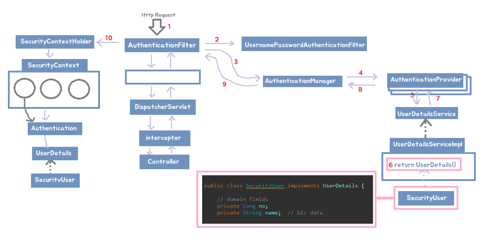

table 수정 : `ROLE_USER, ROLE_ADMIN` 형태로 받을거니까 컬럼 정보 수정 후 데이터 수정하기

```sql
alter table user 
change column role 
role enum('ROLE_USER','ROLE_ADMIN');
```

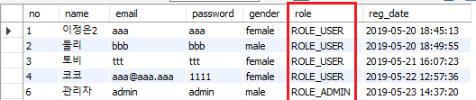

<br>

---

**SecurityUser.java** -> no field 추가

```java
public class SecurityUser implements UserDetails {	
    private Long no;	
    
    public Long getNo() {
        return no;
    }
    public void setNo(Long no) {
        this.no = no;
    }
}
```

<br>

**UserDetailsServiceImpl.java** 코드 수정

> 이전 코드
>
> ```java
> List<GrantedAuthority> authorities = new ArrayList<GrantedAuthority>();
> authorities.add(new SimpleGrantedAuthority(userVo.getRole()));
> ```
>
> **수정 코드**
>
> ```java
> securityUser.setAuthorities(Arrays.asList(new SimpleGrantedAuthority(userVo.getRole())));
> ```

**UserDao.java - > DB 연결**

```java
public UserVo get(String email) {	
    return sqlSession.selectOne("user.getByEmail", email);
}
```

<br>

## jsp에 SS TagLib authorize 추가하기

pom.xml에 taglib를 추가했었음

```xml
<dependency>
    <groupId>org.springframework.security</groupId>
    <artifactId>spring-security-taglibs</artifactId>
    <version>${org.springsecurity-version}</version>
</dependency>
```

**header.jsp**

```html
<%@ taglib prefix="sec" uri="http://www.springframework.org/security/tags" %>
```

> 이전코드
>
> ```html
> <ul>
>     <c:choose>
>         <c:when test='${empty authUser }'>
>             <li><a href="${pageContext.servletContext.contextPath}/user/login">로그인</a><li>
>             <li><a href="${pageContext.servletContext.contextPath}/user/join">회원가입</a></li>
>         </c:when>
>         <c:otherwise>
>             <li><a href="${pageContext.servletContext.contextPath}/user/update">회원정보수정</a></li>
>             <li><a href="${pageContext.servletContext.contextPath}/user/logout">로그아웃</a></li>
>             <li>${authUser.getName() }님 안녕하세요 ^^</li>		
>         </c:otherwise> 
>     </c:choose>
> </ul>
> ```
>
> 수정코드
>
> ```html
> <ul>
>     <sec:authorize access="isAuthenticated()">
>         <li><a href="${pageContext.servletContext.contextPath}/user/update">회원정보수정</a></li>
>         <li><a href="${pageContext.servletContext.contextPath}/user/logout">로그아웃</a></li>
>         <li><sec:authentication property="name" />님 안녕하세요 ^^</li>			
>     </sec:authorize>
>     <sec:authorize access="!isAuthenticated()">
>         <li><a href="${pageContext.servletContext.contextPath}/user/login">로그인</a><li>
>         <li><a href="${pageContext.servletContext.contextPath}/user/join">회원가입</a></li>
>     </sec:authorize>
> </ul>
> ```
>
> `<sec:authentication property="name" />` 은 인증할 때 사용한 name 정보(email을 사용했으니 이메일이 뜸)
>
> 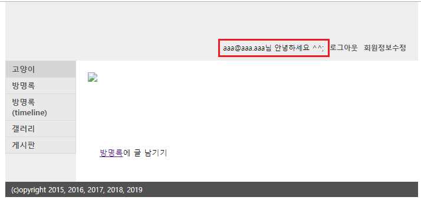
>
> <br>
>
> 이름을 뜨게 하고 싶으면 인증하는 `UserDetails` 클래스의 fields의 name을 사용해야 함 
>
> 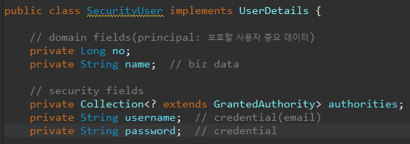
>
> `<sec:authentication property="principal.name" />` 
>
> 

SecurityConfig.java에서 권한을

`		.antMatchers("/admin/**").hasAuthority("ROLE_ADMIN")` 해놓았기 때문에 관리자 접근이 가능해짐

<br>

<br>

## 이전의 Custom 어노테이션 인증  방식 삭제

**MVCConfig.java** 에 추가 

> com.cafe24.config.web/SecurityConfig.java의 코드 옮기고 클래스 삭제

```java
// Argument Resolver
@Bean
public AuthUserHandlerMethodArgumentResolver authUserHandlerMethodArgumentResolver() {
    return new AuthUserHandlerMethodArgumentResolver();
}

@Override
public void addArgumentResolvers(List<HandlerMethodArgumentResolver> argumentResolvers) {
    argumentResolvers.add(authUserHandlerMethodArgumentResolver());
}
```

---

필요없는 이전의 커스텀 어노테이션 인증 패키지 삭제하자!

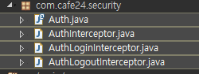

새 패키지에 필요한 AuthUser와 리졸버만 두개 가져와서 쓰자

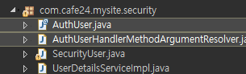

이제 아래의 인증방식은 필요 없으니 삭제

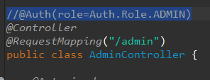

---


## Controller의 @AuthUser 객체 변경

`@AuthUser UserVo authUser` -> `@AuthUser SecurityUser securityUser`

**이전코드**

```java
@RequestMapping(value = "/update", method = RequestMethod.GET)
public String update(@AuthUser UserVo authUser, Model model) {
    UserVo userVo = userService.getUser(authUser.getNo());
	...
}

@RequestMapping(value = "/update", method = RequestMethod.POST)
public String update(@AuthUser UserVo authUser, @ModelAttribute UserVo userVo, Model model) {
	...
    authUser.setName(userVo.getName());
	...
}
```

**수정코드**

```java
@RequestMapping(value = "/update", method = RequestMethod.GET)
public String update(@AuthUser SecurityUser securityUser, Model model) {
    UserVo userVo = userService.getUser(securityUser.getNo());
    	...
}

@RequestMapping(value = "/update", method = RequestMethod.POST)
public String update(@AuthUser SecurityUser securityUser, @ModelAttribute UserVo userVo, Model model) {
	...
    securityUser.setName(userVo.getName());
    ...
}
```


## Security Context Holder에 Details User 정보 등록 

> @AuthUser argumentResolver 수정! 

> `@AuthUser` 어노테이션이 달린 메소드에 `SecurtiyUser`객체를 세션(Security Context Holder)에 등록할거임

---

**AuthUserHandlerMethodArgumentResolver.java** 수정

supportsParameter가 먼저 호출돼서 return true면 resolveArgument 를 실행

**이전코드** -> UserVo사용

```java
package com.cafe24.mysite.security;

public class AuthUserHandlerMethodArgumentResolver implements HandlerMethodArgumentResolver {

    @Override
    public Object resolveArgument(
        MethodParameter parameter, 
        ModelAndViewContainer mavContainer,
        NativeWebRequest webRequest, 
        WebDataBinderFactory binderFactory) throws Exception {

        if(supportsParameter(parameter)==false) {
            return WebArgumentResolver.UNRESOLVED; // 난 이거 몰라
        }

        // 내가 아는 파라미터라면 가져와서
        HttpServletRequest request = 
            webRequest.getNativeRequest(HttpServletRequest.class);
        HttpSession session = request.getSession();
        if(session == null) {
            return null;
        }

        // 설정
        return session.getAttribute("authUser");

    }

    @Override
    public boolean supportsParameter(MethodParameter parameter) {
        AuthUser authUser = parameter.getParameterAnnotation(AuthUser.class);

        // @AuthUser가 안붙어있으면
        if(authUser==null) {
            return false; // 난 걔 관심없어 
        }
        // @AuthUser가 붙어있는데 UserVo가 아니라 BoardVo라던지 파라미터 타입이 다를때
        if(parameter.getParameterType().equals(UserVo.class)==false) { //클래스 객체! 비교
            return false;
        }
        return true;
    }

}
```


**수정코드** -> SecurityUser사용

```java
package com.cafe24.mysite.security;
public class AuthUserHandlerMethodArgumentResolver implements HandlerMethodArgumentResolver {

    @Override
    public Object resolveArgument(
        MethodParameter parameter, 
        ModelAndViewContainer mavContainer,
        NativeWebRequest webRequest, 
        WebDataBinderFactory binderFactory) throws Exception {

        Object principal = null;

        Authentication authentication = SecurityContextHolder.getContext().getAuthentication();

        if(authentication != null ) {
            principal = authentication.getPrincipal();
        }

        if(principal == null || principal.getClass() == String .class) {
            return null;
        }

        return principal;

    }

    @Override
    public boolean supportsParameter(MethodParameter parameter) {

        AuthUser authUser = parameter.getParameterAnnotation(AuthUser.class);

        // @AuthUser가 안붙어있으면
        if(authUser==null) {
            return false; // 난 걔 관심없어 
        }
        // @AuthUser가 붙어있는데 Security가 아니면 return false
        if(parameter.getParameterType().equals(SecurityUser.class)==false) { //클래스 객체! 비교
            return false;
        }
        return true;
    }

}
```

**UserDetailsServiceImpl.java** 에 serNo 추가

`securityUser.setNo(userVo.getNo());`

---


---

## csrf form 처리

`<%@ taglib prefix="sec" uri="http://www.springframework.org/security/tags" %>`

form 밑에 `<sec:csrfInput />  ` 추가


ajax에서는 `<sec:csrfMetaTags />` 추가

```html
<sec:csrfMetaTags />
<script> 
    var csrfParameter = $('meta[name="_csrf_parameter"]').attr('content')
    var csrfHeader = $('meta[name="_csrf_header"]').attr('content')
    var csrfToken = $('meta[name="_csrf_token"]').attr('content')
</script>
```


---

## Access Denied Handler - error page

**xml 버전**

```xml
<!-- SS:begin -->	
<http 
      security-context-repository-ref="securityContextRepository" 
      auto-config="false" request-matcher="regex" 
      entry-point-ref="authenticationEntryPoint" disable-url-rewriting="true">
	...
    <access-denied-handler ref="accessDeniedHandler" />		
  	...
</http>

<!-- SS:end -->

<beans:bean id="accessDeniedHandler" class="org.springframework.security.web.access.AccessDeniedHandlerImpl">
    <beans:property name="errorPage" value="/WEB-INF/views/error/403.jsp" />
</beans:bean>
```


**config 버전**

**SecurityConfig.java**

```java
@Override 
protected void configure(HttpSecurity http) throws Exception {
    
    ...
        
    http
    .exceptionHandling()
    .accessDeniedPage("/WEB-INF/views/error/403.jsp");
}
```

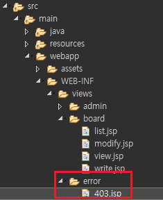

403 페이지 만들기

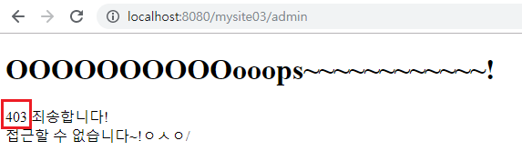

---

todo

---

## password encoding - 암호화

**xml버전**

```xml
<authentication-manager alias="authenticationManager">
    <authentication-provider user-service-ref="customUserDetailsService">
        <password-encoder ref="passwordEncoder">				
            <salt-source ref="saltSource"/>						
        </password-encoder>
    </authentication-provider>
</authentication-manager>
```


**config버전**

**SecurityConfig.java**

```java
// UserDetailService를 설정
@Override
protected void configure(AuthenticationManagerBuilder auth) throws Exception {
    // 사용자 세부 서비스를 설정하기 위한 오버라이딩이다.
    auth
        .userDetailsService(userDetailsService)

        // 프로바이더 하나 만들기
        .and()
        .authenticationProvider(authenticationProvider());
}

@Bean
public AuthenticationProvider authenticationProvider() {
    DaoAuthenticationProvider authProvider = new DaoAuthenticationProvider();
    authProvider.setUserDetailsService(userDetailsService);
    authProvider.setPasswordEncoder(passwordEncoder());
    return authProvider;
}

@Bean
public PasswordEncoder passwordEncoder() {
    return new BCryptPasswordEncoder();
}
```


**UserService.java** -> passwordEncoder 처리

```java
@Autowired
private PasswordEncoder passwordEncoder;

public Boolean joinUser(UserVo userVo) {
    userVo.setPassword(passwordEncoder.encode(userVo.getPassword()));
    return userDao.insert(userVo);
}
```

> 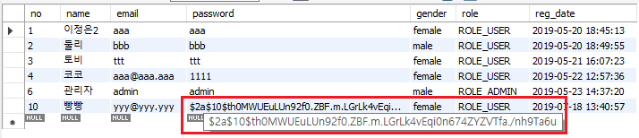

---


---

## remember me

**xml 버전**

```xml
<beans:bean id="rememberMeAuthenticationFilter" class="kr.co.sunnyvale.sunny.security.SunnyRememberMeAuthenticationFilter"> 
    <beans:property name="rememberMeServices" ref="rememberMeServices"/>
    <beans:property name="authenticationManager" ref="authenticationManager"/>
</beans:bean>

<beans:bean id="rememberMeServices" class="kr.co.sunnyvale.sunny.security.SunnyTokenBasedRememberMeServices">
    <beans:property name="key" value="sunny" />
    <beans:property name="userDetailsService" ref="customUserDetailsService"/>
    <beans:property name="parameter" value="_sunny_remember_me"/>
    <beans:property name="cookieName" value="SUNNY_REMEMBER_ME"/>
    <beans:property name="useSecureCookie" value="true"/>
</beans:bean>
```


**config버전**

**SecurityConfig.java**

```java
@Override 
protected void configure(HttpSecurity http) throws Exception {
    ...
        //
        // 5. RememberMe
        //
        .and()
        .rememberMe()
        .key("mysite03")
        .rememberMeParameter("remember-me");
}
```

**로그인 jsp에 remember-me 설정**

```html
<label class="block-label">자동로그인</label>
<input name="remember-me" type="checkbox" value="">
```

---


---

## 권한 제한  <sec:authorize access="hasRole('ROLE_ADMIN')" >

> `<sec:authorize access="hasRole('ROLE_ADMIN')" >`


`<sec:authorize access="hasRole('ROLE_ADMIN')" >`로 admin 권한으로 갤러리 업로드, 삭제 제한하고 싶으면 추가

```java
@Override 
protected void configure(HttpSecurity http) throws Exception {
    
    ...
        
    .antMatchers("/gallery/upload", "/gallery/delete/**").hasAuthority("ROLE_ADMIN")
}
```

view

```html
<%@ taglib prefix="sec" uri="http://www.springframework.org/security/tags" %>
```

`    <sec:authorize access="hasRole('ROLE_ADMIN')" >` 로 묶으면 소크코드보기로 안보임

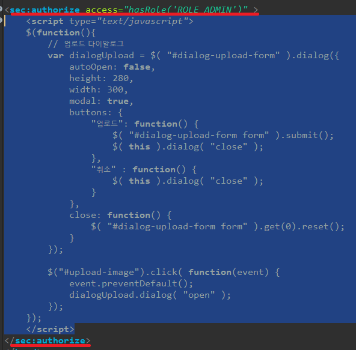

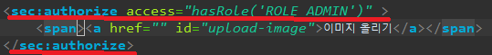


브라우저에서 소스코드 가림(보안)

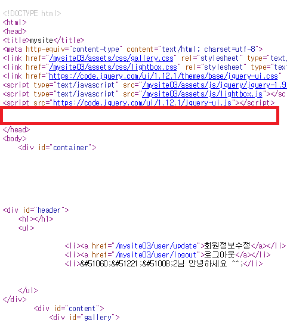


업로드 버튼 가림

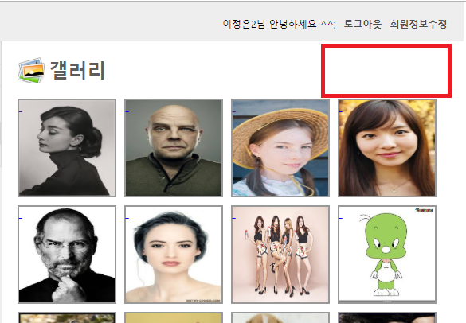

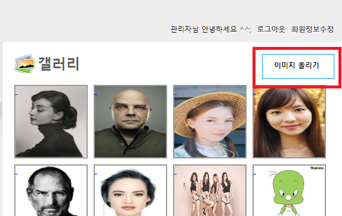

---


------

## ajax login 만들기

```html
<script type="text/javascript" src="${pageContext.request.contextPath }/assets/js/jquery/jquery-1.9.0.js"></script>
<sec:csrfMetaTags />
<script> 
    var csrfParameter = $('meta[name="_csrf_parameter"]').attr('content')
    var csrfHeader = $('meta[name="_csrf_header"]').attr('content')
    var csrfToken = $('meta[name="_csrf"]').attr('content')  

    $(function(){
        $('#login-form').submit(function(event){
            event.preventDefault();
            var params = "email=" + $('#email').val() + "&password=" + $('#password').val()

            $.ajaxSetup({
                beforeSend: function(xhr) {
                    xhr.setRequestHeader(csrfHeader, csrfToken);
                }  
            })

            $.ajax({
                url : "${pageContext.request.contextPath}/user/auth",
                type : "post",
                dataType : "json",
                data : params,
                success : function(response) {
                    console.log(response);
                }, error : function(jqXHR, status, e) {
                    console.error(status + " : " + e);
                }

            });	 
        });
    });

</script>	
```


지금 응답이 json형식으로 안날라와서 에러 남

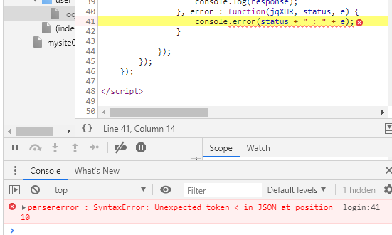

응답 바꾸기 


login config successHandler 수정

**SecurityConfig.java**

successHandler 설정

```java
@Override 
protected void configure(HttpSecurity http) throws Exception {	
    
    ...
        
    //
    // 2. 로그인 설정
    //
    .and()
    .formLogin()
    .loginPage("/user/login")
    .loginProcessingUrl("/user/auth")  // view form의 action과 맞아야함
    .failureUrl("/user/login?result=fail")
    //		.defaultSuccessUrl("/", true)
    .successHandler(authenticationSuccessHandler())
    .usernameParameter("email")
    .passwordParameter("password")
}

// AuthenticationSuccessHandler 등록
@Bean
public AuthenticationSuccessHandler authenticationSuccessHandler(){
    return new CustomUrlAuthenticationSuccessHandler();
}
```


**CustomUrlAuthenticationSuccessHandler.java**

```java
package com.cafe24.mysite.security;

import java.io.IOException;

import javax.servlet.ServletException;
import javax.servlet.http.HttpServletRequest;
import javax.servlet.http.HttpServletResponse;

import org.apache.commons.logging.Log;
import org.apache.commons.logging.LogFactory;
import org.springframework.http.MediaType;
import org.springframework.http.converter.json.MappingJackson2HttpMessageConverter;
import org.springframework.http.server.ServletServerHttpResponse;
import org.springframework.security.core.Authentication;
import org.springframework.security.core.context.SecurityContextHolder;
import org.springframework.security.core.userdetails.UserDetails;
import org.springframework.security.web.authentication.SimpleUrlAuthenticationSuccessHandler;
import org.springframework.security.web.savedrequest.HttpSessionRequestCache;
import org.springframework.security.web.savedrequest.RequestCache;
import org.springframework.security.web.savedrequest.SavedRequest;

import com.cafe24.mysite.dto.JSONResult;


public class CustomUrlAuthenticationSuccessHandler extends SimpleUrlAuthenticationSuccessHandler {
    protected final Log logger = LogFactory.getLog(this.getClass());

    private RequestCache requestCache = new HttpSessionRequestCache();

    @Override
    public void onAuthenticationSuccess(HttpServletRequest request, HttpServletResponse response,
                                        Authentication authentication) throws ServletException, IOException {

        SavedRequest savedRequest = requestCache.getRequest(request, response);

        if (savedRequest != null) {
            requestCache.removeRequest(request, response);
            clearAuthenticationAttributes(request);
        }

        String accept = request.getHeader("accept");

        SecurityUser securityUser = null;
        if (SecurityContextHolder.getContext().getAuthentication() != null) {
            Object principal = SecurityContextHolder.getContext().getAuthentication().getPrincipal();
            if (principal != null && principal instanceof UserDetails) {
                securityUser = (SecurityUser) principal;
            }
        }

        // 일반 응답일 경우
        if (accept == null || accept.matches(".*application/json.*") == false) {

            request.getSession(true).setAttribute("loginNow", true);
            getRedirectStrategy().sendRedirect(request, response, "/guestbook");  // 메인으로 돌아가!
            return;
        }

        // application/json 요청일 경우 아래의 처리!
        MappingJackson2HttpMessageConverter jsonConverter = new MappingJackson2HttpMessageConverter();
        MediaType jsonMimeType = MediaType.APPLICATION_JSON;

        JSONResult jsonResult = JSONResult.success(securityUser); 
        if (jsonConverter.canWrite(jsonResult.getClass(), jsonMimeType)) {
            jsonConverter.write(jsonResult, jsonMimeType, new ServletServerHttpResponse(response));
        }
    }

    public void setRequestCache(RequestCache requestCache) {
        this.requestCache = requestCache;
    }
}
```


이제 응답 잘 날라옴

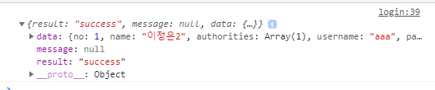


---


---

로그인 xml버전

```xml
<beans:bean id="usernamePasswordProcessingFilter" class="kr.co.sunnyvale.sunny.security.SunnyUsernamePasswordAuthenticationFilter">
    <beans:property name="authenticationManager" ref="authenticationManager" />
    <beans:property name="rememberMeServices" ref="rememberMeServices" />
    <beans:property name="authenticationSuccessHandler" ref="loginSuccessHandler" />
    <beans:property name="authenticationFailureHandler" ref="loginFailureHandler" />
    <beans:property name="authenticationDetailsSource" ref="customWebuthenticationDetailsSource" />
    <beans:property name="usernameParameter" value="username" />
    <beans:property name="passwordParameter" value="password" />
    <beans:property name="filterProcessesUrls">
        <beans:list value-type="java.lang.String">
            <beans:value>/user/auth</beans:value>
        </beans:list>
    </beans:property>		
</beans:bean>	
```

config버전

```java
http
	.formLogin()
    .loginPage("/user/login")
    .loginProcessingUrl("/user/auth")  // view form의 action과 맞아야함
    .failureUrl("/user/login?result=fail")
    .defaultSuccessUrl("/", true)
    .usernameParameter("email")
    .passwordParameter("password")
```


